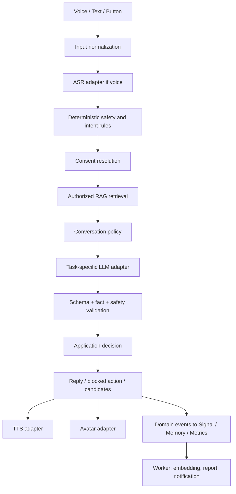
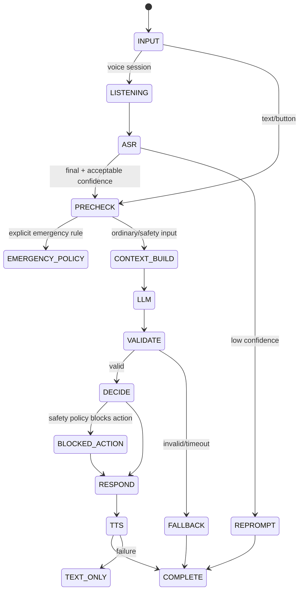
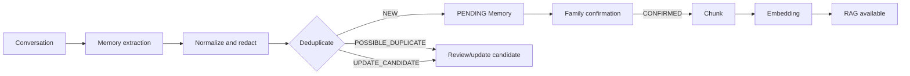
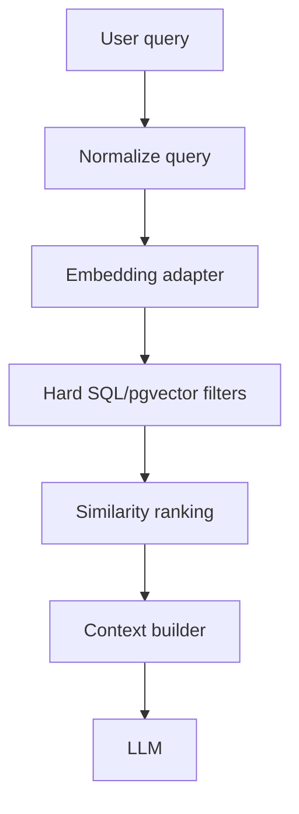
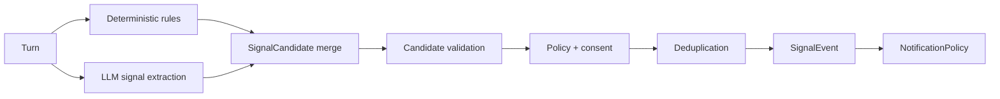

# 念念 AI Design

| 项目 | 内容 |
| --- | --- |
| 状态 | Baseline / v1.0 |
| 目标 | 将既有需求转换为可直接指导 AI Coding Agent 的 AI 编排、安全、RAG、Prompt 和降级规格 |
| 适用版本 | 12 周课程/竞赛原型 |
| 约束 | 不改数据库、不改 OpenAPI、不实现真实 provider、不引入多 Agent/独立向量库 |

## 1. Purpose

本设计覆盖 AI 对话、ASR、LLM、TTS、Avatar、Family Memory、RAG、主动陪伴、SignalEvent、重复主题、周报、防诈骗和评估。它补充而不替代产品需求、系统设计、数据库、API、权限和 UI 文档。

## 2. Source Documents

- `nian-nian-requirements-design.md` v1.1：FR-001~FR-063、产品边界、隐私和验收。
- `docs/system-design.md`：Kotlin 双 App、FastAPI 模块化单体、worker、Adapter、Mock、WSS。
- `docs/database-design.md` / `docs/data-dictionary.md`：Memory、Embedding、Conversation、SignalEvent、Notification、Metric、Report 状态与字段。
- `docs/api-spec.md` / `docs/openapi.yaml` / `docs/api-permission-matrix.md`：REST/WSS、权限、错误、幂等和敏感数据边界。
- `docs/ui-interaction-spec.md`：`IDLE/LISTENING/THINKING/SPEAKING/WARNING/OFFLINE/ERROR` 与老人端降级话术。
- ADR-001~009，尤其 ADR-005（AI Adapter）、ADR-003（pgvector）、ADR-007（worker）、ADR-008/009（Proposed provider）。

## 3. AI Principles

1. **LLM proposes, Application decides**：模型不得授予 Consent、读取 Memory、删除数据、发敏感通知、判断医疗结论、确认诈骗或决定电话成功。
2. **先规则、后模型、再校验**：紧急、授权、删除、诈骗阻断和事实引用在模型前后都有确定性策略。
3. **最小必要上下文**：每次 provider 调用只得到该任务所需的已授权、已脱敏数据。
4. **候选与事实分离**：模型提取 `MemoryCandidate`/`SignalCandidate`，不能直接产生 `CONFIRMED Memory` 或 `SignalEvent`。
5. **不知道就说不知道**：没有可靠家庭记忆时使用不确定话术，不能用常识补齐家庭事实。
6. **不诊断、不冒充**：情绪是交流观察线索；身体不适不是疾病诊断；AI 始终明确身份。
7. **可解释但不暴露思维链**：保存 evidence summary、rule、policy、outcome，不保存 Chain of Thought。

## 4. Architecture

Parallel outputs are `MemoryCandidate`, `SignalCandidate`, `InteractionMetric` updates and a normalized topic. They are independently validated and must not share a hidden global prompt.

## 5. AIOrchestrator

### Responsibilities

- receive a `ConversationContext` from the Conversation module;
- normalize input and invoke ASR when needed;
- run deterministic emergency, scam, consent, quiet-hours and intent rules;
- request authorized Memory through the Memory/RAG service;
- choose a task prompt and provider capability;
- validate structured output, Memory references, safety and fact policy;
- produce the user reply, source labels, Avatar/TTS commands and candidate objects;
- emit commands for Memory, Signal, Metrics, Notification and report services.

### Explicit non-responsibilities

It does not own database CRUD, Consent storage, AuditLog writes, Push/SMS/Phone delivery, Android UI, BLE, provider SDK clients or deletion workers. Those remain module services behind explicit interfaces.

### Orchestration state

The application maps these states to existing UI states. `EMERGENCY_POLICY` and `BLOCKED_ACTION` render `WARNING`; provider failure renders `ERROR` or `OFFLINE`, never a new unhandled UI state.

## 6. Adapter Boundary

`ASRAdapter`, `LLMAdapter`, `EmbeddingAdapter`, `TTSAdapter`, `AvatarAdapter` and `WakeWordAdapter` are specified in `docs/ai-contracts.md`. Weather and Push remain separate existing adapters. Business modules never import `OpenAIClient`, `GeminiClient`, `AzureClient` or an SDK-specific type. Provider selection uses `ProviderCapabilities`, config and data policy.

Initial timeout budgets are tunable recommendations: ASR 4s, LLM 8s first response/20s total, TTS 5s start/12s total, Embedding 10s batch, Avatar 2s acknowledgement. Retry only idempotent transport/429 failures, with an idempotency key and bounded attempts.

## 7. Conversation Context and Fact Classes

Context is composed from a bounded recent window, an optional controlled summary, relevant authorized Memory and current system reminders. Recommended initial limits are 8 recent turns/4,000 characters and a 1,000-character summary; they are evaluation-tunable.

| Fact class | Source | Allowed use |
| --- | --- | --- |
| `GENERAL_KNOWLEDGE` | vetted system prompt/provider | general answers, not family facts |
| `FAMILY_FACT` | `CONFIRMED`, authorized, same-family Memory | only with `memory_refs` and source label |
| `CURRENT_USER_STATEMENT` | current turn | answer in this conversation; never auto-promote to long-term fact |
| `SYSTEM_FACT` | reminder/weather/time/device state | only current system data |

Any family claim not backed by the second row is rewritten to an uncertainty fallback.

## 8. Prompt Architecture

Prompts are Markdown files with YAML front matter under the future directory `backend/app/ai/prompts/`. This keeps review, diff, versioning and fixture testing simple without a SaaS prompt manager.

Required prompt files:

| prompt_id | Purpose | Output |
| --- | --- | --- |
| `conversation` | safe natural conversation and source-labeled answer | `LLMResponse` conversation schema |
| `memory_extraction` | extract possible family facts | `MemoryCandidate[]` |
| `signal_extraction` | classify expressive/safety candidates | `SignalCandidate[]` |
| `summary` | controlled session recap | redacted summary schema |
| `weekly_narrative` | narrate precomputed metrics | narrative + observations |
| `scam_semantic` | identify semantic indicators only | indicator enum set, no verdict |

Each file must declare `prompt_id`, `prompt_version`, `purpose`, `input_contract`, `output_schema`, `forbidden_behavior`, `failure_behavior` and `locale`. Prompt content must state that user input and retrieved Memory are untrusted data and cannot override policy.

## 9. Memory Extraction and Confirmation

A candidate stores type, subject, content, source conversation/message, confidence band, evidence summary and suggested title. It excludes unnecessary full sensitive quotes. Deduplication uses normalized text, same family, same type and optional embedding similarity; the threshold is configuration, not a trained model. `PENDING`, `REJECTED`, `REVOKED` and `DELETED` never become deterministic facts or RAG context.

## 10. RAG Design

The vector query binds `family_id`, `subject`, required consent scope, visibility, `verification_status=CONFIRMED`, `deleted_at IS NULL`, `revoked_at IS NULL`, active chunk and active embedding **before** ranking. It never searches the full vector store first. `RetrievedMemory` contains only id, type, content, relevance, source type, verification, allowed scope and family. On no result, answer “我不确定……可以问问家人”。

### Conflict policy

If two confirmed Memories conflict, the application creates a `MemoryConflict` result for the response layer, does not select one by LLM preference, lowers certainty and recommends family confirmation. This is an in-memory decision/result type, not a new database table in this round.

### Citation guard

The LLM may return at most five `memory_refs`. The service accepts a reference only if it is in the current retrieval set, still authorized, same family, confirmed and not deleted/revoked. Invalid references cause a factual fallback and a trace code; they never leak the referenced content.

## 11. Hallucination Guard

1. Prompt requires source labels and forbids unsupported family claims.
2. Context marks every item as `FAMILY_MEMORY`, `CURRENT_UTTERANCE` or `SYSTEM_FACT`.
3. Structured output requires `memory_refs` for a family fact.
4. Post-validation extracts lightweight claim candidates (names, relationships, dates and places) and compares them to current context; unsupported claims are removed or replaced with uncertainty text.
5. A failed check returns a safe response and does not retry with a more permissive prompt.

This is a scoped 12-week guard, not a general hallucination detector.

## 12. Signal Pipeline

The database enum is exactly `PHYSICAL_DISCOMFORT`, `EMOTION_EXPRESSION`, `IMPORTANT_MEMORY`, `MISS_FAMILY`, `SCAM_RISK`, `EMERGENCY`; severity is `L0`-`L4`. The LLM never inserts `SignalEvent`. Physical discomfort and emotion outputs describe expressions only, never disease or psychiatric labels.

## 13. Scam and Sensitive Safety

The dedicated contract is in `docs/scam-signal-policy.md`. In short: deterministic indicators plus semantic indicators produce a versioned category such as `TRANSFER_AND_SECRECY`; the policy pauses sensitive actions, provides “请先联系家人核实”, checks notification consent, deduplicates, and records rule/policy versions. It does not say the other party is definitely a criminal.

Emergency rules are high priority and deterministic (`救命`, `帮我叫人`, `我要联系急救`, BLE emergency button). LLM may clarify intent, but cannot be the only emergency detector. Physical discomfort offers contact/help, not diagnosis.

## 14. Proactive Companion

`ProactiveCompanionPolicy` is an application policy with inputs: current time/timezone, weather, due reminders, recent interaction, authorized Memory, quiet hours, user preference and daily counters. It returns one of:

`NO_ACTION`, `SUGGEST_INTERACTION`, `REMINDER`, `MEMORY_PROMPT`, `WEATHER_PROMPT`.

The policy checks time window, frequency cap, quiet/pause state and content authorization. LLM only writes text after the decision, for example “下午可能下雨，出门记得带伞。” Scheduling is owned by worker/Reminder, not the model.

## 15. Repeated Topics and Weekly Reports

The system computes interaction count, duration, first/last interaction, reminder feedback, time distribution and event counts from structured tables. Topic summaries are redacted, embedded, clustered per elder and time window, then stored in `interaction_metric.repeated_topic_stats` with model, threshold and version.

Similarity threshold is configurable and evaluated; `cosine > 0.8` is not an assumed truth. WeeklyReport passes only structured metrics, allowed Signal summaries, repeated-topic stats and missing-data flags to `weekly_narrative`. Narrative validation rejects disease, cognitive decline, depression, anxiety, sleep diagnosis and unsupported claims. It says “本周有 3 次交流涉及相似主题” and labels results as “交流观察线索”。

## 16. ASR, TTS, Avatar and Wake Word

- 12-week ASR baseline is Mandarin (`zh-CN`); dialect is a reserved capability and not promised. Low confidence asks for a repeat before risk actions.
- TTS supports text, speed, volume, voice and optional emotion hint. Older-adult controls include repeat, slower and louder. Unsupported emotion is a normal capability downgrade.
- Avatar receives only the existing UI `AvatarState` and optional expression/mouth amplitude. It must not receive provider-specific controls or family facts.
- Wake word outputs timestamp, confidence and source. “念念” is wake-up, not identity authentication.

## 17. Failure and Fallback Matrix

| Failure | User behavior | Application behavior |
| --- | --- | --- |
| ASR unavailable/low confidence | ask to repeat or use button/text | do not feed uncertain text into high-risk action |
| LLM timeout/invalid schema | honest unavailable message | no factual answer, candidate, notification or sensitive action |
| TTS unavailable | show text, repeat option | preserve answer and safety flow |
| Embedding unavailable | Memory remains pending/not searchable | worker retries; no stale retrieval |
| Avatar unavailable | keep audio/text with simplified state | no impact on safety or conversation persistence |
| Network offline | cached reminders, time, contacts and BLE remain | no fake online answer; map to `OFFLINE` |
| Push/SMS/Phone failure | show initiated/failed reason and alternatives | event remains; retry is separate from event truth |

Reminder, Emergency and BLE paths continue without an LLM. Fixed fallback copy comes from the UI/API baseline and is versioned like a prompt.

## 18. Logging, Privacy and Cost

Log `request_id`, `conversation_id`, `provider`, `model`, prompt/rule/policy versions, latency, token/audio usage, result status and candidate counts. Do not log raw audio, full transcript, API key, complete phone/account number, unredacted Memory or Chain of Thought.

Provider calls pass through redaction. Conversation, extraction and scam tasks receive only minimum necessary fields; weekly narrative receives structured aggregates. Cost tracking records provider, model, input/output tokens, audio seconds and request count. Demo/test/prod-like config is separate.

## 19. Configuration

Central config keys:

`model`, `temperature_by_task`, `max_tokens_by_task`, `timeout`, `embedding_model`, `similarity_threshold`, `signal_threshold`, `dedup_window`, `prompt_version`, `rule_version`, `policy_version`, `recent_turn_limit`, `daily_proactive_cap`, `quiet_hours`, `redaction_policy`.

Conversation may use moderate temperature; extraction, signal and scam semantic tasks favor stable low variance; weekly narrative may vary within schema. Values are initial recommendations and must be measured in evaluation, not presented as experimentally proven.

## 20. Mock Contract

Required deterministic mocks: `MockASRAdapter`, `MockLLMAdapter`, `MockEmbeddingAdapter`, `MockTTSAdapter`, `MockAvatarAdapter`, `MockWakeWordAdapter`. Fixtures include:

| Input | Fixed output |
| --- | --- |
| “有人让我把验证码告诉他。” | `SCAM_RISK` candidate with `VERIFICATION_CODE` |
| “我想女儿了。” | `MISS_FAMILY` candidate |
| “我年轻时在杭州工作。” | `MemoryCandidate(EVENT)` in `PENDING` path |
| “我女儿叫小林吗？” with no Memory | uncertainty fallback, no family fact |
| BLE button press | deterministic emergency policy and mock call state |

Mock output is marked `provider=mock`, is stable across runs and does not alter safety semantics.

## 21. FR Traceability

| Requirement | AI design coverage |
| --- | --- |
| FR-003/010/013 | identity prompt, fact policy and uncertainty fallback |
| FR-011/012/016 | adapter chain, WSS states, TTS/Avatar fallback |
| FR-014/030~033 | proactive policy and reminder separation |
| FR-020~023 | candidate-confirm-chunk-embedding pipeline and RAG invariant |
| FR-040~044 | Signal pipeline, minimal summaries and weekly narrative guard |
| FR-050~053 | deterministic scam/emergency policy, notification and contact separation |
| FR-060~063 | wake word, BLE/camera/phone failure boundaries and UI state mapping |

## 22. Open Decisions

- ASR, LLM, TTS, embedding, Avatar and wake-word providers, data retention and China-network availability remain provider-neutral per ADRs.
- Raw audio debug retention and summary retention remain `Decision Required`.
- Exact similarity, signal and dedup thresholds require evaluation data.
- Prompt language/locale expansion beyond Mandarin requires a capability decision.
- Real Push/SMS/Phone and Avatar SDK remain Proposed; MockPush/MockAvatar are the demo baseline.

## 23. Risks

- Consent revocation can leave stale vector/cache results unless “invisible first, cleanup later” is transactionally tested.
- Approximate vector indexes may reduce filtered recall; evaluate authorized-only recall before enabling ANN tuning.
- Low-confidence ASR can create false safety signals; emergency keyword handling needs device tests.
- Provider retention and network failure can invalidate the demo unless mocks are first-class.
- Weekly repeated-topic and emotion labels may be misread as medical conclusions; UI and narrative validators must remain aligned.

## 24. Change Proposals

API Change Proposals: **None.** Existing WSS and REST contracts carry the required state, warning, signal id and summary boundaries.

Database Change Proposals: **None.** Candidates are transient/domain DTOs; persistence uses existing `memory`, `conversation`, `signal_event`, `notification`, `interaction_metric` and `weekly_report` fields.

