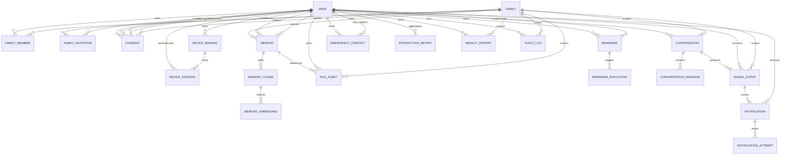

# 念念（NianNian）数据库详细设计

| 项目 | 内容 |
| --- | --- |
| 文档状态 | Baseline / v1.0 |
| 需求基线 | [`nian-nian-requirements-design.md`](../nian-nian-requirements-design.md) v1.1 |
| 技术基线 | [`docs/system-design.md`](system-design.md)、`docs/adr/` |
| 适用范围 | 12 周课程/竞赛版本；供 SQLAlchemy 2、Alembic、后端模块和测试使用 |
| 明确不包含 | 业务代码、Controller、完整 OpenAPI、Android 代码、RAG/SignalEvent/周报实现、实际迁移执行 |

## 1. Purpose

本文把需求中的业务实体转换为 PostgreSQL + pgvector 可实现的数据模型，规定表拥有权、字段语义、关系、约束、索引、授权过滤、删除和生命周期。它不替代需求文档，也不把数据库约束误认为业务流程实现；服务层仍需执行跨表授权、状态机和外部对象存储操作。

## 2. Source Documents

开始设计前完整核对了：

1. `nian-nian-requirements-design.md` v1.1：产品边界、FR-001～FR-063、隐私和非功能需求。
2. `docs/system-design.md`：原生 Android 双 App、FastAPI 模块化单体、PostgreSQL + pgvector、MinIO、Adapter、worker 和 RAG 不变量。
3. `docs/adr/ADR-001`～`ADR-009`：已接受的技术决策以及 Proposed 的推送/数字人决策。

### 2.1 Requirement / Decision conflicts

| Requirement / Decision | Conflict | Impact | Recommended Resolution | Decision Required |
| --- | --- | --- | --- | --- |
| 需求要求考虑原始音频短期保存或不保存；系统设计建议默认不保存 | 未给出统一保留时长和调试例外的期限 | ConversationMessage、FileAsset 的清理任务和导出范围无法写死具体天数 | 数据模型支持 `retention_until`、删除状态和不保存音频；上线前由隐私/竞赛负责人确定期限 | 是否允许调试短期原始音频；若允许，确认自动清理期限和访问角色 |
| 需求要求“规则配置和版本追踪”；系统设计要求 12 周低复杂度 | 动态 RiskRule 表会增加管理页面、权限和迁移成本 | 过度设计会挤压核心闭环 | 规则以版本化 YAML/代码包发布；SignalEvent 持久化 `rule_id`、`rule_version`、命中摘要 | 是否需要比赛现场在线改规则；若需要，再新增 RiskRule 表 |
| 推送/短信/电话供应商仍为 Proposed | Notification 的业务模型不能绑定 FCM 或某一家短信商 | provider 失败和中国大陆网络差异必须可演示 | 只持久化 channel、provider、attempt 和错误，不保存供应商 SDK 对象 | 确认供应商、费用、网络和数据留存后再补 provider 配置表 |

## 3. Database Technology and Design Principles

- PostgreSQL 作为事务库；启用 `pgvector` 扩展但不引入独立向量数据库。
- SQLAlchemy 2 model 负责类型映射，Alembic 负责所有 schema 变化；禁止手工修改演示/生产 schema。
- 所有服务端时间使用 UTC `timestamptz`；用户/提醒额外保存 IANA timezone。
- 主键统一使用应用侧生成的 UUIDv7，数据库类型为 `uuid`；不混用 BIGINT、字符串 ID 和多套随机 ID。
- 核心关系和查询字段结构化；JSONB 只用于明确的可变配置、provider metadata、设备能力、无障碍设置和统计扩展。
- 敏感文本默认最小化、可过期；审计记录追加写入，不复制完整对话或 token。
- 数据库约束保护明显非法状态；跨表业务授权由模块 service 复核。
- 所有业务删除必须同时安排 embedding、缓存和对象存储清理；在清理完成前不可重新暴露数据。

## 4. Entity Overview

最终采用 22 张表：14 张需求核心实体 + 8 张必要规范化实体。下表中的 P0/P1 是本项目优先级，不表示产品新增需求。

| 实体 | 类型 | 采用原因 / 业务问题 | 优先级与 FR |
| --- | --- | --- | --- |
| User | 需求实体 | 全局身份和数据主体 | P0；FR-001、FR-004、FR-005 |
| Family | 需求实体 | 家庭权限边界 | P0；FR-001、FR-002 |
| FamilyMember | 需求实体 | 家庭内角色、成员状态和权限 | P0；FR-001、FR-002 |
| FamilyInvitation | 新增 | 邀请 token 的过期、次数和撤销不能放在 Family | P0；FR-002 |
| Consent | 需求实体 | 可撤回、分项、针对特定受授人的授权历史 | P0；FR-004、FR-022、FR-044 |
| DeviceSession | 新增 | refresh token、设备登出和会话撤销不能放在 User | P0；FR-001、认证设计 |
| Memory | 需求实体 | 家庭事实、待确认和删除状态 | P0；FR-020~023 |
| MemoryChunk | 新增 | 一个 Memory 可拆成可检索片段，且保留 chunk 顺序 | P0；FR-022、FR-023 |
| MemoryEmbedding | 新增 | provider/model/version/dimension/向量生命周期独立于 Memory | P0；FR-022、FR-023 |
| FileAsset | 新增 | 对象存储 metadata、Signed URL、删除和生命周期 | P0；FR-020、FR-023 |
| Reminder | 需求实体 | 可查询的提醒规则和免打扰配置 | P0；FR-030、FR-033 |
| ReminderExecution | 新增 | 每次触发和 DONE/LATER/SKIPPED/NO_RESPONSE 反馈 | P0；FR-031、FR-043 |
| Conversation | 需求实体 | 会话生命周期、摘要和 provider 元数据 | P0；FR-010~015、FR-040 |
| ConversationMessage | 新增 | 受控消息引用和 SignalEvent 来源，避免把会话字段塞进 Conversation | P0；FR-011、FR-015、FR-040 |
| InteractionMetric | 需求实体 | 按用户/日期保存结构化周报统计 | P0；FR-043 |
| SignalEvent | 需求实体 | 关注、诈骗和紧急事件追踪 | P0；FR-040~042、FR-050~053 |
| Notification | 需求实体 | 业务通知与 Push provider 解耦 | P0；FR-041~043、FR-052~053 |
| NotificationAttempt | 新增 | 多渠道、重试、provider error 和失败演示 | P0；FR-041、FR-053 |
| EmergencyContact | 需求实体 | 支持注册用户或外部联系电话 | P0；FR-053、FR-063 |
| DeviceBinding | 需求实体 | 平板、BLE、kiosk、权限和心跳能力 | P0；FR-060~063 |
| WeeklyReport | 需求实体 | 版本化结构化快照和叙述 | P0；FR-043 |
| AuditLog | 需求实体 | 授权、敏感访问、删除和联系的不可抵赖记录 | P0；FR-004、FR-005、FR-044 |

**不新增 `RiskRule` 表**：12 周版本规则随代码/YAML 发布，SignalEvent 保存规则标识和版本。这样能满足答辩追踪且不引入在线规则管理。若 Decision Required 确认需要运行时编辑，后续新增独立表和管理权限。

## 5. ERD



ERD 中的 `o|` 表示外部联系人可能没有 User 账户；所有 FK、状态和字段定义以 [data-dictionary.md](data-dictionary.md) 为准。

## 6. Identity Strategy

### 6.1 User 与家庭角色

`User` 只保存全局身份状态，不保存用于最终授权的家庭角色。可选的 `global_role` 仅用于运营/系统级路由（例如 `USER`、`OPERATOR`），老人、子女和紧急联系人角色必须放在 `FamilyMember.role`。同一 User 可以在家庭 A 为 `CHILD`，在家庭 B 为 `EMERGENCY_CONTACT`。任何内容授权查询必须同时检查 `family_id`、`FamilyMember.status = ACTIVE`、家庭角色和 Consent；前端隐藏按钮不能替代服务端校验。

### 6.2 ID 与手机号

所有实体主键为应用生成 UUIDv7，便于按时间观察和跨端日志关联，又不暴露连续数量。PostgreSQL 只存 `uuid`，不依赖数据库版本提供 uuidv7 默认函数。手机号是敏感 PII：联系人/用户表存应用层加密值或受控密文、`phone_hash`（去重/查找）和 `phone_last4`（展示），普通日志不记录完整号码。

## 7. User / Family / FamilyMember / Invitation

### 7.1 User

关键字段：`id`、`global_status`、`display_name`、`phone_ciphertext`、`phone_hash`、`phone_last4`、`accessibility_settings`、`timezone`、`created_at`、`updated_at`。`accessibility_settings` 可用 JSONB 保存字号、音量、语速和对比度等灵活设置；安全状态、手机号和时间区必须结构化。

### 7.2 Family 与 FamilyMember

`Family` 保存名称、创建人、状态和时间。`FamilyMember` 保存 `family_id`、`user_id`、`role`（ELDER/CHILD/CAREGIVER/EMERGENCY_CONTACT）、成员状态（PENDING/ACTIVE/REVOKED/LEFT）、细粒度 `permission_codes` JSONB、加入/退出时间和邀请来源。数据库使用唯一部分索引阻止同一家庭同一用户出现两个 ACTIVE 成员：`UNIQUE(family_id, user_id) WHERE status IN ('PENDING','ACTIVE')` 的语义由 migration 实现，历史 LEFT/REVOKED 可保留。

### 7.3 FamilyInvitation

邀请码/二维码只传一次性 token；数据库只存 `token_hash`，不存明文永久 token。字段包括家庭、创建人、目标角色、`expires_at`、`max_usage`、`used_count`、`used_at`、撤销状态和时间。兑换使用哈希等值查询、事务锁定未过期记录、检查次数后创建 PENDING FamilyMember；成功后记录 AuditLog。二维码只是 token 的展示载体，不形成第二套授权模型。

## 8. Consent

### 8.1 数据模型

每次授权变化追加一条 Consent 历史记录，不覆盖历史。字段包含：`family_id`、`subject_user_id`（谁的数据）、`grantor_user_id`（谁确认授权）、`grantee_user_id`（授权给谁）、`scope`、`status`（GRANTED/REVOKED/EXPIRED）、`version`、`source`（ONBOARDING/SETTINGS/IMPORT）、`granted_at`、`revoked_at`、`expires_at`、`replaced_by_id` 和 `audit_log_id`。

Scope 至少包括 `VOICE`、`PORTRAIT`、`FAMILY_MEMORY`、`HEALTH_MEDICATION`、`CONVERSATION_SUMMARY`、`CAMERA_PROXIMITY`、`NOTIFICATION_TO_FAMILY`。`grantee_user_id` 必须是同一 Family 的 ACTIVE 成员；紧急事件也不能通过“全家默认授权”绕过 scope。

### 8.2 授权查询

“用户 X 是否能读取老人 Y 的某条 Memory？”使用事务内的参数化查询：

1. 读取 Memory 的 `family_id`、`subject_user_id`、`required_consent_scope`，并要求 `verification_status = CONFIRMED`、`deleted_at IS NULL`。
2. 检查 X 是否为该 family 的 ACTIVE 成员。
3. 若 X = subject_user_id，按数据主体权限允许；否则要求存在 `Consent`：同一 family、subject=Y、grantee=X、scope=required scope、status=GRANTED，且在有效期内。
4. 记录敏感读取 AuditLog；将授权结果以 `authorization_source` 返回，不让调用方自行拼接 SQL。

同一查询条件必须用于普通 Memory API、导出和 RAG；不能先全库向量搜索后再过滤。

## 9. Memory / Chunk / Embedding / RAG

### 9.1 Memory

支持 `PERSON`、`RELATIONSHIP`、`EVENT`、`PLACE`、`PREFERENCE`、`TABOO`、`PHOTO`。状态采用 `PENDING`、`CONFIRMED`、`REJECTED`、`REVOKED`、`DELETED`；模型自动抽取必须以 PENDING 写入。核心字段为 family、subject、source、type、title、content、`required_consent_scope`、`verification_status`、`verified_by/at`、visibility、`expires_at`、`revoked_at`、`deleted_at` 和时间。

`content` 用于短文本事实；类型扩展可放 `attributes` JSONB。照片本体不存此表，只通过 FileAsset 引用。`REVOKED` 表示授权/发布资格失效，`DELETED` 表示业务删除；两者都不可用于检索。

### 9.2 为什么拆 MemoryChunk 与 MemoryEmbedding

不把 vector 直接放 Memory。原因是：一个 Memory 可能按语义拆成多个 chunk；provider/model/dimension 变更需要并行重建；删除和重索引需要独立状态；向量索引不应污染业务事实表。`MemoryChunk` 保存 chunk 顺序、文本哈希和可检索状态；`MemoryEmbedding` 一行对应一个 chunk + provider/model/version，保存 vector、dimension、状态和 metadata。P0 只允许一个生效 embedding provider，但模型升级不需要改 Memory 主表。

### 9.3 RAG 权限不变量

有效检索行必须同时满足：

```text
Memory.verification_status = CONFIRMED
AND Memory.deleted_at IS NULL
AND Memory.revoked_at IS NULL
AND Memory.family_id = :current_family_id
AND MemoryEmbedding.status = ACTIVE
AND authorization(subject, grantee, required_consent_scope) = true
```

向量查询先绑定 `family_id`、subject、visibility、scope 和删除状态，再按 cosine distance 排序。服务层不得接受客户端传入的 family 作为唯一依据；family 从认证 session 和路由资源交叉确认。

## 10. FileAsset

`FileAsset` 保存对象存储 metadata：owner、family、可选 memory/conversation 归属、object key、media type、mime、size、checksum、status、`retention_until`、deleted_at。数据库绝不保存永久公开 URL；服务端授权后生成短时 Signed URL，URL 过期后重新检查 Consent。删除授权后先将资产标记不可读，再安排 object delete/lifecycle；清理失败不能恢复可读状态。

## 11. Reminder / ReminderExecution

### 11.1 Reminder 结构化字段

结构化保存 `owner_user_id`、`created_by_user_id`、`type`（CALENDAR/WEATHER/MEDICATION/WATER/CLOTHING/COMPANIONSHIP）、title、content、`schedule_time_local`、`timezone`、`start_date`、`end_date`、`recurrence_kind`、`recurrence_interval`、`days_of_week`、active、`quiet_hours_start/end`、`quiet_hours_timezone` 和 optional `escalation_policy` JSONB。时间、周期、状态和联系人关系不得塞进一个 schedule JSON。

`escalation_policy` 只保存渠道、延迟和最大升级级别等可变配置；实际通知仍创建 Notification。用药内容由授权家属/指定录入者提供，数据库不表示医生确认或真实服药事实。

### 11.2 ReminderExecution

每个 occurrence 生成一行，使用 `occurrence_key` 保证幂等。记录 scheduled_at UTC、local date/time snapshot、triggered_at、feedback_status（DONE/LATER/SKIPPED/NO_RESPONSE）、feedback_at、feedback_note、source（ONLINE/OFFLINE）、next_due_at、attempt_count。`NO_RESPONSE` 由 worker 在反馈窗口结束后生成，不能解释为“未服药”。

## 12. Conversation / ConversationMessage

`Conversation` 记录 owner、family、可选 device、started/ended、status、summary_status、summary_text、summary_retention_until、provider/model/prompt metadata 和 deleted_at。摘要也是敏感数据，只有在授权范围内提供。

`ConversationMessage` 不是永久聊天日志：保存最小可用的 role、sequence、可选脱敏 `content_text`、sensitivity、asr_confidence、created_at、retention_until、deleted_at 和 provider metadata。当前会话中未落库的原始音频/逐字稿只存在内存或短期受控缓存；默认不保存原始音频。若为 SignalEvent 需要来源，只保存 message id 和最小 evidence_summary，不复制全文。

原始音频保存期限仍为 `Decision Required`；模型已预留 FileAsset + retention_until，不在此文档编造天数。

## 13. InteractionMetric

按 `owner_user_id + metric_date + timezone_snapshot` 聚合，保存 interaction_count、conversation_seconds、first/last interaction UTC、night_interaction_count、reminder_done/later/skipped/no_response_count、emotion_signal_counts、interaction_time_distribution、repeated_topic_stats、source_cutoff_at 和 computed_at。分布和分类统计可用 JSONB，但总数、时长、日期和提醒结果必须结构化。

WeeklyReport 只读取 InteractionMetric、ReminderExecution 和已授权 SignalEvent；不能从报告 narrative 反向计算数字。

## 14. SignalEvent

支持 `PHYSICAL_DISCOMFORT`、`EMOTION_EXPRESSION`、`IMPORTANT_MEMORY`、`MISS_FAMILY`、`SCAM_RISK`、`EMERGENCY`。字段包括 owner/family、type、severity、source_conversation_id、source_message_id、evidence_summary、evidence_hash、confidence、rule_id、rule_version、policy_version、consent_check_result、status、dedupe_key、duplicate_of_id、detected_at、validated_at、notified_at、last_action_by、last_action_at、resolution_code、resolved_at。

Evidence 只存最小必要摘要或受控引用，不默认保存完整原文。规则来源在 `rule_id/rule_version` 中固定，配置文件发布记录由代码版本/部署审计关联。

### 14.1 状态与动作

推荐状态：`DETECTED` -> `VALIDATED` -> `NOTIFIED` -> `ACKNOWLEDGED` / `CONTACTED` / `FALSE_POSITIVE` -> `RESOLVED`；授权不足进入 `WITHHELD`；通知彻底失败进入 `NOTIFICATION_FAILED`。未处理事件保持 NOTIFIED 并可按 policy 创建升级 Notification，不自动当作已解决。

- 家属确认：写入 AuditLog，状态变为 ACKNOWLEDGED。
- 家属联系：创建 EmergencyCase 的业务动作/Notification，并记录 CONTACTED 与实际结果；不能伪造接通。
- 标记误报：状态变为 FALSE_POSITIVE，保留原因和操作人，供规则评估。
- 重复事件：同 family/owner/type/规则窗口使用 `dedupe_key` 检查，新增事件可引用 `duplicate_of_id`；不删除原事件。

## 15. Notification / NotificationAttempt

Notification 是业务通知，不等于 Push。它记录 event/reminder execution（可选其一）、recipient、channel（IN_APP/PUSH/SMS/PHONE）、最小摘要、status、policy_version、provider、sent/read/action timestamps、error_code 和 dedupe_key。完整对话、原始音频和家属内部备注不得进入通知正文。

`NotificationAttempt` 记录每次 provider 尝试、attempt_no、provider、status、started/finished、provider_message_id、error_code、error_detail_redacted 和 retry_at。多渠道通知创建多条 Notification 或同一业务通知的多个 attempt，由 policy 明确；SignalEvent 不保存 provider 细节。

## 16. EmergencyContact / DeviceBinding / DeviceSession

### 16.1 EmergencyContact

`contact_user_id` 可为空，以支持未注册的外部联系人。phone 使用密文、hash、last4；字段包括 owner、name、priority、channel、enabled、verified、verification_at、created/updated。紧急呼叫以授权联系人快照执行，修改联系人不回写历史 Emergency/SignalEvent。

### 16.2 DeviceBinding

结构化保存 device_id_hash、owner、device_type、app_version、os_version、kiosk_status、wakeword_status、ble_status、camera_permission、phone_permission、last_seen_at、last_state_change_at、status。`capabilities` 用 JSONB 保存设备差异，安全判断所需的关键权限仍有结构化字段。

设备心跳不每秒写库：默认设备端本地节流，正常状态每 60 秒最多一次；状态变化、重启、按钮事件和离线恢复立即上报。服务端只更新最新心跳，状态变化写 Audit/Device event；具体间隔可配置但不影响业务事件。

### 16.3 DeviceSession

保存 user/device、refresh_token_hash、issued_at、expires_at、revoked_at、last_seen_at、logout_reason 和受控 user-agent/ip hash。Access Token 不入库；退出全部设备按 user/session 版本撤销。

## 17. WeeklyReport

字段：owner、family、period_start/end、version、status、generated_at、metrics_snapshot、narrative、missing_data、source_cutoff_at、supersedes_id、created_at。报告版本不可变；重新生成创建新 version 并指向旧报告，不覆盖旧 narrative。`metrics_snapshot` 是生成时结构化数据的 JSONB 快照，数字来源仍可追溯到 InteractionMetric/ReminderExecution/SignalEvent。

## 18. AuditLog

AuditLog 追加记录 actor、family、action、target_type、target_id、reason、request_id、timestamp、result、metadata_redacted。必须覆盖授权、撤回、敏感读取、Memory 修改/删除、摘要查看、数据导出、紧急联系、通知处理和设备安全状态变化。禁止完整对话、token、完整号码、原始健康信息和 secrets。

课程项目策略：应用账号无权删除/修改 AuditLog；数据库角色只允许 audit writer INSERT，审计查询只读。精确法定保留期为 `TBD / Decision Required`，但业务数据删除不回删审计事实，可将目标对象标记为已删除。

## 19. Soft Delete / Hard Delete / Revoke Semantics

| 数据 | 语义 |
| --- | --- |
| User/Family/FamilyMember | User/Family 先停用；成员离开保留历史关系和审计，不直接硬删。 |
| Consent | 撤回追加 REVOKED 历史，不删除授权记录；有效授权查询只读当前 GRANTED。 |
| Memory | 先 DELETED/REVOKED 业务不可见，再禁用 embedding、失效 cache、删除 FileAsset，最终物理清理由 worker 完成。 |
| MemoryEmbedding/Chunk | 立即设为不可检索/删除状态，清理任务物理删除或重建。 |
| FileAsset | 标记 DELETE_REQUESTED/DELETED，按生命周期删除对象；数据库保留必要 metadata/audit。 |
| Reminder/Conversation/SignalEvent/Notification | 业务软删除或状态关闭以保留统计/解释；敏感内容按 retention 清理。 |
| WeeklyReport | 版本不可变；用户删除流程按授权/法律决定是否清理正文和 snapshot，审计保留事实。 |
| AuditLog | append-only、不可由应用删除；保留期 TBD。 |
| DeviceBinding/Session | 设备解绑或会话撤销，历史心跳不高频保留。 |

Memory 删除顺序：业务不可见 -> vector 不可检索 -> cache 失效 -> object storage 删除 -> 最终物理清理。任何一步失败都要留任务状态和错误，不能恢复旧数据可见性。

## 20. Data Lifecycle

在期限尚未由人工确认前，以下定义“状态和触发”，不伪造具体天数：

| 数据 | Created -> Used -> Revoked/Expired/Deleted -> Cleanup |
| --- | --- |
| Account | 注册 -> 认证/家庭绑定 -> 停用/删除请求 -> 解绑 session、导出/删除任务；审计引用保留。 |
| Consent | 授权 -> scope 查询 -> 撤回/过期 -> 不再授权，历史保留。 |
| Memory | 手工/模型抽取 -> PENDING/CONFIRMED RAG -> 撤回/删除/过期 -> embedding、cache、asset 清理。 |
| Photo/FileAsset | 上传 metadata -> Signed URL/Memory 展示 -> revoke/delete -> 对象生命周期删除。 |
| Raw Audio | 默认不创建永久资产 -> 若调试启用则短期受控使用 -> retention_until -> 自动删除；期限 TBD。 |
| Conversation | 开始/消息元数据 -> 摘要和 Signal 来源 -> retention/deletion -> 消息、摘要和关联资产清理。 |
| Conversation Summary | 生成 -> 受 Consent 控制的周报/家属查看 -> 撤回/到期 -> 删除或脱敏；期限 TBD。 |
| Embedding | Memory confirmed 后生成 -> RAG -> revoke/delete/model invalidation -> 立即失效和异步物理清理。 |
| SignalEvent | 检测 -> 通知/家属动作 -> resolved/false positive -> 按事件审计和统计需求清理敏感 evidence。 |
| WeeklyReport | 统计快照 -> 家属查看 -> 新版本/删除请求 -> 按 data subject policy 清理 narrative/snapshot。 |
| AuditLog | 操作发生 -> 审计查询 -> 不随业务删除回滚 -> 依 TBD 保留期归档/清理。 |
| Device data | 绑定/心跳 -> 最新能力状态 -> 解绑/过期 -> 撤销 session、保留最低必要审计。 |

原始音频、完整消息和周报正文保留期必须在隐私/威胁模型文档中最终确认。

## 21. Index Strategy

### 21.1 关系索引

- `family_member(family_id, status)`、`family_member(user_id, status)`，并用 active 部分唯一索引阻止重复 ACTIVE 成员。
- `consent(subject_user_id, grantee_user_id, family_id, scope) WHERE status='GRANTED'`，另有 `consent(family_id, subject_user_id, status)`。
- `memory(family_id, verification_status, deleted_at, revoked_at)`、`memory(subject_user_id, type)`；不要只建 deleted_at 单列索引。
- `memory_embedding(chunk_id, status, provider, model_version)`；embedding 状态必须先过滤。
- `reminder(owner_user_id, active, next_due_at)`；ReminderExecution `(reminder_id, occurrence_key)` 唯一及 `(owner_user_id, scheduled_at, feedback_status)`。
- `conversation(owner_user_id, started_at DESC)`、`conversation(family_id, started_at DESC)`；Message `(conversation_id, sequence_no)`。
- `signal_event(owner_user_id, status, detected_at DESC)`、`signal_event(family_id, severity, status, detected_at DESC)`、`notification(recipient_user_id, status, created_at DESC)`。
- `device_binding(owner_user_id, last_seen_at)`、`weekly_report(owner_user_id, period_start DESC)`、`audit_log(actor_user_id, created_at DESC)`。

### 21.2 pgvector

课程/竞赛数据量较小时，优先使用带硬过滤的 exact cosine distance 查询，不为了展示性能提前配置复杂索引。数据量和延迟真实达到需求后选择 HNSW；它无需训练、适合增量写入，但需要监控过滤后的召回。IVFFlat 需要 lists/training 和重建时机，在本项目规模下不推荐。无论是否有 HNSW，都必须在向量查询中先限制 family、confirmed、not deleted、embedding active 和 authorization；绝不先搜索全库再过滤。

## 22. Constraints

- 所有表 `id uuid PRIMARY KEY`、核心外键 `NOT NULL`；可选关联明确允许 NULL。
- FamilyMember、Consent、Memory、Reminder、Notification 等使用 `CHECK` 约束限制状态/类型代码集合；采用 `varchar + CHECK`，避免课程期间 PostgreSQL enum 迁移困难。
- `FamilyInvitation.token_hash`、`User.phone_hash`、`DeviceBinding.device_id_hash` 唯一。
- 同一家庭同一用户不能有两个有效 ACTIVE/PENDING 成员；同一 Reminder occurrence 不能重复执行。
- Consent GRANTED 必须有 granted_at；REVOKED 必须有 revoked_at；授权历史不更新覆盖。
- Memory CONFIRMED 必须有 verified_by/verified_at；PENDING/REJECTED 不得有有效 embedding（由约束/worker 双重保证）。
- SignalEvent confidence 在 [0,1]；NotificationAttempt attempt_no > 0；period_end >= period_start；retention_until >= created_at（允许清理任务修正）。
- 所有跨 family FK 关系由 service 在事务中校验；PostgreSQL 单列 FK 不足以表达“同一家庭”，不能只依赖 Python 请求参数。

## 23. Timezone Strategy

服务端所有 timestamp 使用 UTC `timestamptz`。User 保存 IANA timezone；Reminder 保存创建时的 timezone，并将每次 ReminderExecution 保存 local date/time snapshot。重复规则保存本地规则（time + recurrence + timezone），worker 根据当地 DST/时区计算 UTC occurrence；不能永久把“每天 08:00”转换成固定 UTC。InteractionMetric 按用户 timezone 聚合，避免跨日统计漂移。

## 24. JSONB Policy

允许 JSONB：

- User.accessibility_settings：字号、音量、语速、对比度等扩展偏好。
- FamilyMember.permission_codes：细粒度、可演进的权限代码（scope 仍由 Consent 结构化控制）。
- Memory.attributes：类型专属的非核心扩展属性。
- Reminder.escalation_policy：渠道顺序、延迟、最大升级级别。
- AI/provider metadata：provider、model、latency、prompt version、错误详情（脱敏）。
- DeviceBinding.capabilities：设备能力差异；关键安全权限仍结构化。
- InteractionMetric 分布/分类统计和 WeeklyReport.metrics_snapshot。

必须结构化：身份、家庭关系、授权主体/受授人/scope/status、Memory 家庭范围/验证/删除状态、Reminder 时间/周期/owner、Conversation 时间/owner、SignalEvent 类型/来源/状态、Notification recipient/channel/status、设备 last_seen 和所有审计目标。

## 25. Database Security

### 25.1 Roles

- `nianian_app`：运行时最小权限，只能访问应用 schema 的业务表和必要序列/函数，不拥有 database/schema，不可执行任意 DDL。
- `nianian_migrator`：仅迁移环境使用，拥有 Alembic DDL 权限，不作为 API 连接账号。
- `nianian_readonly`：测试/报表只读账号，不能读取原始敏感字段或直接读取对象存储密钥。
- `nianian_audit_writer`：如采用独立 schema/权限，可追加 AuditLog，不可 UPDATE/DELETE。

禁止 root/superuser 运行应用；密码、JWT secret、对象存储密钥只来自 secret manager/环境变量，不提交 Git。SQLAlchemy 使用绑定参数/ORM 查询，禁止拼接用户输入。生产/演示 bucket 私有，Signed URL 短时有效。

### 25.2 Data protection

传输使用 TLS；手机号、联系人和敏感内容由应用层加密或受控密文存储。日志只记录 request_id、实体 ID、错误码和脱敏摘要。数据库备份加密、访问受限并定期恢复演练；备份保留期同样标记为隐私决策的一部分。

## 26. Migration Strategy

### 26.1 Naming and flow

```text
model change -> Alembic revision YYYYMMDD_<short_slug>
-> code review (schema/PII/index/rollback)
-> disposable DB apply + tests
-> demo/staging apply
-> production approval/apply
```

采用 expand/contract：先加可空列/新表和双读写，再回填、切换、最后删除旧结构。禁止开发者手工修改共享数据库。索引使用可在线的策略时，迁移脚本需单独 review 锁和耗时。

### 26.2 Rollback

数据破坏性 downgrade 不自动执行；只对尚未写入数据的结构变化提供 downgrade。已发布迁移通过“前向修复迁移”回滚业务，不依赖删除列或恢复旧备份。每次 migration 附带验证查询和备份/恢复说明。

### 26.3 Seed and Demo Data

基础 seed 只创建 scope/status 配置和 Mock provider 元数据，必须幂等。`scripts/seed_demo_data.*` 使用固定 UUIDv7 seed、虚构手机号/照片引用和独立 `demo` 标记，重复运行先清理同一 demo namespace 再重建，不触碰真实家庭数据。Demo 至少包含已确认/待确认 Memory、提醒执行、SignalEvent、Notification、WeeklyReport 和撤回/失败状态。

## 27. Requirement Traceability

| FR | Entity | Important fields / database support |
| --- | --- | --- |
| FR-001 | User, FamilyMember, DeviceSession | global identity、family role/status、session revoke；角色不依赖 User.role。 |
| FR-002 | Family, FamilyInvitation, FamilyMember | token_hash、expires_at、max_usage、双向确认后的成员状态。 |
| FR-003/004/005 | User, Consent, AuditLog, FileAsset | AI/隐私授权历史、分项 scope、导出/删除审计和清理状态。 |
| FR-010~015 | Conversation, ConversationMessage, User | session status、summary、retention、当前会话最小消息。 |
| FR-016 | Conversation、provider metadata | 只记录 Avatar/TTS provider/version，不绑定具体 SDK。 |
| FR-020~023 | Memory, MemoryChunk, MemoryEmbedding, FileAsset, Consent | 类型、来源、确认、scope、chunk/vector 状态和对象 metadata。 |
| FR-030~033 | Reminder, ReminderExecution, User | timezone/recurrence、反馈状态、离线来源、未响应。 |
| FR-040~044 | Conversation, SignalEvent, Notification, Consent, AuditLog | evidence 摘要、授权检查、家属动作、最小通知和查看审计。 |
| FR-050~052 | SignalEvent, Notification | rule_id/version、confidence、风险提示和渠道状态；规则本体由版本化配置管理。 |
| FR-053 | EmergencyContact, DeviceBinding, SignalEvent, NotificationAttempt | 用户/外部联系人、BLE/设备状态、呼叫结果和失败重试。 |
| FR-060~063 | DeviceBinding, DeviceSession, SignalEvent, AuditLog | kiosk/唤醒/BLE/Camera/电话能力、心跳和按钮事件。 |
| FR-032 | 无专用持久化实体 | 游戏开始/退出/重试可由 Conversation/InteractionMetric 记录；No persistent data required for game board state。 |
| NFR 可解释性/可靠性 | SignalEvent, NotificationAttempt, AuditLog, ReminderExecution | 状态、重试、规则版本、请求关联和幂等键。 |

所有实际存在的 FR-001、002、003、004、005、010、011、012、013、014、015、016、020、021、022、023、030、031、032、033、040、041、042、043、044、050、051、052、053、060、061、062、063 均有数据库支撑；纯 UI/设备即时状态在不需要持久化时明确标记，不为追踪强行造表。

## 28. Open Decisions / Requirement Conflicts

1. 原始音频是否允许调试短期保存；若允许，保存多久、谁能访问、如何自动证明删除。
2. ConversationMessage 的脱敏文本和 Conversation summary 的最终保留期限。
3. RiskRule 是否需要比赛现场动态编辑；若需要，再引入版本化 RiskRule 表和管理员权限。
4. 推送/短信/电话 provider、FCM 可达性、供应商数据留存和费用。
5. 指定 Android 平板是否有 SIM、Telecom 权限、Device Owner 和 BLE 设备协议；这会影响 DeviceBinding capability 枚举，不改变核心关系。
6. 备份、AuditLog、WeeklyReport 的法定/竞赛保留期限。

## 29. Risks

- Consent 查询若没有把 family、subject、grantee、scope 绑定在同一事务中，可能产生跨家庭泄漏。
- pgvector 过滤条件若放在向量搜索之后，会把未授权结果短暂暴露给应用层；必须用硬过滤查询/视图。
- Memory 删除、对象清理、embedding 失效和 cache invalidation 任一步失败都可能返回已撤回内容。
- 把原始对话写入 Notification、AuditLog 或普通日志会扩大敏感数据面。
- Reminder recurrence 与 DST/时区处理错误会造成重复或漏提醒。
- 直接使用 HNSW/IVFFlat 的近似结果而不测试过滤后召回，可能使已授权记忆看似“找不到”。
- Device heartbeat 每秒写入会造成无意义的写放大；应使用状态变化/节流策略。

## 30. Completion Checks

- [x] 14 个需求核心实体全部覆盖。
- [x] 新增实体均说明了必要性、业务问题、优先级和 FR。
- [x] RAG 硬条件包含 CONFIRMED、AUTHORIZED、NOT_DELETED、SAME FAMILY。
- [x] SignalEvent 来源、规则、授权、通知和处理结果可追踪。
- [x] WeeklyReport 从结构化数据生成，不从 narrative 反算。
- [x] Memory 删除覆盖业务、vector、cache、object storage 和最终清理。
- [x] 未执行迁移、未编写业务代码、Controller、OpenAPI 或 Android 代码。
