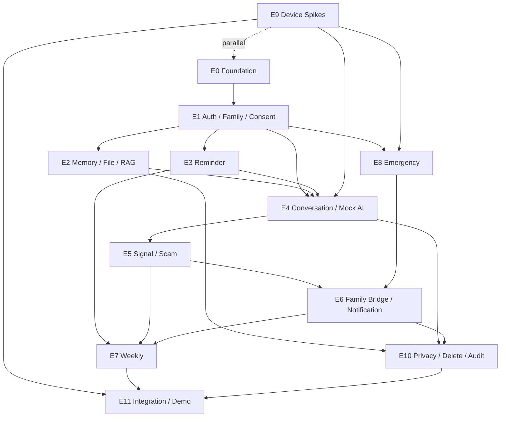

# 念念（NianNian）Development Plan

本计划把 Design Freeze Review 的结果转换为可交给 Coding Agent 的工作单。它不新增需求，不重写 API/DB/UI/AI/Device/Security 设计；所有实现都必须以现有 Source of Truth 和 [`open-decisions.md`](open-decisions.md) 为准。

## 1. Development Principles

1. 先建立可运行、可测试的纵向骨架，再逐步接入业务。
2. Contract-first：OpenAPI/WSS/DB 状态和 Consent 边界先有 contract test，再写实现。
3. Mock-first：外部 AI、Push、Avatar、WakeWord、Telephony 在真实 provider 前均有可复现 Mock。
4. Security is a feature：family scope、Consent、ownership、state 和审计在 service/query 层实现，不靠 UI 隐藏。
5. Privacy-preserving default：raw audio 不持久化；所有真实 S2/S3 provider 数据必须过批准的 data policy。
6. 每周有可演示增量；不把硬件/Provider Spike 冒充 Feature 完成。
7. 12 周内优先保住 9 项核心能力，允许简化 Avatar、Provider、动画、算法和部署复杂度。

## 2. Coding Agent Rules

1. 不修改需求或删除 P0 能力。
2. 不擅自修改 OpenAPI/WSS contract。
3. 不擅自修改 DB schema、enum、constraint 或 migration strategy。
4. 除非任务写明理由，不新增 dependency；新增依赖需记录体积、许可证、替代方案和 Mock 路径。
5. 不绕过 Consent、family scope、ownership、state 或 audit requirement。
6. 不让 LLM 决定权限、事实确认、通知、诈骗 verdict 或电话成功。
7. 不使用 `PENDING` Memory 作为事实或 RAG context。
8. 不保存 Raw Audio，除非 D-002 已批准且任务包含自动删除与证据。
9. 不把 secret、token、完整电话、真实家庭资料写入 Git、日志、测试 fixture 或截图。
10. 不把 Mock 伪装成真实 Provider/真实接通/真实发送。
11. 每个任务完成必须运行相关 unit/integration/contract/device/AI test，并记录结果。
12. 遇到 Contract、enum、状态机或 Security Boundary 冲突，停止受影响任务并报告，不静默选择。

## 3. Repository Structure

只记录推荐结构，本轮不创建空目录：

```text
nian-nian/
├── android/
│   ├── app-elder/
│   ├── app-family/
│   ├── core-model/ core-network/ core-database/ core-auth/
│   ├── core-common/ core-ui/ core-telemetry/
│   ├── feature-auth/ feature-consent/ feature-conversation/
│   ├── feature-memory/ feature-reminder/ feature-signal/
│   ├── feature-report/ feature-emergency/ feature-settings/
│   └── device/{ble,kiosk,camera,wakeword,telecom}/
├── backend/
│   ├── app/{api,modules,integrations,platform,worker}/
│   ├── alembic/
│   └── tests/{unit,integration,contract,ai_eval}/
├── infra/{docker-compose.yml,postgres/init,minio}/
├── docs/
├── scripts/
├── tests/{unit,integration,contract,ai,security,device,demo}/
└── README.md
```

## 4. Backend Structure

`backend/app/modules/` 按 `auth/family/consent/memory/conversation/reminder/safety/signal/notification/report/emergency/device/audit` 划分。每个模块拥有 `api/service/repository/model/schemas`；跨模块只调用公开 service/command/event，不导入私有 repository/model。`integrations/` 放 adapter、provider、mock；`platform/` 放 DB、settings、logging、object storage、task/outbox；`worker/` 放 scheduler、lease、retry、dead-letter。

## 5. Android Structure

使用已 Accepted 的两个 App + shared modules。`app-elder` 独占 BLE、kiosk、camera、wakeword、telecom、foreground service；`app-family` 不声明不必要的硬件权限。共享 `core-*` 提供 DTO、认证、网络、Room/DataStore、状态、无障碍组件和脱敏 telemetry。设备模块只产生 capability state/event，不直接创建 SignalEvent、发通知或调用 LLM。

## 6. Test Structure

```text
tests/
├── unit/          # domain state, policy, validators
├── integration/   # DB, worker, cache/vector/file propagation
├── contract/      # OpenAPI, WSS, adapter DTO and error codes
├── ai/            # cases, fixtures, runner, golden, thresholds
├── security/      # AUTH/CONS/RAG/FILE/WS/PRIV/EMG/DEV/DEL
├── device/        # named tablet, BLE, CameraX, audio, kiosk
└── demo/          # seed and vertical-slice smoke
```

## 7. Epic Overview

| Epic | Outcome | Priority |
| --- | --- | --- |
| E0 Engineering Foundation | repo, environments, backend/Android skeleton, CI, Mock boundary | P0 |
| E1 Auth / Family / Consent | login interface, sessions, family membership, invitation, Consent | P0 |
| E2 Memory / File / RAG | Memory lifecycle, private assets, confirmed-only retrieval | P0 |
| E3 Reminder | rules, execution, feedback, timezone, offline cache | P0 |
| E4 Conversation / AI | WSS state, orchestrator, Mock ASR/LLM/TTS/Avatar | P0 |
| E5 SignalEvent / Scam | deterministic rules, candidate validation, warning, dedupe | P0 |
| E6 Family Bridge / Notification | minimal notifications and family actions | P0 |
| E7 Weekly Report | structured metrics, fixed report, missing-data language | P0 |
| E8 Emergency | contacts, call state, deterministic emergency flow | P0 |
| E9 Device Integration | kiosk, boot, wakeword, presence, BLE, telephony Spike gates | P0 |
| E10 Privacy / Delete / Audit | export/delete propagation, audit, redacted logs | P0 |
| E11 Integration / Demo | seed, vertical slices, packaging, smoke and presentation | P0 |

## 8. Dependency Graph



## 9. Task Backlog

每行都使用统一 Task Template；`Files` 是 likely affected，不是授权可以任意修改的文件清单。

| Task ID | Title | Epic | Priority | Dependencies | Source Docs | Scope | Out of Scope | Acceptance Criteria | Tests | Files Likely Affected | Blocking Decisions |
| --- | --- | --- | --- | --- | --- | --- | --- | --- | --- | --- | --- |
| E0-T01 | Create monorepo build skeleton | E0 | P0 | none | system §16; ADR-001/002/004 | Gradle two apps, backend package, test roots | business features | clean checkout builds placeholders | Android/backend smoke | android/, backend/, tests/ | none |
| E0-T02 | Add dev/test/demo configuration | E0 | P0 | E0-T01 | system §15; UI Demo | typed settings, Mock/Real labels, no secrets | production infra | three configs load; demo visibly marked | config unit + secret scan | backend/platform, android/core-common | D-015 default |
| E0-T03 | Add structured redacted logging | E0 | P0 | E0-T01 | system §14; threat T-017 | request_id, correlation, error codes, redaction | analytics dashboard | no token/full phone/audio/transcript in fixtures | PRIV-002/008 | platform/logging, core-telemetry | none |
| E0-T04 | Provision PostgreSQL/pgvector/MinIO Compose | E0 | P0 | E0-T01 | ADR-003/006; DB | local services, private bucket, health checks | migration implementation | `docker compose` health and private bucket | infra smoke | infra/ | none |
| E0-T05 | Define Alembic initial schema task plan | E0 | P0 | E0-T04 | DB §§4/26 | migration ordering and review checklist only | writing migration now | plan covers 22 entities and rollback evidence | schema plan review | docs/plan, backend/alembic | none |
| E0-T06 | Generate OpenAPI/WSS contract fixtures | E0 | P0 | E0-T01 | api/openapi | load schema, operation inventory, WSS messages | changing contract | 74 operations and 9/11 messages asserted | contract tests | backend/tests/contract | none |
| E0-T07 | Add adapter protocols and deterministic mocks | E0 | P0 | E0-T01 | AI contracts; ADR-005 | ASR/LLM/Embedding/TTS/Avatar/WakeWord/Push/Weather interfaces | real provider | Mock outputs marked `provider=mock` and reproducible | adapter contract tests | integrations/ | D-003/004/005/009 deferred |
| E0-T08 | Add fictional demo seed fixtures | E0 | P0 | E0-T04 | DB seed; UI Demo | elder/child/family/memory/reminder/signal/report states | real data | idempotent namespace, no real PII | seed smoke + artifact scan | scripts/, tests/demo | D-015 |
| E1-T01 | Implement User and DeviceSession models/repositories | E1 | P0 | E0-T05 | DB §§7/16; API auth | hashed refresh, status, session revoke | final credential provider | no plaintext tokens; session ownership enforced | AUTH-008..013 | backend/modules/auth | D-001 defaults |
| E1-T02 | Implement DEMO login/refresh/logout contract | E1 | P0 | E1-T01 | API §5; D-001 | Mock credential discriminator, rotation, logout-all | SMS/OAuth | login works only with fictional demo accounts | auth contract tests | auth/api, core-auth | D-001 |
| E1-T03 | Implement Family/Invitation membership service | E1 | P0 | E1-T01 | DB §§7; API §14 | create, token hash, accept, dual confirmation, revoke | admin console | expired/reused token safe; ACTIVE only after confirmation | family integration | modules/family | none |
| E1-T04 | Implement Consent immutable history service | E1 | P0 | E1-T03 | DB §8; permission matrix | grant/revoke, scope checks, audit command | retention durations | revoke blocks next decision; history immutable | CONS-001/002/008 | modules/consent | D-002 policy default |
| E1-T05 | Implement authorization dependency/predicate library | E1 | P0 | E1-T03/T04 | permission matrix; threat T-001 | same-family/member/role/Consent/ownership/state checks | UI-only checks | cross-family and missing scope denied/hidden | AUTH-001..007/016/017 | platform/authz, all services | none |
| E1-T06 | Add auth/family/consent Android flows | E1 | P0 | E1-T02/T03/T04 | UI E-003/F-001/F-013/F-014 | loading/error/offline/permission states | polished visual redesign | first vertical slice can bind family and revoke scope | Android UI smoke | feature-auth/consent | D-001 |
| E2-T01 | Implement Memory models and repository | E2 | P0 | E1-T05 | DB §9; data dictionary | lifecycle, version, scope, confirmed invariants | new entities | Pending never searchable; cross-family impossible | memory unit/integration | modules/memory | none |
| E2-T02 | Implement private FileAsset upload lifecycle | E2 | P0 | E0-T04/E1-T05 | ADR-006; API §17 | signed upload/download, MIME/checksum/quarantine | public URLs/audio retention | URL rechecks Consent; bucket private | FILE-001..008 | modules/memory/integrations/storage | D-002 |
| E2-T03 | Implement Memory confirm/reject/revoke/delete commands | E2 | P0 | E2-T01/T02 | FR-021/023; DB | state transitions and cleanup command | physical cleanup worker details | API/RAG/cache hidden before worker completes | RAG-002..005, DEL-001 | modules/memory, worker | none |
| E2-T04 | Implement confirmed-only RAG query | E2 | P0 | E2-T01 | AI §10; DB §9 | hard family/Consent/status/vector filters, citation set | ANN tuning | unauthorized/pending/revoked rows never in context | RAG-001..007 | modules/memory, integrations | D-013 config only |
| E2-T05 | Add Memory/File Android screens | E2 | P0 | E2-T01/T02/T03 | UI E-006/007/012/F-005~008 | list/detail/pending/error/feedback | voice authoring | family can confirm and elder sees only authorized facts | UI + API contract | feature-memory | none |
| E3-T01 | Implement Reminder rules/timezone model | E3 | P0 | E1-T05 | DB §11; API §18 | recurrence, quiet hours, owner authorization | behavior-based personalization | IANA timezone and DST policy represented | reminder unit | modules/reminder | D-014 |
| E3-T02 | Implement worker ReminderExecution/idempotency | E3 | P0 | E3-T01/E0-T05 | ADR-007; DB | occurrence key, NO_RESPONSE worker, retries | real push | no duplicate occurrence | REM-001..009 | worker/reminder | none |
| E3-T03 | Implement feedback API and local pending sync | E3 | P0 | E3-T02 | FR-031/033; device §20 | DONE/LATER/SKIPPED; offline queue | medication truth inference | offline feedback sync once; NO_RESPONSE server-only | REM-003..012 | reminder, core-database | none |
| E3-T04 | Add Reminder UI and cached reminder presentation | E3 | P0 | E3-T03 | UI E-004/005/F-009~011/E-016 | human wording, no-response copy | advanced scheduling UI | three feedback paths and offline banner work | UI smoke/device offline | feature-reminder | D-014 |
| E4-T01 | Implement Conversation state/session service | E4 | P0 | E1-T05 | API §19/20; UI state model | session metadata, stable state, summary job command | provider audio | owner/family checked on create/end | conversation integration | modules/conversation | D-017 default |
| E4-T02 | Implement WSS envelope and 9/11 message handlers | E4 | P0 | E4-T01/E0-T06 | API WSS; security WS | sequence, type/size validation, reconnect | changing message set | malformed/replay/flood safely rejected | WS-001..009 | api/ws, tests/contract | D-017 |
| E4-T03 | Implement AIOrchestrator with Mock adapters | E4 | P0 | E2-T04/E3-T01/E0-T07 | AI design/contracts | precheck, RAG, LLM schema, citation, TTS/Avatar state | real provider | invalid/timeout output has no side effect | AI-001..007, G cases | ai/, conversation | D-003/005/009 |
| E4-T04 | Implement identity/unknown/fallback prompts | E4 | P0 | E4-T03 | FR-003/013/015; UI copy | prompt versions, honest fallback, summary redaction | prompt manager | no unsupported family fact, new-session prompt once | G-001/002/012/013/014 | ai/prompts | D-002 |
| E4-T05 | Add Elder Conversation UI | E4 | P0 | E4-T02/T03 | UI E-001/E-002/E-011 | state mapping, interrupt/repeat/slow, offline/error | Avatar SDK polish | no duplicate prompt; text fallback | UI/WSS smoke | app-elder/feature-conversation | none |
| E5-T01 | Implement deterministic scam/emergency rule package | E5 | P0 | E4-T03 | scam policy; FR-050/051 | versioned YAML/JSON, indicator combinations | runtime rule editor | rules explain and block sensitive action | SC-001..010 | safety/rules | D-012 default |
| E5-T02 | Implement SignalCandidate validation and event service | E5 | P0 | E1-T04/E4-T03 | AI signal; DB §14 | candidate merge, consent, dedupe, status | new RiskRule table | LLM cannot insert event; WITHHELD works | signal/AI cases | modules/signal | D-013 |
| E5-T03 | Implement warning/blocked-action WSS path | E5 | P0 | E5-T01/T02/E4-T02 | API WSS warning; UI E-009 | fixed warning, action block, source category | transfer integration | rule hit works with LLM/TTS down | AI-003, EMG-002 | conversation/safety | none |
| E6-T01 | Implement Notification and Attempt service | E6 | P0 | E5-T02/E8-T01 | DB §15; API §22 | minimal payload, dedupe, channel abstraction | provider-specific code | delivery status separate from event | PRIV-001, notification contract | modules/notification | D-003/004 |
| E6-T02 | Implement family dynamic feed/actions | E6 | P0 | E6-T01 | UI F-002/F-003 | list/detail/ack/contact/false-positive | full transcript view | actions audited and authorized | signal UI/integration | app-family/feature-signal | none |
| E6-T03 | Add MockPush + IN_APP polling mode | E6 | P0 | E6-T01 | ADR-008 | deterministic provider failure/success labels | production Push selection | demo never claims delivered without state | provider contract | integrations/mock | D-004 |
| E7-T01 | Implement InteractionMetric aggregation | E7 | P0 | E3-T02/E5-T02/E4-T01 | DB §13; AI §15 | structured counts/time buckets/repeated stats | medical score | source cutoff and timezone snapshot recorded | report unit/integration | modules/report/worker | D-013 |
| E7-T02 | Implement WeeklyReport fixed template | E7 | P0 | E7-T01/E6-T01 | FR-043; API §23 | metrics/narrative/missing_data, guarded language | open-ended diagnosis | forbidden medical terms rejected | report/AI eval | modules/report/ai | D-011 config |
| E7-T03 | Add Family Weekly Report UI | E7 | P0 | E7-T02 | UI F-004 | trend text, missing data, offline last READY | custom analytics | no narrative reverse calculation | UI smoke | feature-report | none |
| E8-T01 | Implement EmergencyContact and call domain service | E8 | P0 | E1-T05 | API §24; DB §16; ADR-014 | contact CRUD, observed state, idempotent call aggregate | guaranteed phone connect | no fake CONNECTED; failure reason present | EMG-001..012 | modules/emergency | D-010 |
| E8-T02 | Implement deterministic emergency entry | E8 | P0 | E5-T01/E8-T01 | scam §13; FR-053 | voice/button/screen source, local progress | LLM-only detection | works when LLM/TTS unavailable | EMG-001..004/010 | emergency/device bridge | D-010 |
| E8-T03 | Add Emergency UI and contact management | E8 | P0 | E8-T01 | UI E-010/F-015 | five/six observed states, fallback contacts | MDM UI | clear next action on no SIM/permission | EMG UI smoke | feature-emergency | D-010 |
| E9-T01 | Run named-device baseline/kiosk Spike | E9 | P0 | E0-T01 | ADR-010; device matrix | evidence model, Device Owner, Lock Task, reboot | universal OEM support | 10 reboot gate or visible fallback | ENV/KIO | device/kiosk, docs evidence | D-006 |
| E9-T02 | Run BLE protocol/dedupe Spike | E9 | P0 | E8-T01 | ADR-011 | packet capture, semantics, battery, reconnect | production adapter before evidence | protocol record and fallback | BLE-001..014 | device/ble | D-007 |
| E9-T03 | Run CameraX presence/privacy Spike | E9 | P0 | E0-T01 | ADR-012 | power/false trigger/privacy evidence | identity recognition | no frame/template/upload | CAM-001..011 | device/camera | D-008 |
| E9-T04 | Run offline wake/audio ownership Spike | E9 | P0 | E4-T01 | ADR-013; device audio | wake SDK, ASR/Call ownership, offline reminder | model training | one audio owner; no fake answer | AUD-001..010 | device/wakeword | D-009 |
| E9-T05 | Run telephony capability Spike | E9 | P0 | E8-T01 | ADR-014 | SIM/Telecom/call permission/outcomes | guaranteed carrier | observed state only; fallback works | EMG-005..009 | device/telecom | D-010 |
| E10-T01 | Implement invisible-first delete worker | E10 | P0 | E2-T03/E6-T01/E7-T02 | security §§9/10; retention | resource hidden, invalidate cache/vector/file/export/notification, retry | legal retention final values | partial failure visible; no resurrection | CONS/DEL P0 | worker/privacy | D-002/011 |
| E10-T02 | Implement AuditLog append-only service | E10 | P0 | E1-T05 | DB §18; privacy §15 | actor/action/result/target, read auditing | audit retention final value | no content/token/phone in rows | PRIV-007 | modules/audit | D-011 |
| E10-T03 | Implement provider redaction/data policy gate | E10 | P0 | E4-T03/E6-T01 | AI contracts; threat T-019 | task allowlist, provider approval check | actual provider integration | unapproved S2/S3 call blocked | AI-006/007 | integrations/security | D-003 |
| E10-T04 | Implement local cache/Keystore wipe | E10 | P0 | E1-T02/E3-T03 | privacy §7/9; device | encrypted token/cache, revoke/delete wipe | MDM full wipe | no plaintext token; stale cache hidden | DEV-001..004/007 | core-auth/database, device | D-016 |
| E11-T01 | Build first vertical slice seed/smoke | E11 | P0 | E1-T06/E2-T05/E6-T02 | requirements demo | login→family→Consent→Elder Home→Family Home | real provider | complete with Mock and fictional data | demo smoke | tests/demo, scripts | D-015 |
| E11-T02 | Build Reminder vertical slice | E11 | P0 | E3-T04 | requirements demo | create→offline/cache→feedback→family view | advanced escalation | no-response wording and sync | demo smoke | tests/demo | none |
| E11-T03 | Build Conversation + Mock AI slice | E11 | P0 | E4-T05/E5-T03 | requirements demo | identity→chat→unknown→warning→summary | real LLM/ASR | all fallback states observable | AI golden + UI | tests/demo | D-002/017 |
| E11-T04 | Add CI and release evidence | E11 | P0 | all E0/E1 contracts | requirements §12; security matrix | lint/unit/contract/Android build/seed smoke/artifact scan | complex DevOps | reproducible CI and evidence bundle | CI pipeline | .github/scripts/docs | none |

## 10. Parallel Work

可并行组：

- Backend foundation (E0-T01~07) 与 Android foundation (E0-T01 shared contract / app skeleton) 并行。
- Device Spikes E9-T01~05 与 Mock AI E0-T07/E4-T03 并行。
- Auth/Family/Consent E1 与 adapter contract/CI 并行；E2 Memory 与 E3 Reminder 在 E1 权限服务稳定后并行。
- E7 Report 可在 E3/E5 的结构化事件接口确定后并行；E10 privacy tests 可从 Batch 0 先写 fixtures。

必须串行的最小链：E0 → E1 → E2/E3 → E4 → E5/E6 → E7 → E11。Device 只在 E8/E11 接入真实能力时汇合。

## 11. Batch 0 — Engineering Foundation

执行顺序建议：`E0-T01, E0-T02, E0-T03, E0-T04, E0-T06, E0-T07, E0-T08, E1-T01, E1-T02 (DEMO), E9-T01..05 Spike kickoff, E10-T03 security gate fixtures, E11-T04 CI baseline`。

Batch 0 完成标志：两端可构建；FastAPI health endpoint 和 worker 可启动；PostgreSQL/pgvector/MinIO 可用；OpenAPI/WSS contract test 运行；Mock adapters 可调用；fictional seed 可重放；secret/log scan 通过；设备 Spike 有负责人和 evidence path。

## 12. Batch 1 — Auth / Family / Consent

执行顺序建议：`E1-T03, E1-T04, E1-T05, E1-T06`，随后 `E11-T01`。

Batch 1 完成标志：Demo user login/session、创建家庭、邀请码/双方确认、角色/权限、分项 Consent grant/revoke、AuditLog 和跨家庭 negative test 均通过；真实 credential provider 不属于 Batch 1 必需项。

## 13. Vertical Slices

1. **VS-01 Foundation to Home：** fictional Demo User → DEMO login → family binding → Consent → E-003 identity disclosure → E-001 Elder Home → F-001/F-002 Family Home。验证角色、scope、审计和 Mock 标识。
2. **VS-02 Reminder：** family creates Reminder → device caches → offline trigger → DONE/LATER/SKIPPED or NO_RESPONSE → sync → family history. 验证 timezone、幂等和“不等于未服药”。
3. **VS-03 Conversation + Mock AI：** new session identity prompt → WSS state → unknown fact fallback / confirmed RAG → scam warning → summary → family minimal event. 验证 WSS、RAG、LLM boundary、redaction。
4. **VS-04 Emergency/Device (after Spike)：** screen/voice/BLE source → local progress → observed call/mock state → family event. 只有真机证据通过后才宣称 kiosk/BLE/Telephony。

## 14. Device Spikes

| Spike | Question | Device | Experiment | Pass Criteria | Fallback | ADR affected |
| --- | --- | --- | --- | --- | --- | --- |
| SPIKE-001 Kiosk | Device Owner/LockTask/boot 是否稳定？ | named tablet | clean provision, exit, 10 reboot/crash cycles | ACTIVE only after observed lock; evidence saved | ordinary App + CONFIG_ERROR | ADR-010 |
| SPIKE-002 BLE | GATT/payload/press/battery/reconnect 是否可靠？ | named tablet + named button | capture services/payload, replay, screen-off, low battery | protocol and dedupe evidence; one case per event | screen/voice emergency | ADR-011 |
| SPIKE-003 Wake Word | offline SDK latency/ownership/license 是否可用？ | named tablet + mic | airplane mode, noise, wake→ASR→call transitions | local wake, one audio owner, no fake answer | button/tap | ADR-013 |
| SPIKE-004 Telephony | SIM/Telecom/permission/call-state 是否可观察？ | named tablet/SIM | call with/without SIM, deny permission, no answer, process death | exact observed status, no fake connected | MockPush/in-app/failed reason | ADR-014 |
| SPIKE-005 CameraX | presence detector功耗/误触发/隐私是否可接受？ | named tablet/camera | low light, photo background, duration/cooldown, file/network scan | no frame/template/upload; metrics captured | disable proximity | ADR-012 |
| SPIKE-006 Boot | force-stop/OEM policy 是否允许自启？ | named tablet | reboot locked/unlocked, force-stop, Doze | observed recovery or honest DEGRADED | manual launch + status | ADR-010 |

## 15. Security Tasks

Security P0 必须转为实现或测试，不能只留在文档：

| Control | Task mapping | Gate |
| --- | --- | --- |
| cross-family/IDOR | E1-T05 + AUTH-001..007/016/017 | zero unauthorized resource access |
| Consent revoke propagation | E1-T04 + E10-T01 + CONS-001..008 | next server decision denies/redacts |
| RAG hard filter | E2-T04 + RAG-001..007 | zero pending/revoked/cross-family retrieval |
| token/session | E1-T01/T02 + E10-T04 + AUTH-008..013 | rotation/reuse/logout/lost-device evidence |
| notification privacy | E6-T01/T03 + PRIV-001 | no full transcript/health on lock screen |
| prompt injection | E4-T03 + E10-T03 + AI-001..007 | candidate cannot execute privileged action |
| object storage | E2-T02 + FILE-001..008 | private bucket, signed URL, quarantine |
| raw audio/provider policy | E4-T04 + E10-T03 + PRIV-005/AI-007 | no unapproved persistence/send |
| emergency/BLE replay | E8-T01/T02 + E9-T02 + EMG/BLE | one logical case; actual outcome only |
| secrets/logs | E0-T03/E11-T04 + PRIV-002/003/008 | scan clean |

## 16. AI Tasks

先做 contracts、Mock、orchestrator、RAG hard filter、candidate validation、redaction、Golden Cases 和 metrics；真实 LLM/ASR/TTS/Embedding/Avatar provider 属于 E4 后半段且受 D-003/D-005/D-009 gate。AI 不能在 Batch 0 决定权限、通知、Memory confirmation、Emergency 或诈骗 verdict。

## 17. Demo Tasks

Demo seed 必须包含 fictional elder/child/family、confirmed/pending/revoked/deleted memories、reminder execution、SignalEvent、Notification、WeeklyReport、device degraded、provider failure 和 deletion partial-failure 状态。演示脚本按 VS-01→VS-02→VS-03→VS-04；每一步显示 Mock/演示状态，不伪造发送、接通或真实 Provider。

## 18. CI

课程级 CI 保持简单：

- Backend：format/lint、type checks（若项目启用）、unit、integration、OpenAPI contract、security negative tests。
- Android：Gradle build、unit、shared contract tests；named-device tests 在本地/实验记录，不假装 CI emulator 通过硬件 gate。
- AI：schema/policy/Golden Cases、redaction scan、dataset hash/threshold report。
- Repository：secret scan、fictional fixture scan、no raw audio artifact scan。
- Demo：seed idempotency、Mock provider parity、关键 vertical smoke。

## 19. Definition Of Done

```text
Implementation complete
Relevant tests pass and evidence recorded
No OpenAPI/DB/Security/Requirement contract violation
No secret or real personal data
Logging redacted
Error and offline handling present
Mock/Real mode clearly labelled
Audit written for sensitive actions
Docs/task status updated if implementation detail changed
```

涉及 API、DB、Consent/security boundary、enum 或跨模块行为时，DoD 还要求关联 Proposal/ADR 已 review；未 review 的变更不得合并。

## 20. 12-Week Mapping

| Week | Planned work | Exit evidence |
| --- | --- | --- |
| 1 | E0 foundation, Compose/backend skeleton, Compose/CI, device baseline kickoff | build, health, named-device record, Mock contracts |
| 2 | E1 Auth/Family/Consent, E9 BLE/kiosk/wake/telephony/camera spikes | VS-01 partial, AUTH/Consent tests |
| 3 | E2 Memory/File, E3 Reminder skeleton, E4 WSS state | confirmed-only Memory, reminder occurrence, WSS contract |
| 4 | E4 Mock AI conversation, identity/fallback/Avatar baseline | VS-03 conversation Mock path |
| 5 | E2 RAG/delete propagation, E3 offline cache/timezone | RAG negative and offline reminder evidence |
| 6 | E4 summary/proactive policy, E5 signal candidates/rules | signal candidate fixtures, no diagnosis |
| 7 | E5 Scam/SignalEvent, E6 Notification Mock/IN_APP | warning→family minimal event |
| 8 | E8 Emergency, E6 family actions, provider failure | actual call-state semantics, EMG tests |
| 9 | E7 metrics/report/template and Family UI | WeeklyReport with missing_data/observation language |
| 10 | E9 implement only passed device adapters; kiosk/BLE/camera/wake/telephony | hardware gate evidence or visible fallbacks |
| 11 | E10 deletion/audit/cache wipe; cross-device integration and negative security | P0 security suite and partial failure proof |
| 12 | E11 stabilization, performance/accessibility, seed/demo packaging, presentation | release checklist, known issues, final demo smoke |

**Scope pressure:** 12 周可覆盖核心闭环，但不能同时追求多 Provider、复杂 Avatar、多机型和生产级通知。若进度落后，简化外部能力和视觉复杂度，不删除 Auth/Consent/Memory/Reminder/Conversation/Signal/Scam/Notification/Report/Emergency 九项核心能力。

## 21. Risk Register

| Risk | Impact | Mitigation | Trigger | Owner |
| --- | --- | --- | --- | --- |
| Hardware/OEM | device P0 cannot be accepted | early named-device Spike, visible fallback | KIO/BLE/CAM/AUD/EMG fail | Device lead |
| Provider/network/retention | unstable demo or data exposure | Mock first, provider gate, no real S2/S3 early | D-003/004 unresolved | Integration/Security |
| Authorization | cross-family/privacy incident | query predicates and negative suites | AUTH/CONS failure | Backend lead |
| RAG cleanup | deleted facts reappear | invisible-first and vector/cache tests | RAG/DEL failure | Memory/AI lead |
| AI false positive/negative | safety/trust harm | deterministic rules, safe-similar eval | regression gate | Safety lead |
| Schedule | too many features for 12 weeks | batches, vertical slices, P0 protection | >1-week slip | Program lead |
| Integration drift | late demo breakage | OpenAPI/WSS contract CI, weekly smoke | contract diff | Tech lead |

## 22. Start Criteria

工程初始化可开始的最小条件：

1. `READY_WITH_NON_BLOCKING_DECISIONS` 已批准；D0 为 0。
2. Batch 0 tasks 有 owner、branch/worktree policy 和 test command。
3. Mock/DEMO/privacy-preserving defaults are explicit。
4. OpenAPI/WSS/DB docs are treated as read-only contracts; design changes have review path。
5. Security P0 fixtures and fictional seed are part of the first implementation batch。
6. Device Spikes have named hardware/evidence paths; unverified capabilities are `UNKNOWN`/`DEGRADED`。

**First coding action:** 执行 `E0-T01 Create monorepo build skeleton`，同时启动 `E0-T06` contract fixtures、`E0-T07` Mock adapters 和 `E9-T01..05` Spike 记录；随后进入 `E1-T01`。
