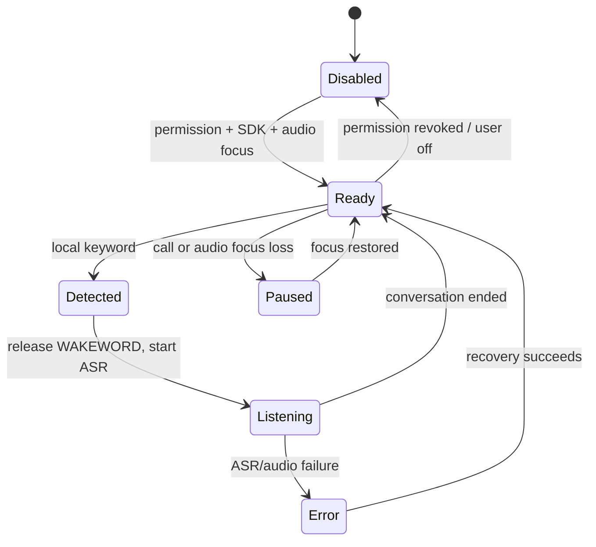
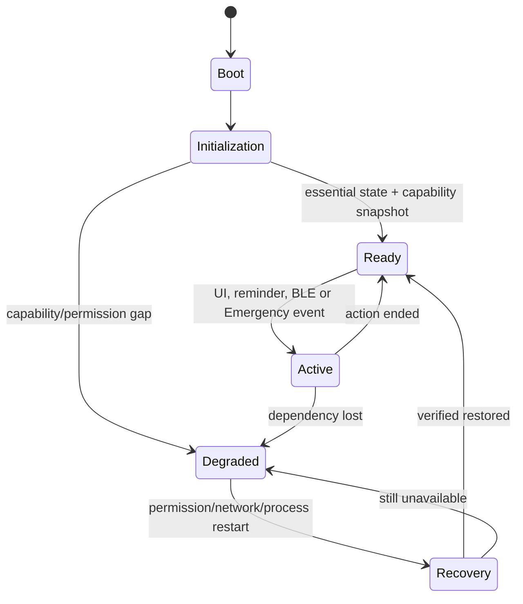
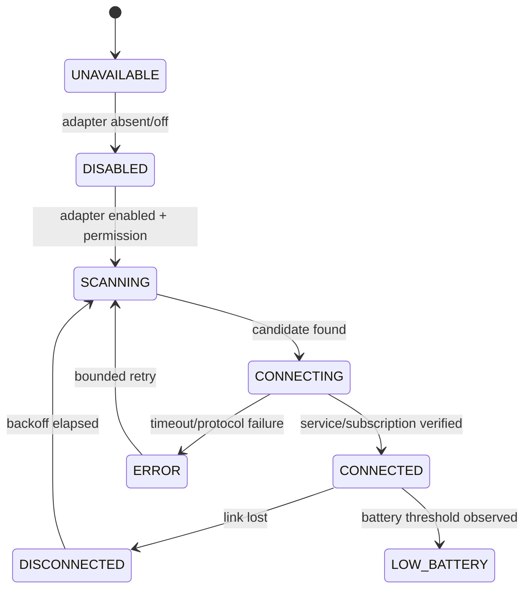
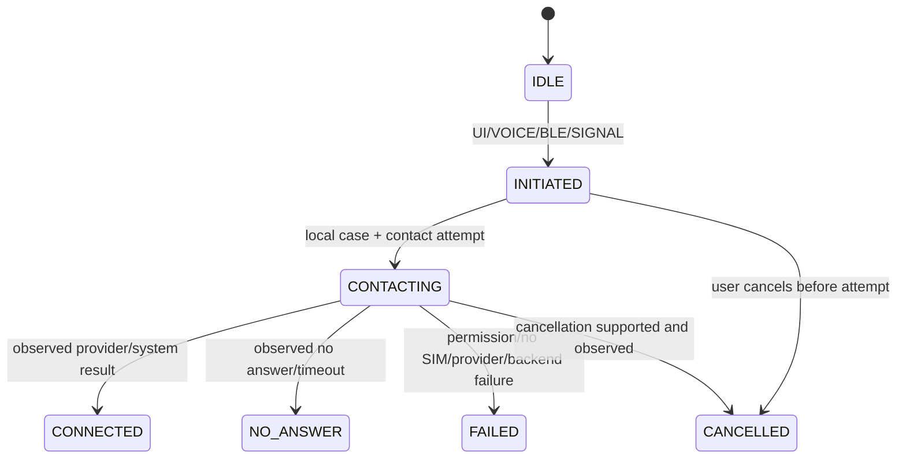
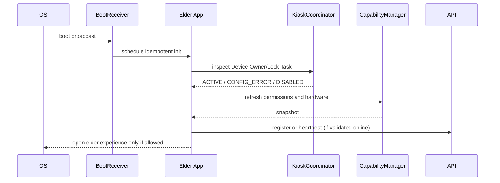
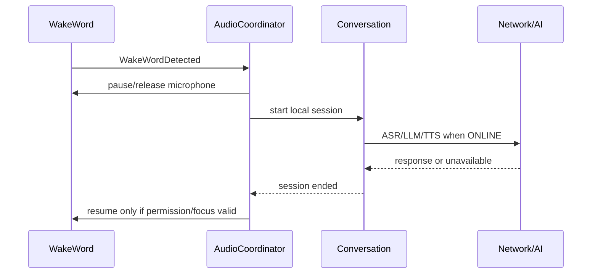
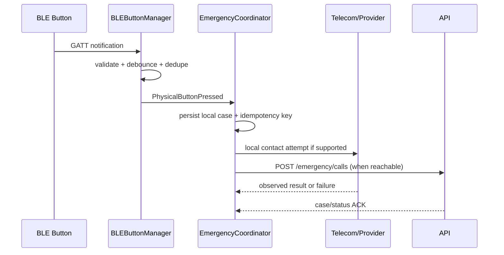
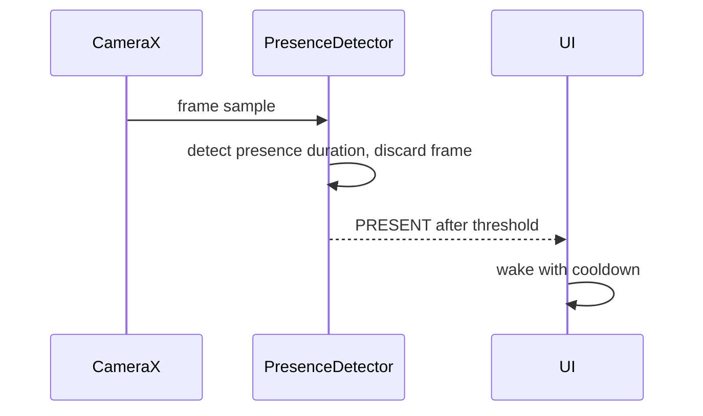
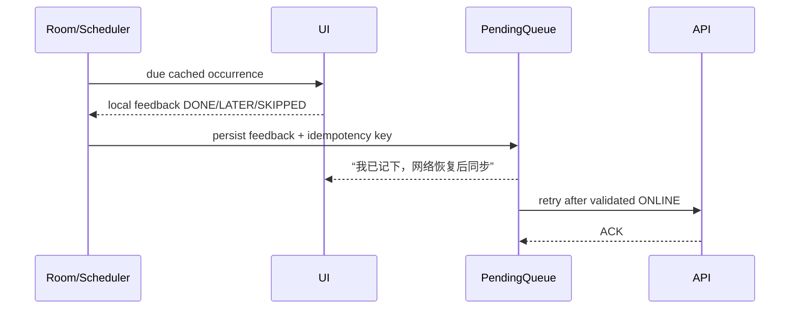
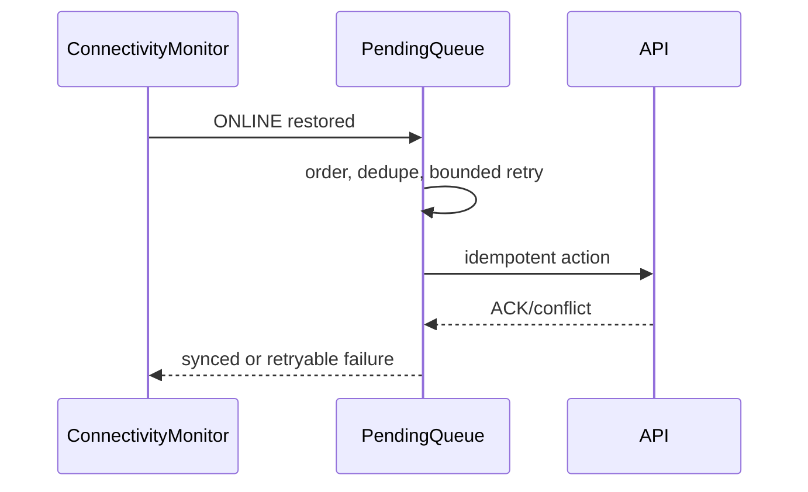

# 念念（NianNian）老人端 Android 设备集成设计

| 项目 | 内容 |
| --- | --- |
| 状态 | Baseline / Proposed where marked |
| 适用范围 | 12 周比赛版 `app-elder`，指定 Android 平板和指定 BLE 实体按钮 |
| 目标 | 为后续 Android Coding Agent 提供不依赖猜测的设备能力边界、状态、降级和验收规则 |
| 相关需求 | FR-053、FR-060~FR-063；NFR-可靠性、隐私、可解释失败 |
| 重要限制 | 不创建 Android 工程；不实现业务 Kotlin；不修改 API、数据库、AI Contract 或 UI Spec |

## 1. Purpose

本文定义老人端 Android 平板的设备集成边界。设备能力由本地 Android 适配器提供，普通业务通过稳定状态和事件使用能力；业务模块不得直接读取 `PackageManager`、`BluetoothAdapter`、`TelecomManager`、`CameraManager` 或厂商 SDK。

本文不把产品需求等同于设备已支持能力：

```text
Required Product Capability != Device / OS Capability
```

指定型号、Android 版本、SIM、Telecom、BLE GATT 协议、唤醒词 SDK、摄像头功耗和 Device Owner 可配置性目前没有在仓库中定稿。凡未有真机证据的项目均标记为 `DEVICE VALIDATION REQUIRED`。

## 2. Source Documents

本设计以以下文档为基线：

- `nian-nian-requirements-design.md`：FR-053、FR-060~FR-063、隐私与离线边界。
- `docs/system-design.md`：原生 Kotlin 双 App、`app-elder` 设备模块、Room/DataStore/WorkManager、Adapter 和 Mock 边界。
- `docs/database-design.md`：`DeviceBinding`、`ReminderExecution`、`EmergencyCase`、设备心跳节流和幂等约束。
- `docs/data-dictionary.md`：设备状态字段、提醒来源和错误字段。
- `docs/ui-interaction-spec.md`：Offline、Permission Denied、BLE、kiosk、Emergency 和 Avatar 状态。
- `docs/api-spec.md`、`docs/openapi.yaml`：设备注册/心跳、紧急联系、提醒反馈、`Idempotency-Key`。
- `docs/api-permission-matrix.md`：老人端设备、联系人、紧急流程的授权边界。
- `docs/ai-design.md`、`docs/ai-contracts.md`：离线唤醒、ASR/TTS、Audio Ownership、AI 失败降级。
- `docs/scam-signal-policy.md`：确定性紧急入口、去重和实际结果状态。
- `docs/adr/ADR-001-android-client.md`、`ADR-005-ai-adapters.md`、`ADR-007-background-tasks.md` 及现有 ADR-008/009 Proposed 决策。
- 本轮提出的 `ADR-010`（kiosk）、`ADR-011`（BLE）、`ADR-012`（Presence）、`ADR-013`（离线唤醒）和 `ADR-014`（Emergency Telephony）。

### 2.1 Contract alignment

本轮不修改 API。Android 侧按已有契约使用：

| 能力 | 现有契约 | 设备侧约束 |
| --- | --- | --- |
| 注册/状态 | `POST /devices/register`、`GET /devices/{id}` | `device_id` 只作注册输入，服务端保存 hash；不在日志写原值 |
| 心跳 | `POST /devices/{id}/heartbeat` | 只上传 `online`、`app_version`、`kiosk`、`ble`、`wakeword`、`critical_permissions`；正常状态默认最多 60 秒一次 |
| 紧急 | `POST /emergency/calls`、`GET /emergency/calls/{id}` | `source=VOICE|BLE|SCREEN|SIGNAL_EVENT`；真实状态只能是契约枚举 |
| 提醒 | `ReminderExecution` + feedback `DONE|LATER|SKIPPED` | 离线先落地本地，恢复后用幂等键同步；`NO_RESPONSE` 由 worker 产生 |
| 同步 | API `Idempotency-Key` | 本地 PendingAction 必须持久化 key、请求体摘要和重试状态 |

## 3. Device Baseline

### 3.1 Known baseline

| 项目 | 当前文档可确认内容 | 结论 |
| --- | --- | --- |
| 形态 | 指定 Android 平板，老人端长期运行 | 产品目标 |
| App | 原生 Kotlin + Jetpack Compose；`app-elder` 与 `app-family` 分离 | 已接受架构决策 |
| 设备能力 | kiosk、开机自启、离线唤醒、Presence、BLE 按钮、基础离线提醒 | P0 产品能力 |
| 本地技术 | Room + DataStore + WorkManager | 已选技术基线 |
| 服务 | 前台服务仅用于必要的 BLE、唤醒词或设备保持 | 设计约束，不代表已验证后台行为 |
| 隐私 | Camera 只检测有人；不存图片、不做人脸识别；不默认保存原始音频 | 硬性边界 |

### 3.2 Device Capability Checklist

在任何设备开发前填写；空值不是“支持”，而是 `UNKNOWN`。

| 检查项 | 需要记录的证据 | 当前状态 |
| --- | --- | --- |
| Manufacturer / model / SKU | 设置页、`adb shell getprop` 输出 | `DEVICE VALIDATION REQUIRED` |
| Android API level / security patch | 设置页和 `getprop` | `DEVICE VALIDATION REQUIRED` |
| Google Play / GMS | 设置页、包安装结果 | `DEVICE VALIDATION REQUIRED` |
| Device Owner provisioning | `dpm get-device-owner` 或等效厂商工具 | `DEVICE VALIDATION REQUIRED` |
| Lock Task allowlist / status | 进入和重启后锁定证据 | `DEVICE VALIDATION REQUIRED` |
| ADB / USB debugging | 开发设备设置和连接测试 | `DEVICE VALIDATION REQUIRED` |
| 是否可修改系统设置 | 电源、屏幕、默认 Launcher、Battery Optimization | `DEVICE VALIDATION REQUIRED` |
| Wi-Fi / captive portal | 断网、门户、恢复测试 | `DEVICE VALIDATION REQUIRED` |
| SIM / cellular / data | SIM 卡、APN、数据和信号测试 | `DEVICE VALIDATION REQUIRED` |
| Telecom capability | `TelecomManager`、电话 Intent、实际通话 | `DEVICE VALIDATION REQUIRED` |
| Bluetooth version / profiles | 系统信息、BLE 扫描与 GATT | `DEVICE VALIDATION REQUIRED` |
| BLE button model / protocol | 型号、服务 UUID、特征、payload、battery | `BLE PROTOCOL TBD` |
| Camera | 前置/后置、分辨率、低光表现、CameraX 兼容 | `DEVICE VALIDATION REQUIRED` |
| Microphone / audio input | 采样率、回声、权限、并发占用 | `DEVICE VALIDATION REQUIRED` |
| Speaker | 音量上限、TTS 可懂度、通话音频路由 | `DEVICE VALIDATION REQUIRED` |
| Battery / charger | 电池容量、插电策略、温度 | `DEVICE VALIDATION REQUIRED` |
| Screen | 尺寸、亮度、timeout、burn-in 风险 | `DEVICE VALIDATION REQUIRED` |
| OEM background policy | Auto-start、battery whitelist、后台限制 | `DEVICE VALIDATION REQUIRED` |

### 3.3 Hardware honesty rule

能力状态只由 `DeviceCapabilityManager` 输出。缺少硬件、系统开关、权限、Provider 或实测证据时分别返回 `UNKNOWN`、`DISABLED`、`PERMISSION_REQUIRED` 或 `DEGRADED`，不得返回 `SUPPORTED`。

## 4. Android Runtime Model

### 4.1 Component boundary

```text
app-elder
├── UI / Compose
├── Conversation
├── Reminder
├── Emergency
├── Device Integration
│   ├── kiosk
│   ├── boot
│   ├── ble
│   ├── presence
│   ├── wakeword
│   ├── telephony
│   ├── power
│   └── connectivity
├── Local Storage
└── Network / Sync
```

设备模块只提供状态流、能力查询、硬件事件和受控命令。它不能创建 `SignalEvent`、写业务数据库、发 Push、直接拨号或调用 LLM。

### 4.2 Kotlin-style interfaces (contract only)

```kotlin
enum class CapabilityState {
    SUPPORTED, UNSUPPORTED, PERMISSION_REQUIRED, DISABLED,
    DEGRADED, UNKNOWN
}

enum class DeviceCapability {
    MICROPHONE, CAMERA, BLUETOOTH, BLE_BUTTON, WAKE_WORD,
    TELEPHONY, KIOSK, BOOT_AUTOSTART, LOCAL_REMINDER,
    NETWORK, SPEAKER
}

interface DeviceCapabilityManager {
    fun snapshot(): Flow<Map<DeviceCapability, CapabilityState>>
    suspend fun refresh(): DeviceCapabilitySnapshot
    suspend fun explain(capability: DeviceCapability): CapabilityExplanation
}

interface DeviceEventSink {
    suspend fun onPhysicalButtonPressed(event: PhysicalButtonPressed)
    suspend fun onWakeWordDetected(event: WakeWordDetected)
    suspend fun onPresenceChanged(state: PresenceState)
}
```

`CapabilityState` 是设备事实；业务是否允许某个动作仍由 Emergency、Conversation、Reminder 和 Consent policy 决定。

### 4.3 App lifecycle

业务状态和临时 UI 状态分开保存：

| 状态 | 持久化/恢复策略 |
| --- | --- |
| `BOOTING` | 进程内；初始化完成后变为 `INITIALIZING` |
| `INITIALIZING` | 读取 DataStore/Room、刷新权限和能力、注册观察者 |
| `READY` | 能力快照可用，可进入老人首页 |
| `ACTIVE` | 对话、提醒、Emergency 或设备事件处理中 |
| `DEGRADED` | 某能力不可用但基础功能继续；原因必须可解释 |
| `RECOVERY` | 进程恢复、网络恢复或权限变化后的重绑定阶段 |
| Conversation UI | 不恢复失效的流式会话；标记结束并允许新会话 |

## 5. Kiosk and Device Owner

### 5.1 Strategy

目标是 dedicated device/COSU：`Device Owner` 配置后由 DPC/应用进入 `LockTaskMode`，并把老人 App 包加入 allowlist。普通 App 单独调用 `startLockTask()` 只能请求锁定当前任务，不能等价于完整 kiosk；屏幕固定（screen pinning）也不能阻止有权限的系统退出或保证重启恢复。

状态映射：

| 设备事实 | `kiosk_status` | 允许的产品行为 |
| --- | --- | --- |
| 未检查 | `UNKNOWN` | 显示配置待验证，不承诺锁定 |
| Device Owner + allowlist + Lock Task 生效 | `ACTIVE` | 老人体验可作为 kiosk 运行 |
| 尝试配置但权限/策略不满足 | `CONFIG_ERROR` | 显示管理员配置步骤，保留开发退出路径 |
| 明确关闭或不支持 | `DISABLED` | 继续普通 App 模式，标记功能降级 |

### 5.2 Demo Provisioning Procedure

仅对可抹除的比赛设备执行；命令必须在确认 Android 版本、包名和 DPC 方案后补入设备运行手册。

```text
Factory reset / clean test device
↓
Record model, API level, security patch and evidence
↓
Provision Device Owner using the Android-supported provisioning path
↓
Install signed elder build and verify package / version
↓
Apply Lock Task allowlist and required user restrictions
↓
Grant runtime permissions through documented admin/test path
↓
Set default home / boot policy only where device permits
↓
Launch elder app and verify kiosk_status=ACTIVE
↓
Reboot and repeat verification
```

`adb shell dpm set-device-owner` is not written as a universal production command: it may require a clean device, exact admin component and OEM/API-specific behavior. `DEVICE VALIDATION REQUIRED` remains until the real tablet passes provisioning and reboot tests.

### 5.3 Enter, exit and recovery

- Enter: after capability refresh, only the kiosk coordinator requests lock task; it reports the observed result.
- Exit for development: use a documented Device Owner removal/factory-reset path on a test device. Do not expose a hidden elder gesture in demo builds.
- Reboot: Boot flow checks Device Owner, allowlist and current lock task state; it re-enters only when policy permits.
- Crash: Android may leave the task unlocked or show the launcher. Device Owner kiosk policy, watchdog/OEM auto-start and a visible `KIOSK_CONFIG_ERROR` path must be tested; the app must not claim recovery before observing it.
- App update: stop/restart lock task according to the signed update procedure, then verify allowlist and package version again.

## 6. Boot Autostart

```text
BOOT_COMPLETED / LOCKED_BOOT_COMPLETED (when applicable)
↓
BootReceiver performs minimal, idempotent work
↓
Restore device state and schedule local work
↓
Start only allowed foreground work
↓
After user unlock, open elder experience when kiosk/OEM policy permits
↓
Refresh capabilities, heartbeat and reconnect BLE
```

Rules:

1. `RECEIVE_BOOT_COMPLETED` is a manifest permission, not proof that an Activity may be launched from the background.
2. Direct background Activity start after boot depends on API level, OEM policy, device owner/kiosk state and user-unlock state. Prefer an allowed kiosk/default-home path; otherwise post a notification or wait for launcher/user unlock and record `BOOT_AUTOSTART=DEGRADED`.
3. Use `LOCKED_BOOT_COMPLETED` only for data that is safe and available from device-protected storage. Do not read credential-protected Room data before unlock.
4. Receiver work must be short and idempotent; schedule longer work through WorkManager or a permitted foreground service.
5. `BOOT_COMPLETED` may be delayed after app force-stop or first install. Test those cases instead of assuming delivery.

## 7. Foreground Services and Process Recovery

### 7.1 Service boundaries

Do not create one permanent service for every feature.

| Component | Long-running need | Start/stop rule | Notification |
| --- | --- | --- | --- |
| `BleConnectionService` | Optional while BLE button is paired/needed | Start after explicit enable/reconnect; stop after unbind/disabled policy | Required visible FGS notification where API requires |
| `WakeWordService` | Only when offline wake word is enabled and audio ownership is `WAKEWORD` | Pause for ASR/call; stop on permission loss, disable or unsupported SDK | Required if service type/API requires |
| `DeviceStateService` | Not permanent by default | Short recovery/heartbeat work; prefer WorkManager | No always-on service |
| Emergency call | System/Telecom owns call audio | Start local coordinator, use Telecom/Intent, finish on observed result | Emergency progress UI/notification as allowed |

The exact Android `foregroundServiceType` and API-specific restrictions are `DEVICE VALIDATION REQUIRED`; manifest declarations must match the actual service use and target SDK.

### 7.2 Process death matrix

| Feature | Survives process death | Restart action | Not restored |
| --- | --- | --- | --- |
| Reminder | Room rule, occurrence key, scheduler intent | reschedule from local rules; reconcile missed occurrences | transient animation |
| BLE | Pair/bond state in OS; app connection state may be lost | reconnect with bounded backoff after capability refresh | duplicate button event |
| Wake word | SDK model/config if local; stream does not survive | restart only after permission and audio ownership check | in-flight audio |
| Kiosk | Device Owner policy may survive; task state is device-dependent | verify/re-enter lock task | claim of success without observation |
| Emergency | local case + idempotency key; Telecom may continue outside process | query/reconcile call result; never create duplicate contact | streaming conversation |
| Conversation | persisted metadata only | mark interrupted/ended and offer new session | ASR/LLM stream and raw audio |

Every restart runs `RECOVERY`: load essential state, rebind observers, reschedule reminders, reconnect BLE/wake word where eligible, emit one heartbeat and record a redacted transition.

## 8. DeviceCapability and Manager

### 8.1 Capability sources

`DeviceCapabilityManager` combines hardware presence, OS API, current permission, system setting, provider/SDK availability and last observed runtime state. It must distinguish:

```text
SUPPORTED       hardware/API exists and prerequisite checks pass
UNSUPPORTED     device/API cannot provide it
PERMISSION_REQUIRED  can provide it after user/admin permission
DISABLED        user/admin/system setting turned it off
DEGRADED        partially works or provider/network limitation is observed
UNKNOWN         not checked or evidence is stale
```

The manager publishes a timestamped snapshot. UI and heartbeat use the same snapshot; a stale snapshot is marked `UNKNOWN`/`DEGRADED` rather than silently reused.

### 8.2 Capability matrix

| Capability | Product requirement | OS/device prerequisite | Local fallback |
| --- | --- | --- | --- |
| `MICROPHONE` | voice interaction | input device + `RECORD_AUDIO` | button/text; local reminder still works |
| `CAMERA` | presence wake | CameraX-compatible camera + `CAMERA` | disable proximity wake |
| `BLUETOOTH` | BLE transport | adapter enabled + scan/connect permission | screen/voice Emergency |
| `BLE_BUTTON` | physical Emergency | known GATT protocol, paired/connected button | screen/voice Emergency |
| `WAKE_WORD` | offline wake | approved offline SDK/model + mic ownership | large button/tap |
| `TELEPHONY` | local contact path | SIM/cellular/Telecom/provider and permission | Push/SMS/VoIP/backend or in-app result |
| `KIOSK` | dedicated elderly device | Device Owner/DPC/Lock Task policy | ordinary App mode with warning |
| `BOOT_AUTOSTART` | restart resilience | boot broadcast + OEM policy/kiosk | manual launch + status error |
| `LOCAL_REMINDER` | offline reminder | clock, Room, scheduler, audio/UI | visible local card if audio unavailable |
| `NETWORK` | sync/online conversation | validated internet, not just network object | offline matrix |
| `SPEAKER` | audible feedback | output route and usable volume | text and visual status |

## 9. BLE Button Integration (P0)

### 9.1 Boundary

`BLEButtonManager` owns scanning, optional bonding, connection, GATT service discovery, subscription, reconnect, battery characteristic when available, and conversion to `PhysicalButtonPressed`. It does not own Emergency policy, notification, SignalEvent, database or phone APIs.

```kotlin
interface BLEButtonManager {
    val state: StateFlow<BleState>
    val events: Flow<PhysicalButtonPressed>
    suspend fun startDiscovery()
    suspend fun connect(deviceHint: String? = null)
    suspend fun disconnect(reason: DisconnectReason)
}
```

`BLE Protocol TBD`: before protocol evidence exists, do not decide single/long/double press semantics, service UUIDs, characteristic UUIDs, payload encoding, battery threshold or bonding requirement.

### 9.2 States

```text
UNAVAILABLE → DISABLED → SCANNING → CONNECTING → CONNECTED
                                      ↘ ERROR
CONNECTED → DISCONNECTED → SCANNING/CONNECTING
CONNECTED → LOW_BATTERY (connection may remain usable)
```

The API/UI mapping remains compatible with existing `DISCONNECTED`, `CONNECTING`, `CONNECTED`, `LOW_BATTERY`, `ERROR`; `UNAVAILABLE`, `DISABLED` and `SCANNING` are local detail states and map to a visible capability explanation.

### 9.3 Event reliability

Each accepted packet receives a local event id, monotonic timestamp, source device hash, characteristic hash and payload hash. Deduplicate on `(device_hash, protocol_sequence_or_payload_hash, event_time_window)`; if the protocol has no sequence, use a short bounded window and document its false-positive/false-negative tradeoff. A duplicate must not create a second EmergencyCase or second server request.

The pipeline is:

```text
BLE notification
→ validate service/characteristic/payload
→ debounce + event dedupe
→ PhysicalButtonPressed
→ EmergencyCoordinator
→ local progress UI
→ POST /emergency/calls (Idempotency-Key)
```

Emergency Coordinator decides confirmation policy. Hardware protocol evidence must determine whether a long press or double press is required; until then, mark `Decision Required` and keep a software dedupe guard.

### 9.4 Reconnect and power

- Foreground: scan briefly, then connect; do not loop continuously.
- Background/screen off: use OS-supported reconnect/connection priority only after real-device test; bounded exponential backoff with a cap and jitter.
- Bluetooth off: report `DISABLED`, do not spin scans; resume after adapter state changes.
- Button reboot: rediscover and re-subscribe; do not replay old notifications.
- App reboot: restore only paired device identity and desired-enabled setting; require fresh connection evidence.
- Low battery: show `LOW_BATTERY`; continue only if event reliability passes the acceptance test.

## 10. CameraX Presence Detection

### 10.1 Privacy and scope

Camera is a local presence sensor, not identity. It may output `PRESENT`, `ABSENT`, `UNKNOWN` and confidence band/duration. It must not perform face recognition, identity matching, face database lookup, biometric template creation or image upload. Frames are analyzed and discarded; no frame is written to Room, logs, analytics or backend.

### 10.2 Twelve-week recommendation

Use CameraX `ImageAnalysis` with a mature, configurable lightweight face/person detector (ML Kit Face Detection is a candidate; provider selection remains Proposed). The detector only answers “有人在设备前吗”; it does not return names or identity. A detector result requires a configurable continuous presence window before `Wake UI`, followed by cooldown to prevent repeated wakeups.

### 10.3 Lifecycle and power

| Condition | Camera behavior |
| --- | --- |
| App not ready / permission missing | unbound; `CAMERA=PERMISSION_REQUIRED` or `DISABLED` |
| Screen off / quiet hours | stop or sample at low duty cycle according to product setting |
| Home idle | short sampling windows, cooldown after wake |
| Conversation / Emergency | pause presence detection; audio/UI owns interaction |
| Process recovery | restart only after permission and lifecycle are valid |

Sampling interval, active window, resolution, CPU, battery drain, temperature, false wake and photo-background behavior are `DEVICE BENCHMARK REQUIRED`. Background image must not be treated as a person in acceptance tests.

## 11. Offline Wake Word and Audio Ownership

### 11.1 Wake word contract

`WakeWordManager` uses a mature offline SDK/model. It emits `WakeWordDetected(timestamp, confidenceBand, modelVersion)` and never authenticates identity or directly starts Emergency. No self-trained model is in scope.

Offline behavior: wake word can wake local UI, play a fixed local prompt, open cached Reminder/contacts and indicate that online conversation is unavailable. It must not fabricate an AI answer.

### 11.2 AudioSessionCoordinator

Only one owner may capture microphone input:

```text
IDLE → WAKEWORD → LISTENING → IDLE
             ↘ CALL → IDLE
```

Rules:

1. `WAKEWORD` owns a bounded local stream only while enabled and permission is granted.
2. On wake detection, pause/release `WAKEWORD` before ASR enters `LISTENING`.
3. During a system call, `CALL` owns audio; wake word and ASR are paused.
4. On ASR/TTS/conversation end, resume wake word only after audio focus and permission checks.
5. Audio focus loss, another app/Telecom call, microphone denial or SDK error moves to `IDLE`/`DEGRADED` and shows the fallback path.
6. Raw audio is not persisted by default. Debug retention requires a separate privacy decision and automatic expiry.

### 11.3 Wake word state machine



## 12. Reminder and Local Scheduling

### 12.1 Source of truth

```text
Backend Reminder
→ local Room cache (rule + timezone + version)
→ local occurrence scheduler
→ ReminderExecution(source=OFFLINE|ONLINE)
→ PendingAction feedback
→ server ACK and reconciliation
```

Server rules remain authoritative when online; local cached occurrences are allowed to execute while offline. A cached reminder is never silently edited into a new medication instruction.

### 12.2 WorkManager vs AlarmManager

| Mechanism | Use | Limitation |
| --- | --- | --- |
| WorkManager | sync, cleanup, retry, non-exact maintenance | not suitable for exact audible reminder time |
| AlarmManager inexact | ordinary low-risk reminders where timing tolerance is acceptable | Doze/idle may defer |
| exact alarm | only for a documented high-accuracy reminder class after permission/API validation | special access, battery and OEM behavior; not for every reminder |

Recommendation: use WorkManager for sync/reconciliation and an alarm-based scheduler for due reminders; reserve exact alarms only if the product acceptance criterion requires them and the device passes permission/power tests. On reboot/timezone/clock change, cancel and recompute future occurrences from the local timezone rule. Record a local-date/time snapshot and `occurrence_key`; never infer `NO_RESPONSE` as “未服药”.

Missed execution policy: on resume, mark occurrence as missed/pending according to reminder window and show “尚未收到反馈”; do not replay an unsafe number of medication prompts.

## 13. EmergencyCoordinator

All sources converge here:

```text
UI Button | Voice Intent | BLE PhysicalButtonPressed | AI/Rule Emergency
                              ↓
                      EmergencyCoordinator
```

```kotlin
enum class EmergencyState {
    IDLE, INITIATED, CONTACTING, CONNECTED,
    NO_ANSWER, FAILED, CANCELLED
}

interface EmergencyCoordinator {
    suspend fun initiate(source: EmergencySource, contactId: String?): EmergencyCase
    suspend fun cancel(caseId: String): EmergencyCase
}
```

State truth follows `docs/api-spec.md` and `openapi.yaml`. `CONNECTING` is a local/provider detail that maps to `CONTACTING` for the API if needed; do not invent `CONNECTED` without an observed provider/system result.

Conceptual flow:

```text
Trigger
→ local confirmation or configured immediate policy
→ persist local case + idempotency key
→ attempt local Telecom/Intent and/or backend notification
→ show actual observed result
→ queue sync if offline
```

Backend/provider failure must not erase a successfully launched local phone attempt. Conversely, “Intent launched” is not “human answered”.

## 14. Telephony Capability Matrix

| Scenario | Local capability | Recommended behavior | Must validate |
| --- | --- | --- | --- |
| A: SIM + Telecom + permission | Possible `ACTION_CALL`/Telecom path | Prefer local contact path, record `INITIATED`/`CONNECTING`; use `ACTION_DIAL` if user confirmation is required | SIM, cellular registration, default dialer, `CALL_PHONE`, kiosk compatibility, result callbacks |
| B: no SIM/Telecom | Local cellular call unavailable | Use backend Push/SMS/VoIP/external provider or in-app family path; show limitation | provider reachability, consent, fallback delivery |
| C: mixed | Some contacts/channels work | Try configured local-first path, then authorized fallback; preserve each attempt separately | contact channel, provider response, no duplicate call |

`ACTION_DIAL` opens a dialer and normally needs a user action; `ACTION_CALL` may place a call but requires `CALL_PHONE` and device/provider support. `TelecomManager` APIs and call-state callbacks vary by API/OEM and do not prove a human answered. The selected path is `Proposed` until true-device evidence exists.

No-SIM demo must still show a real local Emergency case, a mock/fallback family notification and an honest `FAILED`/`DEGRADED` reason when no external channel is available.

## 15. ConnectivityMonitor

Use validated internet capability, not only a non-null `Network`:

```text
UNKNOWN → ONLINE
        ↘ LIMITED / CAPTIVE_PORTAL
ONLINE → OFFLINE → LIMITED/ONLINE
```

`ConnectivityMonitor` combines transport availability, validated internet capability, captive portal detection, DNS/HTTPS probe policy and backend health. Probes must be bounded and privacy-safe; do not upload content to test connectivity.

| State | Meaning | Product behavior |
| --- | --- | --- |
| `ONLINE` | validated route and backend available | normal conversation/sync |
| `OFFLINE` | no validated internet | cached reminders, BLE, local wake, local Emergency path |
| `CAPTIVE_PORTAL` | network requires sign-in | show network action; do not call it online |
| `LIMITED` | route exists but backend/provider is unavailable or unreliable | use offline/degraded matrix, retry with backoff |

## 16. Offline Capability Matrix

| Capability | Online | Offline | Degraded / truth boundary |
| --- | --- | --- | --- |
| Wake Word | wake local UI and start online conversation | wake local UI/fixed prompt | no AI answer; button fallback |
| AI Conversation | ASR/LLM/TTS/Avatar adapters | unavailable unless a separately approved local model exists | show “现在没有网络” and preserve no fake answer |
| Reminder | sync rules and feedback | cached local schedule and feedback | stale cache is labelled; sync pending |
| Family Memory | authorized server RAG | last authorized cache only if policy allows | no new retrieval; revoke hides immediately |
| Weather | provider-backed | last cached value with time, or unavailable | never present stale value as current |
| BLE | local scan/connect/event | local BLE event and Emergency coordinator | no backend ACK; queue sync |
| Emergency | local + backend/provider | local Telecom if available; local case queued | no SIM/provider means actual `FAILED` with fallback |
| Presence | local CameraX detector | local detector if powered/permissioned | disable on denial/power policy; no identity inference |
| TTS | provider or local engine | local TTS only if installed and tested | text/visual fallback |
| Avatar | full UI states | cached/simple local states | no false speaking/online state |
| Family Notification | Push/SMS/provider | local queue | `PENDING`, never claim delivered |

## 17. Device Heartbeat

Heartbeat is a small device health snapshot, not telemetry. Minimum fields follow API/OpenAPI: `online`, `app_version`, `kiosk`, `ble`, `wakeword`, `critical_permissions`. The server-side `DeviceBinding` additionally owns latest `last_seen_at`, camera/phone permission and status.

Triggers:

- app start and post-recovery;
- normal periodic heartbeat, default at most once per 60 seconds while online;
- important state transitions: kiosk, BLE, wake word, critical permission, network offline/restore;
- explicit device register/rebind.

Do not send one heartbeat per BLE packet, frame, audio buffer or UI recomposition. If offline, coalesce the latest snapshot and send once after validated connectivity returns. Never upload camera frames, face data, raw microphone, full phone numbers, full conversation or family memory.

## 18. Android Permission Matrix

| Permission / control | Class | Used by | Denied/degraded behavior |
| --- | --- | --- | --- |
| `RECORD_AUDIO` | Manifest + runtime | ASR, wake word | voice unavailable; button, text, reminders and contacts continue |
| `CAMERA` | Manifest + runtime | CameraX presence | proximity wake disabled; no frame access |
| `BLUETOOTH_SCAN` | Manifest/runtime on applicable Android | BLE discovery | BLE `PERMISSION_REQUIRED`; screen/voice Emergency remains |
| `BLUETOOTH_CONNECT` | Manifest/runtime on applicable Android | connect/read GATT | no connect; explain and retry from settings |
| `POST_NOTIFICATIONS` | Manifest + runtime on applicable Android | FGS/user notification where applicable | in-app status remains; do not assume notification delivery |
| `CALL_PHONE` | Manifest + runtime | `ACTION_CALL`/Telecom path | use `ACTION_DIAL` or configured fallback; show no local call |
| `RECEIVE_BOOT_COMPLETED` | Manifest | boot receiver | no automatic boot path; show kiosk/config error |
| `FOREGROUND_SERVICE` and matching service type | Manifest/special API rules | BLE/wake word service | service not started; use shorter/lower-power path |
| `WAKE_LOCK` (only if justified) | Manifest/runtime behavior | bounded reminder/audio window | avoid indefinite wake lock; scheduler/UI fallback |
| exact alarm access (`SCHEDULE_EXACT_ALARM` / API-equivalent; API/OEM dependent) | Special access | only high-accuracy reminders | use inexact/WorkManager and disclose timing tolerance |
| Battery optimization exemption | Special/system setting | only if measured necessary | do not assume exemption; test OEM policy first |
| Device Owner / Lock Task | Device setup/system policy | kiosk/boot recovery | `KIOSK_CONFIG_ERROR`; ordinary App mode |
| `CAMERA_PROXIMITY` Consent | Product consent, server checked | presence feature | camera remains off until consent |

Manifest declaration does not grant runtime or special access. Every denial records a stable `PERMISSION_*` error and exposes one recovery path; permanently denied permissions lead to an explanation plus Settings/admin instructions, not repeated prompts.

For newer target SDKs, the foreground service declaration must also include the matching service-type permission (for example microphone, camera or connected-device type) when the target API requires it. The exact manifest names and rollout behavior are `DEVICE VALIDATION REQUIRED`; the implementation must derive them from the selected target SDK and actual service use, not copy a universal list.

## 19. Power, Screen and Avatar

- Doze/App Standby, OEM task killers and charger state remain relevant even on a plugged-in tablet.
- Keep screen timeout and brightness within a demo profile; do not require 24-hour full brightness. Productized always-on behavior needs burn-in, heat and power measurement.
- Presence wake is a bounded active window with cooldown; Camera is not a 24-hour full-resolution stream.
- Avatar `IDLE` may use a low-rate/static animation; `LISTENING`/`SPEAKING` can restore activity. No complex GPU optimization is in scope before a measured bottleneck.
- Battery policy must preserve Emergency and local reminders before presence/avatar polish.

## 20. Local Persistence and Pending Sync

### 20.1 Local data

Room stores: cached authorized session metadata, Elder profile minimum fields, Reminder rules/occurrences, Emergency Contact snapshot, device configuration, capability snapshot, PendingAction and last sync cursor. DataStore stores non-sensitive preferences and feature switches. Tokens use Android Keystore-backed storage or the project authentication storage abstraction; do not put refresh tokens in plain SharedPreferences.

Local caches have family/owner/version/expiry metadata. Consent revoke or Memory deletion makes data invisible immediately; physical cleanup may be asynchronous.

### 20.2 PendingAction

```text
PendingAction
{ id, type, idempotency_key, owner, created_at,
  payload_redacted_or_encrypted, payload_hash,
  retry_count, next_retry_at, status, last_error }
```

```text
offline action
→ local transaction (business result + PendingAction)
→ validated connectivity
→ bounded retry with Idempotency-Key
→ server ACK / conflict resolution
→ mark SENT and remove only after durable ACK
```

Emergency attempts, Reminder feedback and important device state changes must be idempotent. A repeated BLE packet, process restart or network retry cannot create duplicate Emergency calls or Reminder feedback.

## 21. Logging and Error Codes

Allowed structured fields: `device_id_hash`, `app_version`, capability, state transition, BLE status, wake word event metadata, permission state, error code, latency and request id. Prohibited: raw audio, camera frame, full phone number, family memory, full conversation and tokens.

Stable code families:

| Prefix | Examples |
| --- | --- |
| `DEVICE_*` | `DEVICE_INIT_FAILED`, `DEVICE_STATE_STALE`, `DEVICE_CONFIG_UNKNOWN` |
| `KIOSK_*` | `KIOSK_NOT_DEVICE_OWNER`, `KIOSK_ALLOWLIST_MISSING`, `KIOSK_LOCK_FAILED` |
| `BOOT_*` | `BOOT_RECEIVER_NOT_DELIVERED`, `BOOT_ACTIVITY_NOT_ALLOWED` |
| `BLE_*` | `BLE_DISABLED`, `BLE_PROTOCOL_UNKNOWN`, `BLE_CONNECT_TIMEOUT`, `BLE_DUPLICATE_EVENT` |
| `WAKEWORD_*` | `WAKEWORD_PERMISSION_DENIED`, `WAKEWORD_SDK_UNAVAILABLE`, `WAKEWORD_AUDIO_BUSY` |
| `CAMERA_*` | `CAMERA_PERMISSION_DENIED`, `CAMERA_ANALYSIS_ERROR`, `CAMERA_POWER_LIMITED` |
| `AUDIO_*` | `AUDIO_FOCUS_LOST`, `AUDIO_OWNER_CONFLICT`, `AUDIO_ROUTE_UNAVAILABLE` |
| `TELEPHONY_*` | `TELEPHONY_NO_SIM`, `TELEPHONY_PERMISSION_DENIED`, `TELEPHONY_PROVIDER_UNAVAILABLE` |
| `PERMISSION_*` | `PERMISSION_RUNTIME_DENIED`, `PERMISSION_PERMANENTLY_DENIED` |
| `CONNECTIVITY_*` | `CONNECTIVITY_OFFLINE`, `CONNECTIVITY_CAPTIVE_PORTAL`, `CONNECTIVITY_BACKEND_LIMITED` |
| `REMINDER_*` | `REMINDER_CACHE_STALE`, `REMINDER_SCHEDULER_FAILED`, `REMINDER_SYNC_PENDING` |

Errors exposed to elders are plain language and next actions; technical codes remain in telemetry/API error mapping.

## 22. State Machines

### 22.1 App lifecycle



### 22.2 BLE



### 22.3 Wake word / conversation

See Section 11.3; AudioSessionCoordinator is the only owner transition authority.

### 22.4 Emergency



## 23. Sequence Diagrams

### 23.1 Boot → Kiosk → Ready



### 23.2 Wake Word → Conversation



### 23.3 BLE Button → Emergency



### 23.4 Presence → Wake UI



### 23.5 Offline Reminder



### 23.6 Connectivity Restore → Pending Sync



## 24. Demo Mode and Safe Fallback

`Demo Mode` is an explicit build/configuration flag visible in Settings and device status. It may use Mock AI, Mock family notification, fixed Memory and fixed SignalEvent, and mock phone results. It must label provider/result as mock and never display mock delivery as a real external success.

Required demo paths without public internet:

- cached Reminder and feedback;
- local BLE event with mock/fallback Emergency result;
- offline wake word → fixed local prompt;
- Presence wake with no identity data;
- permission-denied and kiosk-config-error screens;
- heartbeat queue and later sync.

## 25. Hardware Acceptance Gate

No large-scale device implementation starts until the named tablet passes or has an approved fallback for every row:

| Capability | Expected | Evidence | Fallback if failed | Decision |
| --- | --- | --- | --- | --- |
| Kiosk | Device Owner + Lock Task survives reboot | 10 reboot logs, exit attempt | ordinary App + operator control | `DEVICE VALIDATION REQUIRED` |
| Boot | app recovery and essential reschedule | 10 reboot logs | manual launch / OEM configuration | `DEVICE VALIDATION REQUIRED` |
| Microphone | permission, clear input, no ownership conflict | quiet/noisy/distance runs | button/text | `DEVICE VALIDATION REQUIRED` |
| Speaker | reminder/TTS intelligible at safe volume | audio level and route record | text/visual | `DEVICE VALIDATION REQUIRED` |
| BLE | pair/connect/subscribe/event/reconnect | protocol capture + latency | screen/voice Emergency | `BLE PROTOCOL TBD` |
| Camera | CameraX presence, no image persistence | person/photo/dark/multi-person run | disable proximity | `DEVICE BENCHMARK REQUIRED` |
| Wake word | offline trigger and pause/resume audio | disconnected network run | button/tap | `DEVICE VALIDATION REQUIRED` |
| Local reminder | reboot/timezone/offline behavior | occurrence logs | visible local card | `DEVICE VALIDATION REQUIRED` |
| Telephony/fallback | actual local or honest fallback path | SIM/no-SIM/provider tests | Push/SMS/VoIP/mock | `DEVICE VALIDATION REQUIRED` |
| Network | online/offline/captive/limited states | monitor logs | offline matrix | `DEVICE VALIDATION REQUIRED` |

Record failures as `Capability / Expected / Observed / Impact / Fallback / Decision`; do not hide them in a pass rate.

## 26. Demo Readiness Checklist

```text
[ ] Device charged and charger/cable tested
[ ] Model, API level, patch and build hash recorded
[ ] Correct signed elder build installed
[ ] Demo Mode label and mock provider banner verified
[ ] Device Owner / kiosk status verified after reboot
[ ] Development exit path documented off-stage
[ ] Wi-Fi configured; offline and captive-portal paths rehearsed
[ ] Elder session/auth and emergency contacts configured
[ ] Microphone permission granted and audio ownership test passed
[ ] Camera consent/permission granted or documented disabled fallback
[ ] Bluetooth enabled and BLE button connected
[ ] BLE duplicate-press and disconnect behavior tested
[ ] Wake word tested with network disconnected
[ ] Local reminder tested offline, after reboot and after clock/timezone change
[ ] Emergency tested with SIM and no-SIM/fallback scenario
[ ] Pending sync visible and replayed after connectivity restore
[ ] Battery, temperature and screen brightness checked
[ ] No raw audio, camera frame or full phone number in logs/demo screen
[ ] Backup screen/button path available if voice/BLE fails
```

## 27. Open Decisions

| Decision | Current position | Owner/evidence needed |
| --- | --- | --- |
| Exact tablet model/API/OEM | Unknown | hardware inventory + `adb` evidence |
| Device Owner/DPC path | Proposed COSU/Lock Task | clean-device provisioning and reboot test |
| BLE protocol and press semantics | `BLE Protocol TBD` | vendor packet capture and duplicate tests |
| Wake word SDK/model/license/offline behavior | provider-neutral | SDK spike on target tablet |
| Presence detector | ML Kit candidate, Proposed | privacy, power, false-trigger benchmark |
| Exact reminder timing | inexact by default; exact only if required | product acceptance + special-access test |
| Local telephony | capability matrix, not promised | SIM/Telecom/OEM test |
| FGS types and OEM exemptions | unknown | target SDK/API and battery policy test |
| Screen always-on policy | demo profile only | burn-in/heat/power measurement |
| Raw audio debug retention | disabled by default | privacy owner decision if needed |

## 28. Risks

1. Device Owner or OEM boot policy may prevent a reliable kiosk/autostart experience.
2. BLE GATT protocol, background reconnect and battery characteristic are unknown; P0 Emergency can be blocked until a real button is available.
3. Android Telecom/SIM availability may make local phone calls impossible; backend/fallback must remain demonstrable.
4. Wake word, ASR and system call audio can contend for the microphone without strict ownership.
5. Camera presence detection can consume battery, heat the tablet or false-trigger on photos; benchmark before enabling long windows.
6. Doze/OEM task killing can delay reminders, FGS or reconnect despite the device being plugged in.
7. Offline cached data can become stale or revoked; visibility and idempotent reconciliation must be tested.
8. Permission denial can remove voice/camera/BLE features; all fallbacks must remain usable by an elderly user.

## 29. Change Proposals

### API Change Proposals

None. Existing device heartbeat, emergency, reminder feedback and idempotency contracts are sufficient. An implementation may need a future API proposal for richer capability evidence or per-attempt telephony results, but this round does not change OpenAPI.

### UI Change Proposals

None required for this round. Existing UI states express `OFFLINE`, `Permission Denied`, BLE, kiosk config error, Emergency result and sync pending. If product later needs a distinct `CAPTIVE_PORTAL` or `TELEPHONY_NO_SIM` card, add it as a reviewed UI change rather than overloading `OFFLINE`.

## 30. Implementation Handoff Rules

The future Android Coding Agent must first complete the Hardware Acceptance Gate and fill the checklist. It may then implement adapters behind this document's interfaces, add unit/contract tests for state transitions and use the device test matrix as the release gate. It must not promote a Proposed decision to Accepted based only on emulator behavior.
