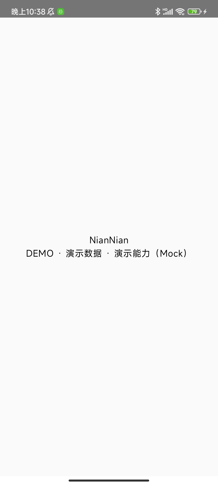

# E0-T02 configuration and secret-scan evidence

Date: 2026-09-23. Scope: dev/test/demo profile loading, source labels, and repository secret scan.

## Status clarification — 2026-10-01

**E0-T02 configuration and Demo/Mock entry-screen labels are complete (`PASS`). Business seed display remains pending subsequent business flows (`NOT VERIFIED`).** This status review uses the configuration implementation and the recorded 2026-09-30 Xiaomi 12 acceptance below; it does not claim a new device run.

- Backend dev/test/demo configuration and Android dev/qa (test)/demo flavors are implemented. Both app entry screens render the shared Demo/Mock status label; the saved device evidence covers both Demo apps.
- E0-T08 provides a deterministic fictional fixture, but fixture validation does not establish live database replay or business UI display. The current entry screens show only the static title and configuration status and do not load seed records.
- `docs/development-checklist.md` separates the completed E0-T02 gate from the pending fictional-seed business-flow gate. Database replay and on-device business seed display await their subsequent flows and E11-T01 vertical-slice acceptance; no subsequent task is executed by this review.

Current status-review checks:

| Check | Result |
| --- | --- |
| `backend/.venv/Scripts/python.exe -m pytest backend/tests/test_config.py -q -p no:cacheprovider --basetemp=.task-temp/e0-t02-status-20261001-pytest` | PASS; 11 tests |
| `backend/.venv/Scripts/python.exe scripts/seed_demo_data.py --check` | PASS; 24 deterministic fictional rows, no database write |
| Saved Elder/Family screenshot SHA-256 compared with `E0-T02/xiaomi12-display-check.json` | PASS; both match the recorded device artifacts |
| `git -c safe.directory=D:/class_project diff --check` | PASS |

The first configuration-test invocation used a nested temporary path whose parent did not exist, causing five fixture setup errors. The corrected command above completed all 11 tests successfully. Android build/device acceptance and artifact-scan results below remain dated evidence, not newly executed checks.

## Configuration

- Backend: `backend/config/{dev,test,demo}.env` loads through `load_settings`; `APP_ENV` selects each profile through `get_settings`. All checked-in profiles select Mock, while demo requires `DEMO_DATA=true`. Tests also cover a local dev Real override, invalid modes, demo Real rejection, and secret-free settings representation.
- Android: both apps define dev, qa (test), and demo flavors. The shared label for demo reads `DEMO · 演示数据 · 演示能力（Mock）`; dev/test and Real labels have unit assertions. Both app entry screens render that shared label.

## Commands and results

| Check | Result |
| --- | --- |
| `backend\.venv\Scripts\python.exe -m pytest backend/tests/test_config.py -q -p no:cacheprovider --basetemp=.task-temp/pytest` | PASS, 11 tests |
| `backend\.venv\Scripts\python.exe -m pytest backend/tests tests -q -p no:cacheprovider --basetemp=.task-temp/pytest-full` | PASS, 27 tests |
| From `android/`: `.\gradlew.bat --offline --no-daemon :core-common:test :app-elder:assembleDemoDebug :app-family:assembleDemoDebug -q` | PASS; RuntimeConfigTest debug and release XML each report 2 tests, 0 failures/errors |
| From `android/`: `.\gradlew.bat --offline --no-daemon :app-elder:assemble :app-family:assemble -q` | PASS; dev, qa (test), and demo variants assembled for both apps |
| `python -m unittest discover -s tests/security -p test_*.py -v` | PASS, 9 tests; source/fixture, reachable Git blob history, and 12 built APKs scanned |
| `git -c safe.directory=D:/class_project ls-files .env` | PASS, no tracked local `.env` file |

The secret scan checks known private-key, access-key, bearer-token, and full-phone patterns. It is a pattern scan, not a guarantee against every credential format. Runtime/crash logs and fictional demo seed acceptance are separate gates; the E0-T08 seed is not implemented by this task. On-device visual inspection had not been run as of 2026-09-23; the follow-up below supplies the device display evidence.

## Xiaomi 12 device display acceptance — 2026-09-30

**PASS for the E0-T02 Demo/Mock entry-screen display gate on both apps.** Source: E0-T02 acceptance in `docs/development-plan.md`, Demo/source labels in `docs/ui-interaction-spec.md` §§2/7.1/15, and the current app configuration. No product code or contract was changed.

### Device and configuration

- Physical Xiaomi 12: manufacturer `Xiaomi`, model `2201123C`, codename `cupid`; Android 12 (API 31), MIUI `V13.0.41.0.SLCCNXM`.
- Observed display: 1080×2400, density 440 dpi, font scale 1.0; unlocked, portrait screen. Device serial and account identifiers are omitted.
- Both installed applications: `demoDebug`, version `0.1.0-demo` / code 1. Generated `BuildConfig` declares `ENVIRONMENT="demo"` and `PROVIDER_MODE="mock"`. Each installed APK's SHA-256 equals its locally built APK's SHA-256.
- Backend `backend/config/demo.env` independently declares `PROVIDER_MODE=mock`, `DEMO_DATA=true`; these Android skeletons do not connect to that backend.
- [Machine-readable device, package, label bounds and artifact hashes](E0-T02/xiaomi12-display-check.json).

### Observed screens

| App / installed package | Launch | Observed status text | Visibility and configuration |
| --- | --- | --- | --- |
| Elder / `org.example.niannian.elder.demo` | `am start -W`: `Status: ok`, `LaunchState: COLD` | `DEMO · 演示数据 · 演示能力（Mock）` | PASS: complete, readable, no clipping or obstruction; matches demo/mock |
| Family / `org.example.niannian.family.demo` | `am start -W`: `Status: ok`, `LaunchState: COLD` | `DEMO · 演示数据 · 演示能力（Mock）` | PASS: complete, readable, no clipping or obstruction; matches demo/mock |

The shared status label is visible immediately on the configuration entry screen without scrolling or opening a hidden control. UI Automator reports the expected label and each app's own package, at `[128,1222][952,1288]`, fully inside the display. Both raw PNGs were visually inspected; neither screen claims real provider delivery or call connection.

**Elder — unedited physical-device screenshot:**

**Family — unedited physical-device screenshot:**

### Data and privacy scope

Only the static `NianNian` title and Demo/Mock status are displayed. No real family data, names, phone numbers, credentials, conversations, photos or notifications containing personal content appear in the screenshots. PNGs are original `adb screencap` output, with no generated, composited or substituted UI.

The current apps have no business-data screens or seed loading. The existing E0-T08 fictional fixture passed `--check` (24 deterministic rows), but **fictional family records rendered on-device are NOT VERIFIED**. These are safe Demo configuration screenshots, not evidence of the E0-T08 fixture displayed in a business flow. Adding such a flow belongs to its own task.

### Commands and follow-up results

ADB executable: `C:/Users/13901/AppData/Local/Android/Sdk/platform-tools/adb.exe`. `<device>` below means the explicitly selected attached Xiaomi 12; no serial is retained. Run Gradle from `android/`, and Python from repository root.

| Check | Result |
| --- | --- |
| `.\gradlew.bat --offline --no-daemon :core-common:test :app-elder:assembleDemoDebug :app-family:assembleDemoDebug -q` | PASS; both Demo debug APKs built |
| `.\gradlew.bat --offline --no-daemon :core-common:testDebugUnitTest :core-common:testReleaseUnitTest --rerun-tasks -q` | PASS; 3 tests per variant (RuntimeConfig 2 + BuildInfo 1), 6 total, no failures/errors/skips |
| `backend/.venv/Scripts/python.exe -m pytest backend/tests/test_config.py -q -p no:cacheprovider --basetemp=.task-temp/e0-t02-device/pytest` | PASS; 11 tests |
| `backend/.venv/Scripts/python.exe scripts/seed_demo_data.py --check` | PASS; 24 deterministic fictional fixture rows, no database write |
| `adb -s <device> install -r <app-demo-debug.apk>` for both apps | PASS; `Success` for each |
| `adb -s <device> shell am start -W -n <package>/<MainActivity>` for each app | PASS; cold launch, `Status: ok` for each |
| `adb -s <device> shell uiautomator dump <temporary-xml>`, `screencap -p <temporary-png>`, then `pull` | PASS; app package and full label verified, two 1080×2400 PNGs visually reviewed |
| Installed `base.apk` pulled and compared with local APK SHA-256 | PASS for both apps; hashes recorded in JSON |
| `backend/.venv/Scripts/python.exe -m unittest discover -s tests/security -p test_artifact_scan.py -v` | PASS; 7 tests covering source/fixture, reachable Git blobs and built APK pattern scans; screenshots also visually checked for personal content |
| `git -c safe.directory=D:/class_project diff --check` and saved screenshot SHA-256 recheck | PASS |

### Limitations and issues

- NOT VERIFIED: dev/qa/Real variants on-device, landscape, enlarged system fonts, business screens/fictional family data, real provider behavior, hardware capability gates, runtime/crash-log privacy acceptance. This follow-up closes only the E0-T02 Demo/Mock entry-screen display gap.
- MIUI's UI Automator command printed a missing `theme_compatibility.xml` warning during the Elder dump; it still produced valid XML and the expected label. Screenshots and app launches succeeded; this was not an observed app crash.
- Contract Changes: None. Follow-up work is recorded only and was not executed.
