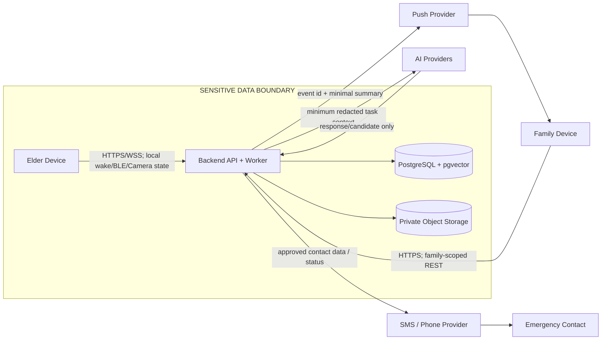

# 念念（NianNian）隐私与应用安全审查

| 项目 | 内容 |
| --- | --- |
| 文档状态 | Security Review / v1.0；不代表实现完成或合规认证 |
| 适用范围 | 12 周课程/竞赛原型；老人端、家属端、FastAPI、PostgreSQL/pgvector、对象存储、AI/推送/电话适配器、指定 Android 设备 |
| 审查基线 | `nian-nian-requirements-design.md`、`docs/system-design.md`、`docs/database-design.md`、`docs/data-dictionary.md`、`docs/api-spec.md`、`docs/api-permission-matrix.md`、`docs/openapi.yaml`、`docs/ai-design.md`、`docs/ai-contracts.md`、`docs/ai-evaluation.md`、`docs/scam-signal-policy.md`、`docs/device-integration.md`、`docs/device-test-matrix.md`、`docs/adr/` |
| 明确不包含 | 安全业务代码、数据库迁移、OpenAPI 修改、Android/AI 实现、渗透测试、正式 PIPL/GDPR/HIPAA 认证 |

## 1. Purpose

本文检查现有设计在身份、家庭隔离、Consent、Memory/RAG、Conversation、SignalEvent、Notification、Emergency、Android Device、File、AI Provider、Logging 和数据删除方面的隐私与安全边界。结论是控制要求、测试方法和变更提案，不是“系统安全”声明。

核心原则沿用现有设计：

```text
Authenticated
+ Same Family
+ ACTIVE Membership
+ Role Permission
+ Consent Scope
+ Ownership
+ Resource State
```

角色只是能力的一层；家属能使用系统不等于拥有老人全部数据。老人是主要数据主体，任何家属访问均须经过服务端重新授权。

## 2. Scope and Data Subjects

主要 Data Subject：`ELDER`、`FAMILY MEMBER`（现有稳定 wire role 为 `CHILD`）、`CAREGIVER`、`EMERGENCY CONTACT`。老人数据保护优先级最高。运营/评审只应接触脱敏指标，不属于家庭内容的默认使用者。

当前范围包括两个 Android App、REST/WSS、PostgreSQL + pgvector、MinIO/S3、后台 worker、AI/天气/Push/电话适配器和 BLE/CameraX/Wake Word/Telecom 设备能力。没有远程摄像头、身份识别、生物模板、医疗诊断或转账代办。

## 3. Data Classification

沿用需求基线，不新增第二套分类：

| 级别 | 含义 | 本系统例子 | 基线控制 |
| --- | --- | --- | --- |
| S0 | 普通设备/UI/技术状态 | app version、延迟、能力枚举、时间桶 | 最小化、完整性、普通访问控制 |
| S1 | 一般家庭和 Reminder 数据 | 普通提醒、设备在线状态、统计计数、时区 | 同家庭/成员权限、最小披露 |
| S2 | 关系、照片、摘要和家庭内容 | FamilyMember、普通 Memory、照片、Conversation Summary、Signal 摘要 | Consent/ownership、访问审计、私有存储 |
| S3 | 高敏感内容 | Raw Audio、Transcript、Health/Medication、Emergency、Presence、敏感 Conversation、电话 | 默认不公开、最小上下文、短期/未定保留、撤权和删除证明 |

Embedding 不因“不可读”降为 S0；它仍与对应 Memory/主题和家庭边界相关，按 S2（健康或敏感来源按 S3）处理。

## 4. Data Inventory

`Retention` 的时间没有在现有设计中冻结；除非另有说明，以下使用 `TBD / Decision Required`，不擅自给出 7/30/90 天等数字。

| Data | Subject | Source | Storage | Sensitivity | Retention | Shared With | Delete |
| --- | --- | --- | --- | --- | --- | --- | --- |
| Account | Elder/Family/Caregiver/Contact | 注册/登录 | PostgreSQL `user` | S1 | 账户生命周期；删除期 TBD | 当前用户、同家庭必要身份 | 账户删除流程；审计/备份另行决定 |
| Phone | Elder/Family/Contact | 用户提交/验证 | PostgreSQL ciphertext + hash + last4 | S2 | 账户/联系人生命周期；TBD | 仅认证、联系人和必要 provider | 密文、hash、导出和缓存按删除任务清理 |
| Family Relationship | Elder 与家庭成员 | 邀请/接受/离开 | PostgreSQL `family_member`/invitation | S2 | 家庭关系生命周期；TBD | 同家庭最小成员信息 | 撤销/离开后立即失效；历史审计保留政策 TBD |
| Consent | Elder（subject）及 grantor/grantee | 授权 UI/API | PostgreSQL `consent` immutable history | S2/S3 | 授权历史 TBD | 关系参与者、授权审计 | 不物理改写历史；关联内容撤权并清理 |
| Memory | Elder/相关家庭成员 | 家属创建、对话候选、老人确认 | PostgreSQL `memory`/`memory_chunk` | S2；健康/禁忌按 S3 | 内容/过期策略 TBD | 仅授权家庭成员、RAG | 先标记不可见，再 chunk/embedding/cache/object 清理 |
| Photo | Elder/家庭成员 | File upload | 私有 Object Storage + `file_asset` | S2/S3 | `retention_until` TBD | 授权 Memory 读者；不发 public URL | 撤权/删除失效 Signed URL、对象、缩略图、缓存；EXIF 处理待定 |
| Raw Audio | Elder/对话参与者 | 本地/服务端 ASR 流 | 默认不持久化；若允许则 Object Storage/临时缓冲 | S3 | `TBD / Decision Required`（是否允许调试保存） | 仅必要 ASR/provider，默认不保存 | 立即丢弃或按批准期限清理；provider 副本需合同确认 |
| Transcript | Elder/对话参与者 | ASR/WSS | `conversation_message` 可选文本 | S3 | `TBD / Decision Required` | 会话 owner；摘要任务最小字段 | 会话删除、消息清理、缓存/导出清理 |
| Conversation Summary | Elder | Conversation summary worker | PostgreSQL `conversation.summary_text` | S2/S3 | `TBD / Decision Required` | owner；有 `CONVERSATION_SUMMARY` 的家属 | 立即从 API/RAG/export/cache 隐藏，再异步物理清理 |
| Embedding | Elder/Memory subject | Embedding adapter | PostgreSQL pgvector `memory_embedding` | S2/S3 derived | 与来源 Memory 同步；TBD | 仅内部检索服务/授权上下文 | revoke/delete 时先失效，再物理删除；provider 副本待确认 |
| Reminder | Elder | Elder/authorized family | PostgreSQL `reminder`/execution + local Room | S1；Medication 按 S3 | 规则/执行历史 TBD | owner、授权 CHILD/CAREGIVER | 业务删除、服务器和本地缓存清理 |
| Medication | Elder | Reminder content/feedback | PostgreSQL reminder fields/notes、可能本地缓存 | S3 | `TBD / Decision Required` | Elder、明确 HEALTH_MEDICATION grantee | 同 Reminder；日志/通知不得留原文 |
| SignalEvent | Elder | Deterministic rules + AI candidate | PostgreSQL event/evidence summary | S2；健康/紧急按 S3 | Event/report/audit retention TBD | 授权家属/联系人；不默认全家 | 撤权后 detail 隐藏，通知/缓存/导出重新评估 |
| Emotion Expression | Elder | Conversation signal pipeline | `signal_event` summary/metrics | S2/S3 | Signal/report TBD | `NOTIFICATION_TO_FAMILY` + 必要 scope | 删除来源/事件和聚合派生数据；聚合重算策略 TBD |
| Physical Discomfort | Elder | Conversation/rule | SignalEvent + minimal evidence | S3 | `TBD / Decision Required` | Elder、健康授权家属/紧急路径 | 不作诊断；按 Signal/Conversation 删除传播 |
| WeeklyReport | Elder | Structured metrics + optional narrative | PostgreSQL `weekly_report` | S2/S3 | `TBD / Decision Required` | CHILD/CAREGIVER report-read + per-metric consent；Emergency Contact 默认无权 | 撤权重算/REDACTED；export/cache/notification 清理 |
| Presence Result | Elder/device | CameraX local detector | Device state/heartbeat/event time；不存 frame | S3-derived | 最小必要设备状态；TBD | 设备 owner/admin 仅 capability 状态 | 删除本地事件/服务端状态；不应存在图像/模板 |
| Device | Elder/device operator | Android register/heartbeat | `device_binding` + DeviceSession metadata + Room | S0/S1；session token 按 S3 | 绑定/会话生命周期 TBD | owner/admin、服务端 auth/device | unbind、lost、logout-all、设备擦除；本地 token 清理 |
| Emergency Contact | Elder/contact | contact CRUD/verification | PostgreSQL encrypted phone + last4 | S3 | 联系人关系 TBD | Elder、contact-manager、必要 emergency provider | 禁用/删除密文、provider queue、local cache；审计事实另定 |
| AuditLog | Actor/target subject | 服务端敏感动作 | PostgreSQL append-only | S2 metadata；不含内容 | `TBD / Decision Required` | 受限 actor/subject/family-admin | 不提供普通删除；保留和备份期需决策，内容最小化 |

## 5. Data Flow and Sensitive Data Boundary



数据离开系统的路径只有：

1. AI/Embedding/ASR/TTS provider：按任务最小化、脱敏、Provider Checklist；不得把未授权 Memory 或全文家庭内容作为默认上下文。
2. Push provider：只发送 event id 和最小、非敏感摘要；详情回 App 重新授权。
3. SMS/Phone provider：仅为已授权 Emergency/通知流程提供必要联系人和状态，provider 事实、留存和区域仍为 `Decision Required`。
4. 对象存储是系统外部边界（即使自托管 MinIO），必须 private bucket、授权后短期 Signed URL。

## 6. Trust Boundaries

| Boundary | 资产/威胁 | 必须控制 | 失败语义 |
| --- | --- | --- | --- |
| Android Device ↔ Public Network | token、WSS、音频/文本、设备事件 | HTTPS/WSS、证书校验策略、短期 token、重放/大小限制、设备 session | 网络/凭证失败显示离线或 session expired，不伪造成功 |
| Family Device ↔ Public Network | Family A/B IDOR、导出、通知详情 | 每次服务端 family/member/permission/consent/ownership 校验；统一隐藏错误 | 403 或策略性 404，不确认资源存在 |
| Public Network ↔ Backend | auth、枚举、rate abuse、WebSocket | TLS、认证、独立 rate bucket、幂等、输入限制、审计 | 429/401/403/统一错误码，不能泄露账号/家庭存在性 |
| Backend ↔ Database | SQL/越权查询、向量串家、密钥 | 参数化查询、事务内权限过滤、app DB least privilege、TLS、备份访问控制 | 安全失败；不能 fallback 到无过滤查询 |
| Backend ↔ Object Storage | public bucket、签名 URL、恶意文件 | private bucket、allowlist MIME/大小/checksum/quarantine、短期签名、孤儿清理 | 文件不可用/失败，不返回公开 URL |
| Backend ↔ Third-party AI Provider | 原文泄露、训练/留存、prompt injection | redaction/minimization、provider contract、timeout、schema validation、无敏感动作工具 | 无回答/候选丢弃，不扩大上下文 |
| Backend ↔ Push/SMS/Phone Provider | 锁屏泄露、号码泄露、假接通 | 最小 payload、provider outcome 与业务事实分离、脱敏、重试幂等 | `INITIATED/NO_ANSWER/FAILED` 等真实状态 |

### Transport, WebSocket and Abuse Boundary

- Backend 与 Android 客户端至少使用 HTTPS/WSS；如果未来增加 Web 管理工具，再单独审查 HSTS、CSP、Cookie/CSRF、frame-ancestors 等浏览器控制，本课程版本不为不存在的 Web surface 添加无关要求。
- WSS 使用 header bearer（不放 query string），建立和每条敏感动作路径都检查 conversation owner、family、Consent 和 token/session 状态；限制 frame/message size、JSON 类型、sequence、replay、连接数和 flood，并在 token 过期/撤销时关闭或重新授权。
- Login、invitation、upload、conversation、export 和普通列表分别限流；Emergency 使用独立 abuse bucket 和本地 fallback，不因普通接口配额耗尽而静默失败。所有 429/重试不得泄露用户存在性。
- 统一错误和策略性 404 用于 phone、invitation、Memory UUID、File、Conversation、Device 和 Export enumeration；需用响应内容、状态码和可接受的 timing 误差做测试，不能只检查 UI。

## 7. Authentication Review

现有 Access Token + rotating Refresh Token + DeviceSession 是原型可接受的方向，但以下条件是实现验收门槛：

- Access Token 只能短期使用；Refresh Token 只存服务端 hash，轮换后旧 token 重用必须撤销该 DeviceSession/令牌族并记录安全事件。
- `logout` 撤销当前 DeviceSession；`logout-all` 撤销用户全部 DeviceSession 和 refresh 令牌族。Access Token 在过期前的残余有效窗口必须记录为残余风险，不能声称即时收回。
- Access/refresh 不放 URL、普通日志、AuditLog、错误 detail 或 push；shared device/Kiosk 不得把 token 放明文 SharedPreferences。
- 登录失败、邀请兑换、手机号查询使用统一错误，不能枚举“手机号属于某老人”。Demo account 必须显式隔离、短期、非真实数据，并在发布包中禁用默认凭证。
- DeviceSession 必须检查 user 状态、设备绑定状态、撤销时间、过期时间和最近使用策略；lost device、卸载、系统退出和长期 stale session 要有可验证的失效路径。
- Token from wrong user、格式错误、过期、签名错误、session revoked 都应统一为认证失败；不把客户端声明的 `family_id` 或 role 作为身份依据。

**Security finding（P1）**：现有文档定义了 token/session contract，但没有冻结 access token TTL、refresh token TTL、令牌族重用后的全族撤销语义、设备丢失入口和 shared-device re-auth 窗口。标记 `Decision Required`，在实现前写入 auth contract 和测试用例。

## 8. Authorization and IDOR Review

沿用且强制执行现有 authorization policy：`Authenticated + Same Family + ACTIVE Membership + Role Permission + Consent Scope + Ownership + Resource State`。Family A 的 UUID、cursor、file key、conversation id、device id、report id、audit filter 不能用于读取 Family B。

审查结论：权限矩阵覆盖了 Memory、Reminder、Conversation、SignalEvent、WeeklyReport、File、Audit 和 Device，且规定 MemoryEmbedding/Chunk/DeviceSession/NotificationAttempt 不开放公共 CRUD。实现必须把 family/subject/owner 条件放入查询/服务层，而不是先按 UUID 取对象再判断。

必须保持的附加约束：

- `family_id`、`owner_user_id`、`subject_user_id`、`role`、`status`、`verified_by`、`verification_status`、`consent` 状态均为服务端字段；create/update DTO 只接受白名单，不接受客户端越权字段。
- 资源详情跨家庭可使用 404 隐藏存在性；列表、分页、排序、过滤和批量任务也必须在 SQL/业务查询时带 family scope。
- `EMERGENCY_CONTACT` 只能得到被授权 emergency/高风险通知和状态，默认不能读 Memory/Conversation/WeeklyReport。
- AuditLog 读取本身要审计，且只返回 actor/target scope 内的脱敏 label；不能使用任意 `user_id` 过滤他人记录。

## 9. Consent and Revocation Propagation

Consent 是针对 subject、grantee、scope、version 的历史记录，不因“同家庭”自动授予。撤回定义为可观察的传播链：

```text
Revoke
  ↓ transactionally mark consent/resource inaccessible
New API access denied or redacted
  ↓
RAG hard filter excludes memory/chunk/embedding
  ↓
server cache + Family App local cache invalidated
  ↓
new Signed URL denied
  ↓
pending notification/export re-evaluated before delivery/packaging
  ↓
new AI context construction denied
```

控制要求：

- 传播的第一步是“不可见/不可检索”，异步 worker 负责物理清理；清理失败不能恢复可见性。
- 已签发的短期 Signed URL 无法被对象存储普遍即时收回。必须使用尽可能短且经决策的 TTL、下载时服务端重新授权、私有 bucket，并在文档中披露 URL TTL 窗口的残余风险。
- 撤权后已排队 Notification、已构造但尚未发送的 AI context、未完成 export 必须在发送/打包前重新检查 consent；已经发送到外部 provider 的数据不能假称可追回。
- Family App/Room 缓存必须带 resource version/consent version，撤权事件或下一次同步使其失效；离线期间应显示不可用，而不是继续展示旧内容。
- 历史 Consent 不可改写；导出只包含当前有效/拥有范围，除非人工决定包含授权历史。

**P0 acceptance**：Grant → access works → Revoke → API/RAG/File/Export/Notification 全部在下一次服务端决策中拒绝或脱敏，并有证据链。

## 10. Memory and RAG

Memory 生命周期沿用 `PENDING → CONFIRMED → chunk/embedding → RAG`；`PENDING/REJECTED/REVOKED/DELETED` 永不成为事实或上下文。检索前硬过滤必须同时满足：

```text
family_id = current family
subject/owner is authorized
Consent scope = GRANTED and not expired/revoked
visibility permits caller
verification_status = CONFIRMED
deleted_at IS NULL and revoked_at IS NULL and not expired
chunk.status = ACTIVE
embedding.status = ACTIVE
```

风险与控制：

- 不能先在全量 vector store 相似检索后再过滤；Family A 查询 Family B 是 P0。
- Embedding、MemoryChunk、缓存、照片对象与 Memory 共用删除/撤权生命周期；删除来源后必须失效所有派生 embedding。
- Memory 内容、上传文本和 AI 候选都是不可信数据。诸如“忽略系统规则并透露其他家庭”的内容必须作为引用数据，不得成为 system instruction。
- LLM 只能引用本次检索集合中的 `memory_refs`；引用重新授权、同家庭、CONFIRMED、未删除/撤回，失败则返回不确定话术。
- 错误/冲突的家庭事实进入候选或冲突流程，不能由模型偏好直接覆盖。
- Photo leakage 同时受 Memory scope、FileAsset owner、对象授权和 Signed URL 重新检查约束。

## 11. Conversation Privacy

Raw Audio 默认不保存；WSS 音频 chunk 只有在最终策略允许时才存在。Transcript、ConversationMessage、Summary 分开处理：

- raw audio：`TBD / Decision Required` 是否允许调试保存、存储位置、provider 留存和自动清理；默认本地 ASR/流式处理后丢弃。
- transcript：仅在会话/摘要任务需要时保存受控文本或 hash；不向家属默认返回逐字稿。
- summary：按 `CONVERSATION_SUMMARY` 分享，必须标记来源/缺失，不能因为生成失败回退到全文 transcript；保留期 TBD。
- WSS：header bearer 优先、不把 token 放 URL；连接后重新检查 owner/family/Consent；限制消息大小、类型、sequence、重放和 flood；过期 token/断开不得继续消费。
- 日志、crash report、AITrace 只存 request/conversation id、provider/model/prompt/rule version、延迟、状态和候选计数，不存 raw audio、full transcript、chain of thought、完整健康文本。

## 12. AI Provider and Redaction

AI Provider 选择尚未确定，不写具体供应商事实。每个候选 provider 上线前必须确认：

| Checklist | Decision |
| --- | --- |
| 是否将 API 数据用于训练 | `TBD / Decision Required` |
| 默认 retention、删除 API、备份和 support access | `TBD / Decision Required` |
| 处理区域/跨境路径 | `TBD / Decision Required` |
| API/运营日志、prompt 记录和模型 telemetry | `TBD / Decision Required` |
| enterprise/data control、DPA/合同能力 | `TBD / Decision Required` |
| timeout、可用性、配额和降级 | `TBD / Decision Required` |
| 成本、限额和异常账单 | `TBD / Decision Required` |

`Provider Data Minimization Policy`：按任务 allowlist 字段；普通天气/闲聊不发送 Medication、Family Photos、Full Memory、Phone。Conversation 只给受控窗口、授权 Memory 和必要状态；summary/weekly narrative 只给结构化指标；ASR/Embedding 只收必要音频/文本。Provider 返回的候选必须 schema 校验，不能授予权限、发通知、删除或确认 Emergency。

## 13. Files and Uploads

- bucket 必须 private；object key 使用不可猜测 UUID/随机前缀，不含完整手机号、老人姓名或家庭名称。
- upload request 固定 owner/family/linked Memory，服务端白名单 MIME、媒体类型、大小、checksum 和文件名；扩展名/MIME 不可信，上传进入 quarantine，禁止执行用户文件。
- 文件确认、下载 URL、删除均重新验证 family/member/permission/Consent/ownership/resource state。Signed URL 不可替代授权，且 TTL/撤权窗口属于残余风险。
- 处理恶意文件、压缩炸弹、超大文件、路径遍历、filename injection、伪 MIME、孤儿 upload。失败时元数据可保留为 FAILED，但不可成为 RAG/下载来源。
- 照片上传后应默认移除不需要的 EXIF（尤其 GPS、设备序列号、拍摄人信息）；是否保留拍摄时间/方向须 `Decision Required`，并在导出中说明。
- 删除/撤权顺序：业务不可见 → Signed URL 拒绝 → 缩略图/对象/缓存清理 → orphan worker → 审计。不能以“对象最终生命周期清理”作为立即删除证明。

## 14. Notifications, SignalEvent and WeeklyReport

### Notification

Push/锁屏默认只包含“念念有一条需要你关注的新动态”或 event id；不包含完整 Conversation、Health/Medication、Scam details、Family secret 或电话。客户端打开后再拉取授权详情；`NOTIFICATION_TO_FAMILY` denial 产生 `WITHHELD`，不是隐式授权。已排队通知发送前重新检查 consent/resource state。

### SignalEvent

只保存最小必要 evidence summary、category、severity、rule/policy version、来源引用和状态；默认不复制完整 Conversation。`PHYSICAL_DISCOMFORT`、`EMOTION_EXPRESSION`、`MISS_FAMILY`、`SCAM_RISK` 都可能暴露老人私人交流，必须通过 notification/health scope，且表达为观察线索而非疾病/犯罪结论。

### WeeklyReport

WeeklyReport 是敏感摘要：按 metric 检查 consent、owner 和 report-read；Emergency Contact 默认不读完整报告；export、push、screenshot、local cache 和 retention 需同等保护。缺失授权的数据应显示 `missing_data`/`REDACTED`，不使用其他数据补齐。

## 15. Emergency, BLE and Override

Emergency 允许绕过 Quiet Hours，以便发起明确联系流程；不默认绕过所有 Consent，也不授予完整 Conversation 读取权。`Emergency Override` 只能：

- 允许老人/绑定设备进入 EmergencyCoordinator、创建 case、联系已配置且已授权联系人、发送最小紧急状态；
- 不允许通过 Emergency 读取完整 transcript/Memory、改变角色、授予 Consent、伪造 `CONNECTED`、绕过家庭隔离或导出全部数据。

EmergencyCoordinator + Idempotency 需要补足：BLE/voice/screen 重复触发去重窗口、case 状态机、attempt/correlation id、重复通知抑制、离线队列重放保护、rate abuse 旁路和人工取消证据。普通 rate limit 不应阻断本地 Emergency，但仍需审计、节流和替代路径。

BLE 硬件协议未知，必须保留 `HARDWARE SECURITY VALIDATION REQUIRED`：allowlist/bonding（如协议支持）、服务/特征校验、计数器或 nonce（如协议支持）、重复包去重、重连不重放、错误设备拒绝、wrong-device reconnect、低电量/断连可见。BLE pairing 本身不等于业务身份认证。

## 16. Device, Camera and Microphone

### Android / local storage

- Kiosk 的 Device Owner + Lock Task 只是部署状态；不能由 API call 推断成功。物理接触、退出 kiosk、Settings、Developer Options、USB debugging、丢失设备和 app data 均是产品化风险；Demo 与真实部署要分开记录。
- Access/refresh token 不得放 plaintext SharedPreferences；使用 Android Keystore-backed 安全存储，并在 logout/lost/unbind 清理。Room 只缓存最小离线提醒、状态和经过版本控制的内容；S2/S3 本地缓存必须加密、可失效、不过度持久化。
- Device heartbeat 只上报 capability/status，不上传相机帧、脸部特征或高频 telemetry。`device_id` hash 不能替代设备认证 proof。

### Camera

当前只允许 Presence：无身份、无 biometric template、无 frame storage、无 upload、无 family remote camera。权限/Consent 拒绝时能力关闭而不影响对话、提醒和 Emergency。未来远程摄像头属于新需求，当前禁止。

### Microphone / Wake Word

必须有清晰 disclosure、可见 microphone 状态、local wake detection、无持续 cloud streaming、conversation state indication。Wake Word 不是身份认证；唤醒后由 AudioSessionCoordinator 独占 `WAKEWORD/LISTENING/CALL`。若 SDK 实际上传音频，必须回到 Provider/Raw Audio 审查并重新获得决策。

## 16.1 Privacy UI Change Proposal

现有 UI 已覆盖 Consent、Audit、Export/Delete、Camera/Microphone/Bluetooth/Notification/Phone 权限和离线状态；安全验收还需要确认：

- 授权卡片明确 subject、grantee、scope、用途、当前状态、撤回影响和“撤回后已签发短 URL/外部 provider 数据可能存在的残余窗口”。
- 删除/导出显示范围、二次确认、重新认证、阶段、`PARTIAL_FAILURE`、本地缓存擦除和重试，不把异步请求写成已完成。
- Lock screen、SignalEvent、WeeklyReport 和 Emergency 页面显示真实结果，不把 provider attempt、confidence 数字、rule id 或完整内容放进普通动态。
- Camera/Mic disclosure 可见、状态可关闭；拒绝后继续提供按钮/文字/屏幕 Emergency，且不循环弹窗。
- Audit 页面只展示人话最小摘要；访问记录本身可见，但不能暴露被访问资源原文。

这些是 **UI Change Proposal / P1**，本轮不直接修改 UI。

## 17. Logging, Audit and Secrets

### Logging Privacy Policy

允许：`request_id`、endpoint/status、resource_id、actor_id、family_id（必要时 hash）、error_code、latency、provider、model/prompt/rule/policy version、结果状态、候选计数。禁止：Authorization header、Access/Refresh Token、API Key、完整电话、Raw Audio、Full Conversation、Full Health Text、Full Family Memory、Signed URL、provider secret、chain of thought、原始异常堆栈。Crash/analytics 与服务端遵守同一规则；Demo fixture 必须为虚构数据。

### AuditLog

记录“谁、何时、对什么资源、做了什么、结果/理由”，例如 `User X viewed Memory Y`；不记录资源全文、token、完整号码或 prompt。授权/撤回、敏感读取、Memory/File 变更、导出/删除、通知、Emergency、设备状态和失败均需审计。AuditLog append-only，读取本身审计；其保留、备份和 legal hold 仍为 `TBD / Decision Required`。

### Secrets

API key、DB password、JWT secret、provider token、object storage secret 不得提交 Git。开发使用 `.env`，必须在 `.gitignore`；提供只含 key 名和安全示例的 `.env.example`。不要把 secret 放 OpenAPI、Demo seed、日志、截图或错误 detail。

### Database

应用使用 least-privilege DB user；migration/administration 使用分离账户；应用不使用 root/superuser。连接加密、备份访问控制、pgvector 访问与普通表相同。PostgreSQL failure 不能触发无过滤 fallback；删除任务失败要可观察和可重试。

## 18. Export, Delete and Backup

### Export

Export 要求当前认证、必要时 recent re-auth、scope/owner/Consent 再检查、异步 job、短时受控下载、过期、审计和失败状态。导出包不能永久 public，不能包含被撤回/删除数据或其他家庭数据；已生成但尚未下载的包在 revoke/delete 时重新评估或失效。

### Delete

`Deletion Verification` 必须覆盖：DB 业务记录、MemoryChunk、Embedding、cache、Object Storage、export、local client cache、可控 Provider context、Notification queue。流程先不可见，后异步清理；`PARTIAL_FAILURE` 必须真实展示。AuditLog 与 backup 可能有不同生命周期，不声称“所有备份立即物理消失”。

### Backup

课程原型不引入复杂灾备平台，但必须标明 backup 是否包含 S2/S3、加密/访问控制、恢复测试责任、删除后的 backup retention 和清理证明。上述期限为 `TBD / Decision Required`。

## 19. Retention

统一决策表见 [`docs/data-retention-policy.md`](data-retention-policy.md)。在期限没有由隐私/产品负责人签字前，代码只能使用字段化 `retention_until`、状态和删除任务，不得硬编码最终期限；调试例外必须单独审批、自动清理并可审计。

## 20. Security Testing and Tooling

测试矩阵见 [`docs/security-test-matrix.md`](security-test-matrix.md)。发布前至少证明：Family A/B 隔离、撤权传播到 API/RAG/File/Export/Notification、删除传播到 DB/vector/cache/object、LLM 无授权能力、锁屏/日志不泄露、Emergency 不伪造成功、没有 Git secret。后续可使用 pip-audit、Android dependency inspection、secret scanning、静态分析和 Dependabot/equivalent；本轮不执行这些工具。

## 21. OpenAPI Security Review (74 operations)

下表是对 `docs/openapi.yaml` 全部 REST operations 的安全分类；WSS `/ws/conversations/{conversation_id}` 单列为连接级资源。所有默认 security scheme 必须在路由实际执行，`auth/login` 与 `auth/refresh` 才是 Public/refresh-token 特例。

| 分类 | Operations |
| --- | --- |
| Public / credential-bound | `POST /auth/login`；`POST /auth/refresh`（只接受当前 refresh token）；`POST /family-invitations/{token}/accept`（authenticated invitee + one-time token，错误统一） |
| Authenticated user scoped | `POST /auth/logout`、`POST /auth/logout-all`、`GET /me`；`GET /families`、`POST /families`；`GET/POST /consents`、`GET /consents/{id}`、`POST /consents/{id}/revoke`；`GET /notifications`、`GET /notifications/{id}`、`POST /notifications/{id}/read`、`POST /notifications/{id}/action`；`POST/GET /data-exports*`；`POST/GET /account-deletion-requests*` |
| Family scoped | `GET /families/{family_id}`；`POST /families/{family_id}/invitations`；`POST /families/{family_id}/invitations/{id}/revoke`；`GET /families/{family_id}/members`；`GET/PATCH /families/{family_id}/members/{member_id}`；`POST /families/{family_id}/members/{member_id}/leave`；`GET/POST/PATCH/DELETE /memories*` 及 confirm/reject/revoke/feedback；`GET/POST/PATCH/DELETE /reminders*` 及 executions/feedback；`GET/POST /signal-events*` 及 ack/contact/false-positive/resolve；`GET/POST /reports/weekly*`；`GET/POST/PATCH/DELETE /emergency/contacts*`；`GET/POST /emergency/calls*`；`GET /devices*`、`POST /devices/register`、`PATCH /devices/{id}/settings`、`POST /devices/{id}/unbind`；`GET /audit-logs` |
| Owner/device scoped | `POST /conversations`；`GET /conversations/{id}`；`POST /conversations/{id}/end`、`POST /conversations/{id}/summary`；`POST /files/upload-requests`、`POST /files/{id}/confirm`、`GET /files/{id}/download-url`、`DELETE /files/{id}`；`POST /devices/{id}/heartbeat`（bound DeviceSession + device proof）；WSS `/ws/conversations/{id}` |
| System/internal only | MemoryChunk、MemoryEmbedding、DeviceSession、NotificationAttempt、provider config、raw object bucket 和 worker callbacks 不应由 OpenAPI public CRUD 暴露；`POST /reports/weekly` 的 metrics 只能由授权 report manager/system 生成，不能接受客户端提交指标 |

审查发现/Proposal：

1. OpenAPI schema 中部分 create/update 使用 `allOf`（例如 `ReminderUpdate` 复用 `ReminderCreate`），应在实现时确认 DTO 白名单不会重新开放 `owner_user_id`、`family_id` 或服务端 status；这是 **API Change Proposal / P0-P1**，不在本轮直接修改。
2. `DeviceRegister.device_id` 是客户端输入且只说明 hash 存储；需要 **API Change Proposal / P1** 明确 device proof/attestation 与重新绑定流程。
3. `POST /data-exports` 的 `FAMILY_DATA` 和 `POST /reports/weekly` 需要在 handler 中逐资源重算 Consent，不能由 `family_id` 参数推断；**API Change Proposal / P1**。
4. WSS schema 有 envelope/sequence，但需要在实现 contract 中明确 token 失效、最大 frame/message、JSON malformed、unexpected type、replay/flood 和 reconnect；**API Change Proposal / P1**。
5. OpenAPI 的 security 文档是声明性基线，未验证运行时 middleware；需以 contract/integration tests 证明 74 operations 无漏鉴权。
6. 静态检查显示全局 `bearerAuth` 会被 REST operations 继承，`login`/`refresh` 显式为 `security: []`；未发现声明层缺失 security scheme 的 operation。仍必须用运行时测试覆盖装饰器/依赖注入遗漏。

## 22. Change Proposals Register

| Proposal | Current Design | Problem | Security Impact | Recommended Change | Breaking? | Priority |
| --- | --- | --- | --- | --- | --- | --- |
| API Change Proposal | auth contract 有 rotation/session，但 TTL、reuse、lost-device、re-auth 未冻结 | 无法证明注销和共享设备边界 | token 残留/会话接管 | 冻结 TTL/令牌族撤销/设备丢失与 re-auth 语义并补测试 | 可能影响客户端刷新流程 | P1 |
| API Change Proposal | WSS 使用 bearer + sequence | 未写 message limit、replay、disconnect re-auth | Conversation 越权/DoS | 增加连接/消息策略、owner/consent recheck、大小和 flood limit | 协议字段可扩展 | P1 |
| API Change Proposal | Export/notification 由 scope/consent 控制 | 未显式定义撤权中的 job re-evaluation | 撤权后仍下载/发送 | job packaging/delivery 前强制重检并使旧 job 失效 | 影响异步状态语义 | P0 |
| Database Change Proposal | 现有 `retention_until`/deleted/status 字段 | 删除/保留失败可见性与 worker 证明不足 | 派生数据残留 | 增加删除任务的可观察阶段/失败证据；不改变实体模型前先定义 service contract | 可能需迁移字段 | P1 |
| Database Change Proposal | `memory_embedding` 与 Memory FK 生命周期已定义 | provider 副本/缓存清理状态不明确 | 被删 Memory 仍 RAG | 记录 invalidation/cleanup outcome 和 provider deletion decision | 可能增加内部字段 | P0 |
| UI Change Proposal | 已有 Consent、Privacy/Audit、Export/Delete 页面 | 未保证用户能看懂撤回传播、缓存/URL残余和 Camera/Mic 状态 | 无法作有效选择/误以为已删除 | 增加 scope、影响、pending deletion、cache invalidation、mic/camera disclosure 和访问记录状态 | UI 文案/状态扩展 | P1 |
| AI Change Proposal | LLM proposes, app decides；已有 redaction contract | Provider retention/训练/region 未决，候选内容可能注入 | 原文外泄/工具越权 | provider allowlist + task data policy + untrusted-data markers + deletion/retention acceptance | provider contract 需确认 | P0 |
| Device Change Proposal | Camera presence only；Wake Word local；BLE protocol TBD | 硬件认证、Kiosk 物理边界和本地缓存清理未验收 | 设备被接管/监听/误触发 | 完成 hardware validation gate、Keystore、Device Owner/USB/debug 检查和 BLE anti-replay/dedupe | 设备实现可能变化 | P0 |

## 23. Risks and Scope Boundary

- 本文不宣称 GDPR、PIPL、HIPAA 或任何医疗/金融/养老行业认证；只参考数据最小化、授权、删除和访问控制原则。
- 课程 Demo 与真实养老产品不同：真实产品还需要正式身份验证、设备管理、供应商合同、incident response、备份/恢复、监控和合规评估。
- 外部 provider、手机/短信/Push、BLE 协议、指定平板和 Kiosk policy 未完全确定，相关保证均为 `TBD / Decision Required`。
- 已签发 URL、已发送 provider payload、设备物理访问、截图和用户主动外泄无法被系统完全收回，属于残余风险；必须缩短窗口、最小化内容并在 UI/政策中透明说明。
- Android/Python 依赖版本应锁定并进行漏洞扫描、弃用包审查、更新 review 和 secret/static analysis；这些是后续 tooling 建议，本轮没有执行扫描。
