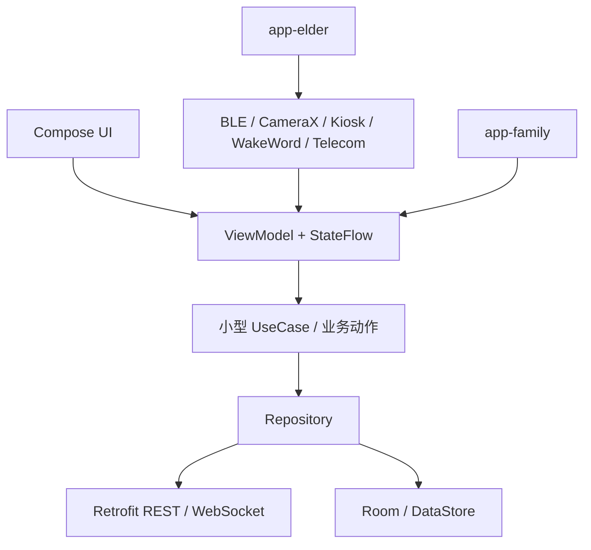
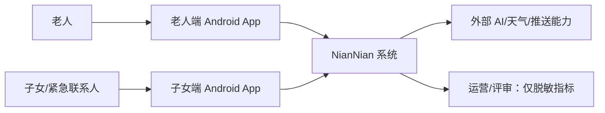
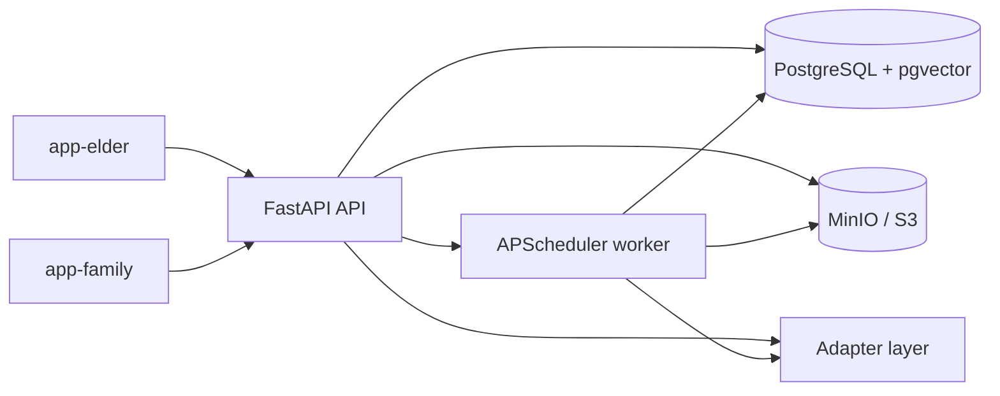
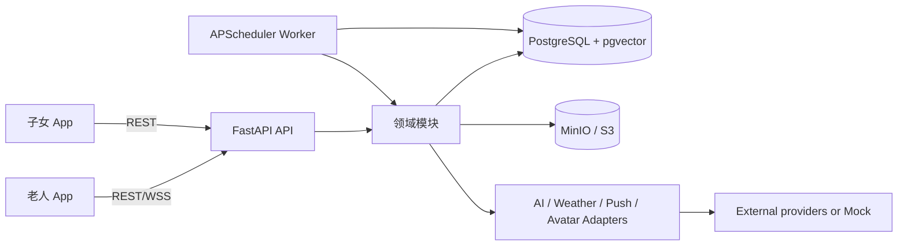
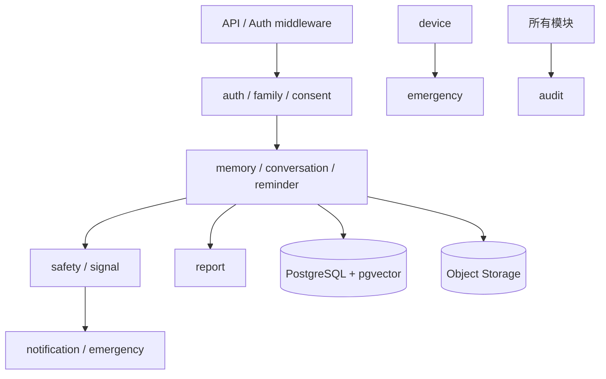
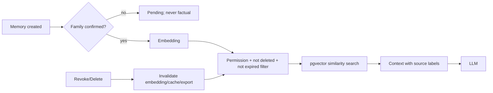
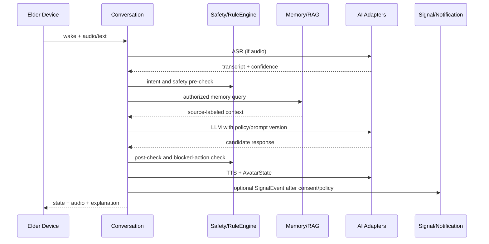
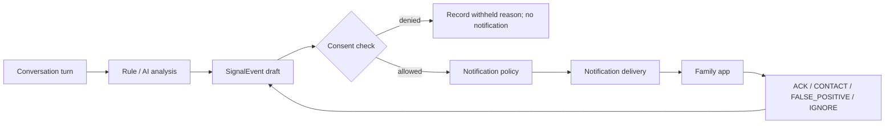
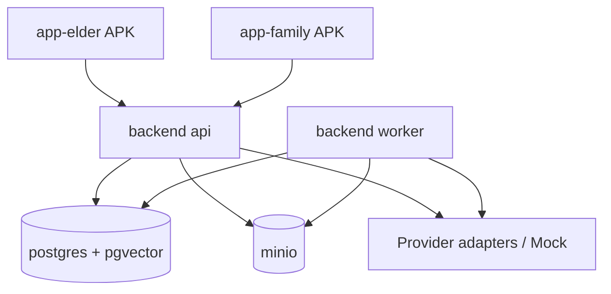

# 念念（NianNian）系统设计

| 项目 | 内容 |
| --- | --- |
| 文档状态 | Baseline / v1.0 |
| 适用范围 | 12 周课程/竞赛版本，老人端、子女端、后端和指定 Android 平板演示 |
| 需求基线 | [`nian-nian-requirements-design.md`](../nian-nian-requirements-design.md) v1.1 |
| 本文不包含 | 数据库 SQL、完整 OpenAPI、Android 页面代码、FastAPI 业务代码 |

## 1. 文档目的

需求文档回答“系统需要做什么”，本文回答“系统准备怎样实现”。本文固定技术边界、模块拥有权、数据流、失败降级和部署方式，作为后续数据库设计、API 设计、AI 适配器、客户端和设备集成的共同依据。本文只做架构决策，不改变产品定位、不删除功能需求，也不把尚未确认的供应商选择伪装成定稿。

### 1.1 设计原则

1. 先满足需求，再考虑 12 周内可交付、可测试、可演示和可替换。
2. 核心业务采用模块化单体，不以微服务数量、消息中间件数量或基础设施复杂度作为质量指标。
3. 安全、授权和确定性规则先于 LLM；客户端只呈现状态，服务端拥有最终权限判断。
4. 所有外部 AI、推送、天气和数字人能力通过适配器接入；Mock 是正式运行模式之一，不是临时测试补丁。
5. 任何无法满足的设备或网络能力必须显示可解释的失败状态，不能用假成功掩盖限制。

## 2. 需求基线与覆盖范围

### 2.1 产品边界

系统服务独居/空巢老人及其子女，包含老人端、子女端、模块化单体后端、家庭记忆与 RAG、主动陪伴、SignalEvent、亲情桥接、防诈骗、周报、紧急联系、隐私授权和 Android 设备化能力。系统不做医疗诊断、心理诊断、身份冒充、转账代办、人脸身份识别或自研大模型/ASR/TTS/复杂数字人。

### 2.2 需求到技术能力追踪

以下覆盖需求文档中实际编号的全部 FR；未列出的编号不存在，不通过虚构编号填充覆盖矩阵。

| 需求 | 技术支撑与验收边界 |
| --- | --- |
| FR-001~005 | `auth`、`family`、`consent`、`audit`；角色路由、邀请码/二维码双向确认、分项授权、异步删除和结果通知。 |
| FR-010~016 | `app-elder` 会话状态机、ASR/LLM/TTS/Avatar Adapter、会话摘要、主动陪伴策略和无障碍设置。 |
| FR-020~023 | `memory`、对象存储和 pgvector；待确认状态、权限过滤、撤回/删除时索引及缓存失效。 |
| FR-030~033 | `reminder`、设备本地缓存和 worker；提醒反馈语义不等同于服药事实，断网只执行缓存能力。 |
| FR-040~044 | `signal`、`notification`、`report`、`audit`；可解释线索、规则通知、家属动作、周报观察指标和最小必要披露。 |
| FR-050~052 | `safety` RuleEngine + LLM 辅助；规则优先阻止敏感动作，通知只陈述风险信号和核实建议。 |
| FR-053 | `emergency`、`device`、PushProvider 和 Android Telecom/电话 Intent；记录已发起、接通、未接、失败原因。 |
| FR-060~063 | `device-kiosk`、BootReceiver、CameraX presence、WakeWordAdapter、BLE Adapter 和离线提醒缓存；验收以指定平板/按钮/系统版本为准。 |

逐项检查：`FR-001`、`FR-002`、`FR-003`、`FR-004`、`FR-005`、`FR-010`、`FR-011`、`FR-012`、`FR-013`、`FR-014`、`FR-015`、`FR-016`、`FR-020`、`FR-021`、`FR-022`、`FR-023`、`FR-030`、`FR-031`、`FR-032`、`FR-033`、`FR-040`、`FR-041`、`FR-042`、`FR-043`、`FR-044`、`FR-050`、`FR-051`、`FR-052`、`FR-053`、`FR-060`、`FR-061`、`FR-062`、`FR-063` 均已映射到实现边界、数据责任或设备能力；非功能需求在第 13、14、17 节落实。

### 2.3 九项核心能力覆盖

1. 账号、家庭绑定、角色和授权：Auth/Family/Consent。
2. 透明身份声明与语音对话：Conversation 编排 + 会话提示状态机。
3. 数字人、TTS 和基础口型：AvatarState + TTS/Avatar Adapter。
4. 家庭记忆库与 RAG：Memory + Object Storage + pgvector + Permission Filter。
5. 时间、天气、日程、用药和生活提醒：Reminder + Weather Adapter + Worker。
6. 关注提示、亲情桥接与家属通知：SignalEvent + Notification + Consent。
7. 防诈骗：确定性 RuleEngine + AI 语义补充。
8. 紧急联系：Emergency + BLE/语音/系统电话/Push。
9. 周报和交流观察指标：Report + 结构化 InteractionMetric；不输出医疗结论。

设备化的 kiosk、开机自启、离线唤醒、人员接近和 BLE 按钮作为 P0 设备交付，属于上述安全/紧急能力的运行载体。

## 3. 技术选型

### 3.1 选型结论

| 层 | 定稿选择 | 选择理由 |
| --- | --- | --- |
| 老人端/子女端 | Kotlin + Jetpack Compose，两个 Android App | 老人端需要 Lock Task、BootReceiver、BLE、CameraX、Foreground Service、Telecom 等原生能力；两个 App 的发布、权限和 UI 生命周期彼此独立。 |
| 客户端架构 | ViewModel + StateFlow + Repository；必要处使用小型 UseCase | 状态可测试、Compose 订阅简单，避免为了形式上的 Clean Architecture 制造大量空接口。 |
| 网络/序列化 | Retrofit/OkHttp、Kotlin Serialization | 成熟、可拦截 request_id、易于 Mock；WSS 共用认证拦截器。 |
| 本地数据 | Room + DataStore + WorkManager | Room 存离线提醒/设备状态，DataStore 存偏好和 token 元数据，WorkManager 做客户端同步/清理。 |
| 后端 | Python 3.12、FastAPI、Pydantic v2、SQLAlchemy 2、Alembic | 团队学习成本低，API、后台任务和 AI SDK 集成直接。 |
| 关系库/向量 | PostgreSQL + pgvector | 业务事务、权限、审计和相似检索使用同一一致性边界；不引入独立向量库。 |
| 文件 | S3 Compatible Object Storage，开发默认 MinIO | 图片/短期音频不进入 PostgreSQL；Signed URL、生命周期和替换云存储路径统一。 |
| 后台任务 | PostgreSQL task/outbox 表 + 独立 APScheduler worker | 有重试、幂等和可观察状态，不需要 Redis/Celery；worker 与 API 进程故障隔离。 |
| 实时通信 | REST 为主，WebSocket 只用于会话状态，Push + REST 用于家属通知 | 按通信语义选协议，避免把 CRUD 和推送全部塞进 WebSocket。 |
| 推送 | `PushProvider` 抽象；演示默认 Mock/本地轮询，FCM 作为可替换实现 | 中国大陆网络、比赛现场和设备权限可能使 FCM 不可靠，Demo 不依赖 FCM。 |
| AI | ASR/LLM/Embedding/TTS/Avatar/WakeWord Adapter + Mock 实现 | 可切换供应商、控制超时和脱敏、支持离线演示。 |

### 3.2 明确不选

12 周版本不引入 Flutter 与 Kotlin 混合工程、React Native、微服务、Kafka、Kubernetes、Service Mesh、Celery/Redis、Milvus/Pinecone/Weaviate、Elasticsearch 或自研唤醒/语音/数字人模型。后续若规模增长，可先把 worker 或某一模块按现有边界拆出，而不改变领域契约。

## 4. Android App 组织方式

### 4.1 方案比较

| 维度 | 方案 A：一个 App 按角色切换 | 方案 B：两个 App + 共享模块 |
| --- | --- | --- |
| 设备权限 | 需在同一包中处理老人端 BLE、摄像头、电话、kiosk 权限和子女端普通权限，manifest 与运行时分支复杂。 | 老人端单独声明设备权限；子女端不请求不必要的硬件权限，越权面更小。 |
| UI 差异 | 导航、字号、生命周期和无障碍分支大，回归范围容易互相污染。 | 两个入口清晰，老人端可围绕平板和语音优化，子女端可围绕信息密度优化。 |
| 共享代码 | 共享最直接，但容易把角色判断散落在 UI。 | 通过 `core-*`、`feature-*` 共享模型、网络、权限和业务组件，重复代码仍可控。 |
| 并行开发 | 同一 App 的 Gradle/导航/资源冲突多。 | 老人端和子女端可并行；共享模块设置清晰 API 边界后冲突少。 |
| 发布和设备化 | 一次发布简单，但平板锁定和手机端权限难以分别配置。 | 可独立签名、发布、测试和配置 Device Owner；未来可独立发布平板版。 |
| 12 周风险 | 初期目录少，后期条件分支和权限回归成本高。 | 初始 Gradle 配置稍多，但更符合设备差异和团队并行方式。 |

### 4.2 推荐

采用方案 B：`app-elder` 与 `app-family` 两个 App，共享 Kotlin 多 Module 工程。推荐不是基于偏好，而是因为老人端的设备权限、前台服务、kiosk 和离线状态是产品边界的一部分；将其与子女端隔离能减少权限、发布和回归风险。两端通过 `core-model`、`core-network`、`core-auth`、`core-database`、`core-common`、`core-ui`、`core-telemetry` 和共享 feature modules 复用代码。

共享模块只暴露稳定的状态和动作，不暴露另一端的导航实现。`app-elder` 独占 `device-*` 模块；`app-family` 不依赖设备模块。

## 5. Android 架构

### 5.1 分层



### 5.2 统一状态模型

所有页面采用 `UiState`（Loading/Content/Empty/Error/Offline）和一次性 `UiEffect`（播报、导航、电话 Intent、Toast）分离，避免 Compose 重组重复执行副作用。以下状态由 ViewModel/Repository 提供，最终权限状态由服务端返回并复核：

| 状态域 | 典型状态 |
| --- | --- |
| 网络 | ONLINE、DEGRADED、OFFLINE、UNKNOWN |
| 登录 | SIGNED_OUT、TOKEN_REFRESHING、SIGNED_IN、SESSION_EXPIRED |
| 角色 | ELDER、FAMILY、EMERGENCY_CONTACT；只由服务端声明 |
| 权限 | UNKNOWN、GRANTED、DENIED、REVOKED、REQUIRES_SYSTEM_PERMISSION |
| 会话 | IDLE、WAKING、LISTENING、TRANSCRIBING、THINKING、SPEAKING、INTERRUPTED、FAILED |
| BLE | DISCONNECTED、CONNECTING、CONNECTED、LOW_BATTERY、ERROR |
| 设备 | BOOTING、KIOSK_ACTIVE、KIOSK_CONFIG_ERROR、CAMERA_DISABLED、WAKEWORD_READY |
| 离线 | CACHE_READY、SYNC_PENDING、SYNCING、SYNC_FAILED |
| 数字人 | IDLE、LISTENING、THINKING、SPEAKING、WARNING |

### 5.3 老人端设备边界

- **Kiosk**：Device Owner + LockTaskMode 为目标配置；若设备管理员权限不足，显示 `KIOSK_CONFIG_ERROR` 和人工配置步骤，不宣称已锁定。
- **开机自启**：`BOOT_COMPLETED` BroadcastReceiver 只启动老人端入口；新 Android 后台限制通过允许的启动路径和前台服务验证，失败记录设备能力状态。
- **BLE**：Android BLE API 封装成 `BleButtonDataSource`，扫描、连接、GATT 事件转为状态流。按键本地先显示呼叫状态，再提交后端；断连、低电量、蓝牙权限不足都可见。
- **CameraX**：只做人员/人脸存在检测和持续时长判断，不保存图片、不做人脸身份比对；未授权时整项能力关闭。
- **离线唤醒**：`WakeWordAdapter` 接成熟 SDK，离线只唤醒本地界面或缓存提醒，不生成联网回答。
- **电话**：使用系统 Intent/Telecom；权限、SIM、网络和接通结果分状态显示，不承诺联系一定成功。
- **前台服务**：仅用于必要的唤醒、BLE 连接或设备状态保持，显示系统可见通知并支持停止。

## 6. 后端架构

### 6.1 运行形态

后端是一个 FastAPI 模块化单体。模块通过公开 service/command/query 和事件接口协作，不直接读写其他模块的 Repository 或表。单体内部保持事务边界和模块目录边界，部署上可运行 `api` 与 `worker` 两个进程。

### 6.1.1 System Context Diagram



### 6.1.2 Container Diagram





### 6.2 Backend 模块职责

| 模块 | 拥有的数据 | 对外能力 | 依赖 | 明确不负责 |
| --- | --- | --- | --- | --- |
| `auth` | User、DeviceSession、token 版本 | 登录、刷新、登出、设备会话 | `audit` | 家庭权限和内容授权判定 |
| `family` | Family、FamilyMember、邀请 | 创建家庭、邀请码/二维码绑定、成员管理 | `auth`、`consent` | 生成 AI 回答、发送任意通知 |
| `consent` | Consent、scope/version/revocation | 授权、撤回、授权检查 | `auth`、`audit` | 代替业务模块保存内容或自行放宽权限 |
| `memory` | Memory、MemoryAsset、embedding 状态 | 待确认、发布、纠错、过期、删除、检索 | `consent`、ObjectStorage、EmbeddingAdapter | 对未确认记忆作事实回答 |
| `conversation` | Conversation、turn metadata、summary | 会话编排、摘要、状态流、记忆查询入口 | `auth`、`memory`、`safety`、AI adapters | 直接发送家属通知、改变授权 |
| `reminder` | Reminder、ReminderOccurrence、反馈 | 创建/暂停/反馈/升级规则 | `family`、worker、WeatherAdapter | 判断是否真的服药、修改医嘱 |
| `signal` | SignalEvent、evidence metadata、状态 | 创建、解释、ACK/忽略/误报/联系动作 | `conversation`、`consent`、`notification` | 直接决定医疗诊断或绕过通知策略 |
| `safety` | RuleVersion、RiskAssessment、blocked action | 诈骗规则、风险分级、敏感动作拦截 | `conversation`、LLMAdapter（辅助） | 让 LLM 单独决定风险或执行转账 |
| `notification` | Notification、DeliveryAttempt、Policy | 通知策略、Push/应用内/短信电话适配、重试 | `consent`、`signal`、`emergency`、PushProvider | 改写 SignalEvent 事实或越权披露原文 |
| `report` | InteractionMetric、WeeklyReport、生成状态 | 结构化统计、固定模板周报 | `conversation`、`reminder`、`signal`、EmbeddingAdapter | 计算医学指标、生成睡眠/疾病/认知结论 |
| `emergency` | EmergencyContact、EmergencyCase | 语音/按钮联系、状态更新、升级 | `family`、`notification`、device command | 保证电话接通、替代急救机构 |
| `device` | DeviceBinding、capabilities、heartbeats | 设备绑定、能力和按钮事件 | `auth`、`emergency`、`audit` | 在服务端假设设备已拥有系统权限 |
| `audit` | AuditLog | 敏感访问、授权、删除、通知和失败记录 | 基础日志上下文 | 保存完整对话、token 或电话号码 |
| `integrations` | Provider config、调用元数据 | Adapter 实现、超时、重试、Mock 和脱敏 | 外部 SDK/API | 在业务模块中暴露供应商 SDK |

### 6.2.1 Backend Module Diagram



### 6.3 后端目录建议

```text
backend/
├── app/
│   ├── main.py
│   ├── api/                 # 路由、鉴权依赖、错误映射
│   ├── modules/             # auth/family/consent/...，每模块含 api/service/repository/model
│   ├── integrations/        # adapters/、providers/、mock/
│   ├── platform/            # db、object_storage、task_queue、logging、settings
│   └── worker/              # APScheduler、任务处理器、重试与锁
├── alembic/
├── tests/                   # unit、integration、contract、ai_eval
└── pyproject.toml
```

模块内部允许共享 `platform` 基础设施，但禁止跨模块导入另一模块的私有 model/repository；跨模块写操作使用公开 service 或 domain event。

## 7. 数据职责与生命周期

PostgreSQL 负责 User、Family、FamilyMember、Consent、Memory 元数据、Reminder、Conversation 元数据、InteractionMetric、SignalEvent、Notification、EmergencyContact、DeviceBinding、WeeklyReport 和 AuditLog。`pgvector` 只保存已允许建立索引的 Memory/主题 embedding 及版本状态。

### 7.1 对象存储

照片和可选的短期音频存 MinIO/S3；PostgreSQL 只存 object key、mime、大小、校验、授权范围、保留期限和删除状态。读取先过服务端授权，再发短时 Signed URL。删除流程是：业务标记删除 -> 撤销检索资格 -> 删除 embedding/缓存 -> 删除对象或等待生命周期清理 -> 写 AuditLog。默认不保存原始音频；调试保存必须设置自动删除期限。

### 7.2 权限和 RAG 不变量

记忆进入上下文必须同时满足：`verification_status = CONFIRMED`、当前请求主体具备有效 `Consent`、`deleted_at IS NULL`、未过期且 embedding 版本有效。撤回授权或删除后，普通查询、RAG、缓存和导出都必须排除该条记录；清理任务失败时标记为高优先级待处理，不能继续返回旧缓存。



## 8. AI Adapter 与对话架构

### 8.1 适配器

统一接口至少包含：`ASRAdapter`、`LLMAdapter`、`EmbeddingAdapter`、`TTSAdapter`、`AvatarAdapter`、`WakeWordAdapter`、`WeatherAdapter`、`PushProvider`。业务只依赖输入/输出 DTO、超时、错误码和能力声明；供应商实现放在 `integrations/providers`，Mock 放在 `integrations/mock`。

每次调用要求：request/correlation id、provider、model/version、timeout、latency、result/error_code、quota metadata。原始对话和 token 不进入普通日志。重试只对幂等、可恢复错误进行，指数退避并设上限；超时或配额耗尽进入固定兜底。Provider 切换由配置和能力探测控制，不能在业务代码中出现供应商类名。

### 8.2 对话链路

### 8.2.1 AI Conversation Diagram



LLM 不能直接创建通知、改写事实或执行敏感动作。未知问题使用诚实兜底；记忆回答标记“家人提供的信息”。Prompt 版本、工具权限和允许的数据级别由服务端策略配置。

## 9. SignalEvent、亲情桥接与防诈骗

### 9.1 SignalEvent

支持 `PHYSICAL_DISCOMFORT`、`EMOTION_EXPRESSION`、`IMPORTANT_MEMORY`、`MISS_FAMILY`、`SCAM_RISK`、`EMERGENCY`。实体至少记录：来源 conversation/turn、发生时间、类型、脱敏 evidence 摘要、confidence、severity、rule_version、policy_version、授权检查结果、通知状态、家属 action、处理时间和审计关联。



任何通知失败不改变事件本身；事件状态与 DeliveryAttempt 分开，便于重试和解释。家属内部备注不回传老人端。

### 9.2 防诈骗

RuleEngine 维护可版本化的词、意图和组合规则：转账/汇款、验证码、冒充亲属、保密要求、陌生链接、银行卡/账户信息。命中确定性组合后立即阻止代操作并播报“存在风险，请联系家人核实”；LLM 仅补充语义、摘要和老人友好话术。规则误报通过家属标记和规则版本统计改进，不以 Prompt 代替安全决策。

### 9.3 周报

`report` 先用 SQL/结构化数据计算互动次数、时长、提醒反馈、SignalEvent 汇总、情绪表达分类、互动时段和重复主题相似度，再让 LLM（可选）润色固定模板。所有输出带“交流观察线索”和数据缺失说明，明确禁止睡眠、疾病、抑郁、认知障碍或其他医疗推断。

## 10. 通信方式

| 场景 | 协议 | 说明 |
| --- | --- | --- |
| 登录、家庭、授权、记忆、提醒、周报、审计、设备管理 | HTTPS REST | JSON、分页、幂等键、统一错误码；服务端每次校验角色/家庭 scope/consent。 |
| 老人实时会话状态、录音转写进度、TTS/Avatar 状态 | WSS（可回退 REST 轮询） | 只传状态和短期会话数据；断线后以 session id 恢复或结束，不假设消息必达。 |
| SignalEvent、诈骗、紧急、提醒升级 | PushProvider + REST 详情 | Push 只带 event id 和最小摘要，客户端拉取授权后的详情；Mock/本地轮询保证演示。 |
| 服务端模块之间 | 同进程 service/event + PostgreSQL outbox | 不引入 Kafka；跨进程 worker 从任务表领取。 |

## 11. 认证与授权

Authentication 负责“你是谁”：短期 Access Token、轮换 Refresh Token、DeviceSession、退出当前/全部设备。Authorization 负责“你能访问什么”：服务端根据 User、FamilyMember role、Permission 和 Consent Scope 做每次请求校验。

推荐 JWT Access Token + 服务端可撤销 Refresh Token；token 只存哈希/版本信息，登出或撤销后拒绝旧版本。家庭范围必须从服务端 session 绑定，不能信任客户端传入的 family_id。老人、家属、紧急联系人和运营/评审使用最小权限；紧急联系能力可以在 UI 固定展示，但联系人、事件内容和原文仍需授权。

## 12. 后台任务方案

| 方案 | 结论 |
| --- | --- |
| FastAPI BackgroundTasks | 只适合请求后短任务；进程重启会丢失，不能承担提醒、删除和通知重试。 |
| APScheduler 嵌在 API | 成本低但与 API 生命周期耦合，多实例会重复执行。 |
| 独立 worker + APScheduler + PostgreSQL task/outbox | **采用**。worker 负责调度、领取、租约、幂等、重试和死信状态；API 只写任务/事件。 |
| Celery + Redis | 能力强但引入 broker、运维和调试成本，12 周版本收益不足。 |

任务类型包括提醒触发、主动陪伴候选、周报、删除清理、通知重试、embedding 重试和设备事件同步。任务必须有唯一业务键、最大重试次数、退避、超时和可人工重放标记。未来若吞吐量超过 PostgreSQL 任务表，再按同一任务契约迁移 Celery/Redis。

## 13. Mock 与降级

提供 `MockASR`、`MockLLM`、`MockTTS`、`MockPush`、`MockAvatar`、`MockWakeWord`；通过配置切换，Mock 输出固定可复现并标注 `provider=mock`。演示脚本默认可在无公网时完成绑定、记忆、RAG、规则诈骗、SignalEvent、周报和假电话状态。

| 失败 | 用户看到 | 系统记录/重试 | 是否继续/安全影响 |
| --- | --- | --- | --- |
| 网络断开 | “当前离线；可使用已缓存提醒和紧急联系人” | 记录状态，连接恢复后同步 | 继续本地提醒；联网对话不伪造回答。 |
| ASR 失败 | 请重说/改用按钮或文字 | provider、latency、error；短退避重试一次 | 可继续非语音入口。 |
| LLM 超时/配额 | 固定诚实话术，建议联系家人 | 超时和 provider；有限重试/切 Mock | 不创建事实、不执行安全动作。 |
| TTS 失败 | 显示文字并提示重播 | 重试一次，记录会话失败 | 可继续文字回答；不阻塞紧急联系。 |
| Avatar 失败 | 保留语音/文字，显示简化状态 | 记录 SDK 错误 | 不影响核心对话和安全流程。 |
| Embedding 失败 | 记忆仍待发布或提示稍后检索 | 进入 worker 重试 | 不把未索引记忆当可检索事实。 |
| Push 失败 | 家属端显示待同步/应用内提示 | DeliveryAttempt 重试和升级状态 | 事件保留；紧急流程展示失败原因。 |
| BLE 断开/低电量 | 显示 DISCONNECTED/LOW_BATTERY，保留屏幕/语音呼叫 | 设备心跳与审计 | 不假设按钮可用；紧急按钮安全性可降级。 |
| Camera 权限拒绝 | 关闭人员接近唤醒并说明 | 权限状态，不上传图像 | 对话、按钮和电话继续。 |
| 电话权限/SIM/网络失败 | 已发起/未接/失败及原因 | EmergencyCase + notification retry | 不承诺接通；提供其他联系人/应用内路径。 |
| 对象存储失败 | 图片待上传或不可用 | 上传/删除任务重试 | 不丢失元数据；RAG 不引用缺失资产。 |
| 数据库失败 | 通用暂不可用，不泄露内部错误 | request_id、error_code、告警 | 安全动作采用可解释失败；禁止写入假成功。 |

## 14. 安全、隐私与可观测性

数据分级沿用需求文档 S0-S3。默认不保存原始音频；S2/S3 内容分项授权、最小披露、短期保留和访问审计。传输使用 HTTPS/WSS，密钥放环境变量/密钥管理而非仓库。第三方 AI 调用前做字段脱敏，并确认服务商不用于训练（以合同/配置为准）。

结构化日志字段：`request_id`、`user_id`、`family_id`、`conversation_id`、`event_id`、`device_id`、`provider`、`latency_ms`、`result`、`error_code`。禁止记录完整对话、token、完整电话号码和未脱敏健康信息；日志只保留脱敏摘要和哈希关联。关键状态使用 metrics/审计表，而不是把敏感文本写入日志。

## 15. 部署拓扑与开发环境



`docker compose up` 的最小服务是 `backend`、`worker`、`postgres`、`minio`；可选 `mail/sms mock` 仅用于演示。反向代理在需要 HTTPS/WSS 或外部访问时加入，不作为本地开发前置依赖。Compose 初始化脚本负责 pgvector 扩展、迁移、MinIO bucket 和虚构 Demo 数据；真实家庭资料、真实照片和生产密钥不得进入仓库。

## 16. Monorepo 目录

```text
nian-nian/
├── android/
│   ├── app-elder/                 # 老人端入口与设备权限
│   ├── app-family/                # 子女端入口
│   ├── core-model/                # DTO、状态、错误码
│   ├── core-network/              # Retrofit/WSS、认证拦截器
│   ├── core-database/             # Room、离线同步
│   ├── core-auth/                 # token/session/role
│   ├── core-common/               # 时间、结果类型、配置
│   ├── core-ui/                   # 共享无障碍组件和主题
│   ├── core-telemetry/            # 脱敏日志、request id
│   ├── feature-auth/              # 登录、绑定、首次声明
│   ├── feature-consent/           # 授权、撤回、导出删除
│   ├── feature-conversation/      # 会话与状态
│   ├── feature-memory/            # 家庭记忆
│   ├── feature-reminder/          # 提醒和反馈
│   ├── feature-signal/            # 动态/关注提示
│   ├── feature-report/            # 周报
│   ├── feature-emergency/         # 联系与状态
│   ├── feature-settings/          # 无障碍和设备设置
│   └── device/{ble,kiosk,camera,wakeword,telecom}/
├── backend/
│   ├── app/{api,modules,integrations,platform,worker}/
│   ├── alembic/
│   └── tests/{unit,integration,contract,ai_eval}/
├── infra/
│   ├── docker-compose.yml
│   ├── postgres/init/
│   └── minio/
├── docs/
│   ├── system-design.md
│   ├── adr/
│   └── (后续数据库、API、设备、隐私、测试文档)
├── scripts/                       # 一键启动、seed、检查和演示脚本
├── tests/                         # 跨端验收、演示回归和脱敏 fixtures
└── README.md
```

这是一份目标组织，不在本阶段创建空目录或业务代码。

## 17. 关键技术风险与验证顺序

| 优先级 | 风险 | 最早验证 |
| --- | --- | --- |
| P0 | 指定平板 Device Owner/LockTask 与开机自启受系统版本限制 | 第 1 周拿到真实平板做重启、退出桌面和权限失败演示。 |
| P0 | BLE 按钮 GATT 协议、低电量和后台连接行为未知 | 第 1-2 周完成指定按钮配对、断连、按键延迟和电量读取 Spike。 |
| P0 | 中国大陆/比赛现场无法使用 FCM、短信或外部 AI | 第 1 周跑通 MockPush/本地轮询和 Mock AI 全链路，之后再接真实 provider。 |
| P0 | RAG 权限撤回后旧 embedding/缓存残留 | 第 2-3 周用集成测试验证 CONFIRMED+AUTHORIZED+NOT_DELETED 不变量和删除证明。 |
| P0 | CameraX 人员存在检测功耗、误唤醒和权限状态 | 第 3 周只在指定设备测持续时长和关闭权限路径，禁止保存图像。 |
| P1 | Android 双 App 共享模块 Gradle 构建时间和资源冲突 | 第 1 周建立最小多模块骨架和 CI 构建矩阵。 |
| P1 | Provider 超时、配额、数据留存和模型输出不稳定 | 第 2 周完成 Adapter contract、timeout/fallback/mock 和脱敏检查。 |
| P1 | 周报相似主题阈值和统计口径被误读为医疗结论 | 第 7 周锁定指标定义、文案和评估样例。 |
| P1 | 电话权限、SIM、无网时无法真正接通 | 第 2 周固定“已发起/失败原因”状态，避免把接通作为系统承诺。 |

## 18. 12 周实施边界检查

- 第 1-2 周先完成双 App 构建、认证/家庭/授权、Compose 状态、PostgreSQL/MinIO/worker、Mock 适配器和设备 Spike。
- 第 3-4 周完成对话状态机、身份声明、TTS/Avatar、天气/提醒和联系人。
- 第 5-6 周完成记忆确认、对象存储、embedding/RAG 权限过滤和主动陪伴。
- 第 7-8 周完成 SignalEvent、诈骗 RuleEngine、通知闭环、紧急联系。
- 第 9 周完成结构化周报和交流观察文案。
- 第 10 周完成指定平板 kiosk、开机自启、离线唤醒、CameraX 接近和 BLE。
- 第 11-12 周完成异常矩阵、删除/审计、双端联调、演示固化和答辩材料。

任何新增外部基础设施必须说明它解决的现有阻塞、运维成本和 Mock/降级路径；否则保持当前模块化单体方案。

## 19. 后续文档依赖

正式编码前依次补齐：

1. 页面与交互规格、老人端/子女端状态图和无障碍验收。
2. 需求追踪矩阵（FR -> 页面/接口/实体/测试/演示）。
3. 数据库 ERD、字段/索引/迁移和删除策略。
4. API/OpenAPI、错误码、鉴权、幂等和权限矩阵。
5. AI Adapter contract、Prompt 版本、脱敏、评估集和固定兜底话术。
6. 诈骗规则、SignalEvent 策略和周报统计口径。
7. 隐私/威胁模型、设备集成说明、部署运维和测试发布清单。

## 20. ADR 与待确认决策

已创建 `docs/adr/ADR-001` 至 `ADR-009`。Android、Backend、PostgreSQL/pgvector、模块化单体、AI Adapter、对象存储和 worker 方案已定稿。推送供应商和数字人具体 SDK 仍为 `Proposed`，因为需求基线明确要求结合中国大陆网络、费用、数据留存、设备和竞赛环境确认；在确认前使用 `MockPush`/`MockAvatar`。

与需求存在实现冲突的项目记录如下：

| Requirement | Problem | Impact | Recommended Resolution | Decision Required |
| --- | --- | --- | --- | --- |
| 需求文档 7.2 提到 Flutter 或 React Native | 设备化 FR-060~063 需要原生 Android API，混合工程会增加权限和桥接成本 | 可能延迟 kiosk/BLE/CameraX 验收 | 采用原生 Kotlin 双 App；保留业务模块可替换边界 | 团队确认课程是否强制既有跨平台栈；若强制，需另行评估原生插件风险。 |
| FCM/短信/电话依赖外部网络 | 比赛现场或中国大陆网络可能不可用 | 通知 Demo 不稳定 | MockPush + 应用内轮询为基线，真实 provider 可插拔 | 确认比赛网络、服务商、费用和合规。 |
| 离线紧急呼叫 | 无 SIM/电话权限/网络时系统无法承诺接通 | 只能展示可解释失败 | 固定状态机和备用联系人路径，不伪造接通 | 确认指定设备是否有 SIM、Telecom 权限和允许的演示方式。 |
