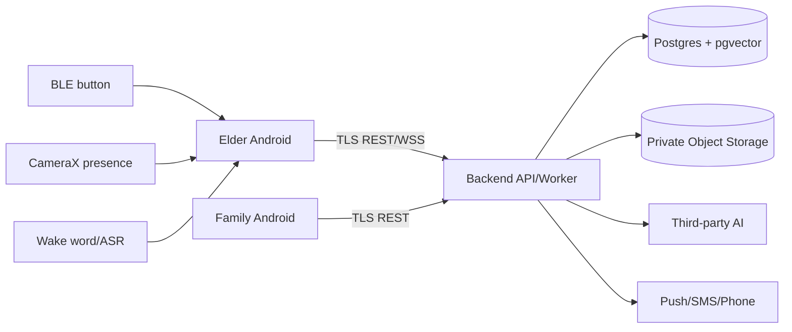

# 念念（NianNian）轻量 Threat Model

| 项目 | 内容 |
| --- | --- |
| 方法 | STRIDE + 资源/流程审查；聚焦真实系统边界，不堆砌通用术语 |
| 范围 | 老人端、家属端、Backend/Worker、PostgreSQL+pgvector、Object Storage、AI/Push/SMS/Phone provider、BLE/Camera/Microphone/Kiosk |
| 数据主体优先级 | Elder > Family Member/Caregiver > Emergency Contact；同家庭不等于全量可读 |
| 状态 | Security Review / v1.0；不是渗透测试结论 |

## 1. System Assets

| Asset | 价值/影响 | 级别 |
| --- | --- | --- |
| Access/Refresh Token、DeviceSession | 账户接管、家庭横向移动 | S3 |
| Family membership/role/permission | 跨家庭和越权根源 | S2 |
| Consent history/current grants | 决定老人数据是否可共享 | S2/S3 |
| Memory、Chunk、Embedding、Photo | 家庭事实、照片和 RAG 上下文 | S2/S3 |
| Conversation raw audio/transcript/summary | 私人交流和健康线索 | S3 |
| Reminder/Medication、SignalEvent、WeeklyReport | 健康/行为/安全摘要 | S2/S3 |
| EmergencyContact/EmergencyCase | 人身安全、电话和联系结果 | S3 |
| Device/Kiosk/BLE/Camera/Microphone state | 设备控制和监听面 | S0-S3 |
| Notification/Export/Signed URL | 外部披露和下载能力 | S2/S3 |
| AuditLog/Provider metadata/Secrets | 追责、供应链和系统接管 | S1-S3 |

## 2. Attack Surfaces

1. Login/refresh/logout、Demo account、shared/lost device。
2. Family invitation、member role/permission、Consent grant/revoke。
3. UUID/分页/过滤/排序/下载 URL 的 IDOR 与 enumeration。
4. Memory/File upload、object key、EXIF、RAG/vector query。
5. REST actions、Export/Delete jobs、notification queue。
6. WSS auth、conversation ownership、message parsing/replay/flood。
7. AI prompts、retrieved Memory、uploaded text、LLM candidate/structured output。
8. Push/SMS/Phone provider、Emergency retry、BLE packet/duplicate/reconnect。
9. Android physical access、Kiosk escape、USB debugging、Room/DataStore、Camera/Mic/BLE permissions。
10. Logs、crash reports、backup、provider logs、Git/.env/CI artifacts。

## 3. Trust Boundaries

设备输入不可信，公共网络视为 hostile；Backend 是授权策略执行点；DB/Object Storage 是数据平面而不是授权替代品；AI 是不可信处理者；provider delivery 不是业务成功证明。

## 4. Threat Actors

| Actor | Capability | Likely goal |
| --- | --- | --- |
| Unauthenticated Internet user | Login/invite/API probing | Enumeration、credential abuse、资源发现 |
| Compromised Family A account | Valid token and family membership | 读取 Family B 或超出 Consent 的老人数据 |
| Malicious/curious family member | Valid role but abusive queries/export | Bulk scrape、隐藏 Memory/Conversation 访问 |
| Lost/shared Android user | Physical access、解锁 Kiosk 或本地存储 | Token theft、截图、设置/USB/debug escape |
| Malicious BLE peripheral/packet sender | Nearby radio traffic | Spoof/replay/duplicate Emergency |
| Prompt-injection author | Elder input、Memory、upload、AI candidate | Override policy 或外泄其他数据 |
| Provider/operational insider | Provider logs/support 或错误配置 | Retain/train/expose sensitive content |
| Accidental developer/CI leak | Git/.env/log/artifact access | Secret disclosure/system takeover |
| Network/availability attacker | Drop/replay/flood requests | DoS、duplicate action、false status |

## 5. STRIDE Analysis

| STRIDE | Real scenario | Existing control | Required verification |
| --- | --- | --- | --- |
| Spoofing | Stolen token、forged heartbeat、fake BLE | rotating refresh、DeviceSession、device proof、BLE adapter | token theft/reuse/logout-all/lost device；device proof；BLE tests |
| Tampering | Mass assignment、changed Memory/Consent、replayed Emergency | explicit DTO、immutable Consent、idempotency、state machine | negative DTO、concurrency/replay、audit evidence |
| Repudiation | 敏感读取/删除/联系无记录 | AuditLog、request/correlation id | 审计完整性且不泄露内容 |
| Information Disclosure | A 读 B、public bucket、锁屏健康 push、provider logs | family+permission+Consent；private bucket；minimal push；redaction | cross-family、object policy、lock-screen/log/provider fixture |
| Denial of Service | login/upload/WSS/emergency flood、provider timeout | rate limits、独立 Emergency bucket、bounded retry/message | abuse matrix、Emergency fallback、worker backoff |
| Elevation of Privilege | CHILD/CONTACT 改角色/全报告；LLM 发动作 | role+permission+Consent；LLM proposes/app decides | role matrix、mass assignment、AI action denial |

## 6. Threat Register

| ID | Threat | Asset | Attack | Impact | Existing Control | Additional Control | Test | Priority |
| --- | --- | --- | --- | --- | --- | --- | --- | --- |
| T-001 | Cross-family object access | Memory/Conversation/File/Device | 替换 Family B UUID/cursor | Elder privacy breach | family-scoped matrix、hidden 404 | query-level family predicate、全资源 negative suite | AUTH-001..007 | P0 |
| T-002 | Consent bypass after revoke | Memory/File/Notification/Export | 使用 cached grant、old URL、queued job | revoked data disclosure | Consent history/current checks | versioned cache、delivery/package recheck | CONS-001..008 | P0 |
| T-003 | Deleted Memory remains in RAG | Chunk/Embedding | delete/revoke 后向量查询 | family fact leak/hallucination | hard filters、async cleanup | invisible-first、cleanup state/alert | RAG-001..007 | P0 |
| T-004 | Token theft/reuse | Account/DeviceSession | replay refresh/access after logout | account takeover | rotating refresh、session revoke | freeze TTL、family reuse response、Keystore/lost flow | AUTH-008..013 | P0 |
| T-005 | Sensitive notification leak | Signal/Health/Conversation | lock-screen/provider payload | household disclosure | event id/minimal summary | severity policy、generic copy、queued recheck | PRIV-001 | P0 |
| T-006 | Prompt injection data leak | AI context/Memory | malicious Memory says ignore rules | cross-scope disclosure/action | untrusted markers、LLM proposes | task allowlist、reference validator、adversarial fixtures | AI-001..005 | P0 |
| T-007 | Public/guessable object | Photo/Audio | bucket/key enumeration | file disclosure | private bucket、signed URL | key entropy、policy scan、TTL decision | FILE-001..008 | P0 |
| T-008 | Raw audio unintended retention | Audio/provider logs | debug/provider stores audio | high-sensitivity breach | default no raw audio、retention TBD | explicit decision、deletion contract/evidence | PRIV-005、AI-007 | P0 |
| T-009 | Emergency false success | Emergency/Contact | provider/network failure shown connected | delayed help | explicit state machine、no fake connected | observed outcome、UI evidence/retry | EMG-001..010 | P0 |
| T-010 | BLE duplicate/replay | EmergencyCase | repeated/replayed packet | repeated calls/notification storm | Coordinator + idempotency | nonce/counter if available、dedupe、case key | BLE-001..008 | P0 |
| T-011 | Mass assignment | role/status/owner/verified | privileged JSON fields | privilege escalation | explicit DTO principle | reject unknown/server-owned fields | AUTH-015 | P1 |
| T-012 | Enumeration | Phone/invite/Memory UUID | compare errors/timing | user/family discovery | uniform errors、hidden 404 | rate/timing review | AUTH-014 | P1 |
| T-013 | Local cache exposure | Room/DataStore | physical/lost device read | offline S2/S3 disclosure | minimal cache | encrypted storage、version invalidation、wipe | DEV-001..004 | P1 |
| T-014 | WSS hijack/flood | Conversation | wrong id/token、malformed/flood | transcript leak/DoS | token header、owner recheck、sequence | frame/type/size/replay limits | WS-001..009 | P1 |
| T-015 | EXIF/malicious upload | Photo/Object | fake MIME/GPS/oversize/path | malware/privacy leak | checksum/quarantine/private object | sniffing、EXIF policy、orphan cleanup | FILE-002..006 | P1 |
| T-016 | WeeklyReport overexposure | Report/metrics | Contact/denied metric reads | health/behavior disclosure | per-metric consent/report-read | redacted/missing data、export review | PRIV-006 | P1 |
| T-017 | Secret/log leak | JWT/API/phone/content | inspect Git/log/crash | system takeover/privacy breach | logging prohibition/.env guidance | secret scan + fixture inspection | PRIV-002、008 | P0 |
| T-018 | Backup residual | all S2/S3 | restore old backup after delete | deletion claim false | backup acknowledged separate | decide encrypted backup retention/restore evidence | DEL-006 | P1 |
| T-019 | AI provider retention | audio/text/embedding | provider trains/logs/keeps data | external disclosure | provider-neutral adapter/redaction | provider checklist/contract gate | AI-007 | P0 |
| T-020 | Kiosk/physical escape | Device/token | Settings/ADB/USB/unlocked tablet | local takeover/listening | Device Owner target + gate | real-device provisioning、Keystore、wipe/lost procedure | DEV-005..008 | P1 |

## 7. P0 Threats

发布阻断项：T-001 cross-family；T-002 Consent bypass；T-003 deleted Memory in RAG；T-004 token leakage/reuse；T-005 sensitive notification；T-006 prompt-injection leak；T-007 public object storage；T-008 raw audio retention；T-009 emergency false success；T-010 BLE duplicate/replay；T-017 secrets/logs；T-019 provider retention。必须 Pass 或有人工批准的可见 fallback，不能以 `NOT_RUN` 通过。

## 8. Existing Controls

- Access Token + rotating Refresh Token + DeviceSession；logout/logout-all contract。
- FamilyMember ACTIVE + role/permission + Consent + ownership + resource state policy。
- Memory `CONFIRMED + AUTHORIZED + SAME FAMILY + NOT_DELETED` retrieval invariant。
- Private object storage、服务端授权 Signed URL、上传 checksum/MIME/size/quarantine 原则。
- LLM proposes、application decides；prompt/RAG untrusted-data boundary、schema/citation validation。
- Minimal Push payload、Signal evidence summary、WeeklyReport structured metrics、Emergency observable states。
- Camera presence-only/no frame；local wake word；BLE adapter 和 hardware acceptance matrix。
- Structured redacted logging、AuditLog、`.env`/secret prohibition、least-privilege DB intent。

## 9. Required Controls

1. 冻结 auth TTL、refresh reuse response、shared/lost-device 和 re-auth 语义。
2. 对全部 REST operations 和 WSS 强制 query-level family/owner/Consent predicates。
3. 实现 invisible-first 撤权/删除；先失效 cache/vector/object/export/notification，再异步清理。
4. 真实 S2/S3 发送前完成 provider data policy 和 acceptance checklist。
5. 固定 private bucket、quarantine、EXIF、Signed URL TTL 和 orphan cleanup 证据。
6. 使用 Keystore-backed local secrets、加密/最小 Room cache、lost/unbind wipe。
7. 增加独立 Emergency abuse controls 和 BLE replay/duplicate 证据，不阻断本地 fallback。
8. 检查 logs/crash/demo/Git artifacts 的原文和 secrets。

## 10. Residual Risks

- 已交付的短期 Signed URL 在到期前可能仍可使用。
- 数据已经发给外部 provider 或被用户截图后不能远程追回。
- Android 设备物理接触可能绕过应用假设。
- BLE 协议、SIM/Telecom 和 provider availability 在硬件验证前不能承诺。
- Backup/AuditLog 可能晚于业务删除；期限需决定。
- 离线设备可能延迟撤权同步；UI 必须标记 stale/unavailable。

## 11. Security Acceptance Criteria

1. Family A 不能读、改、导出、订阅 Family B 资源。
2. Consent revoke 后 API/RAG/File/Export/Notification 下一次决策均拒绝或脱敏，并有证据。
3. Delete 在 worker 完成前已让 DB/list/RAG/cache/object 不可见；部分失败真实可见。
4. LLM/Memory/uploaded text 不能覆盖授权或直接执行敏感动作。
5. 锁屏、普通日志、crash、Demo 截图和 Git artifact 不含禁止数据/secrets。
6. Emergency 只报告实际 `INITIATED/NO_ANSWER/FAILED` 等结果，重复 BLE/voice 被幂等约束。
7. Camera/Microphone/BLE/Kiosk 在指定设备通过或记录已批准的可见 fallback。
8. Raw audio、provider retention、backup 和 retention 值在使用类生产数据前完成决定。
9. 不宣称正式法律/行业合规。

