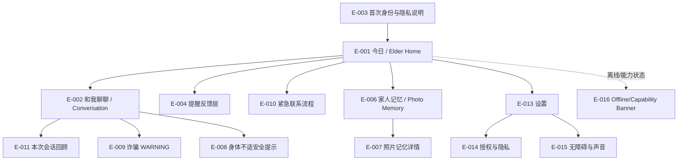
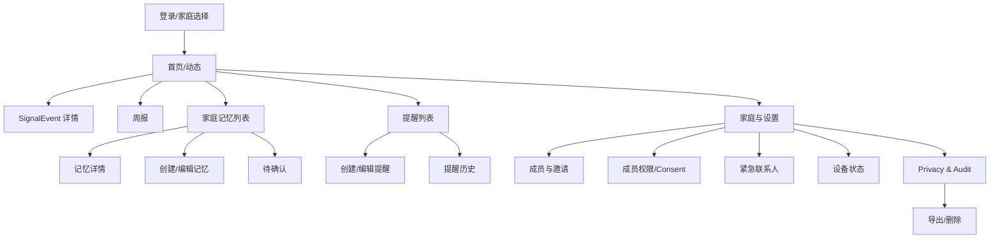
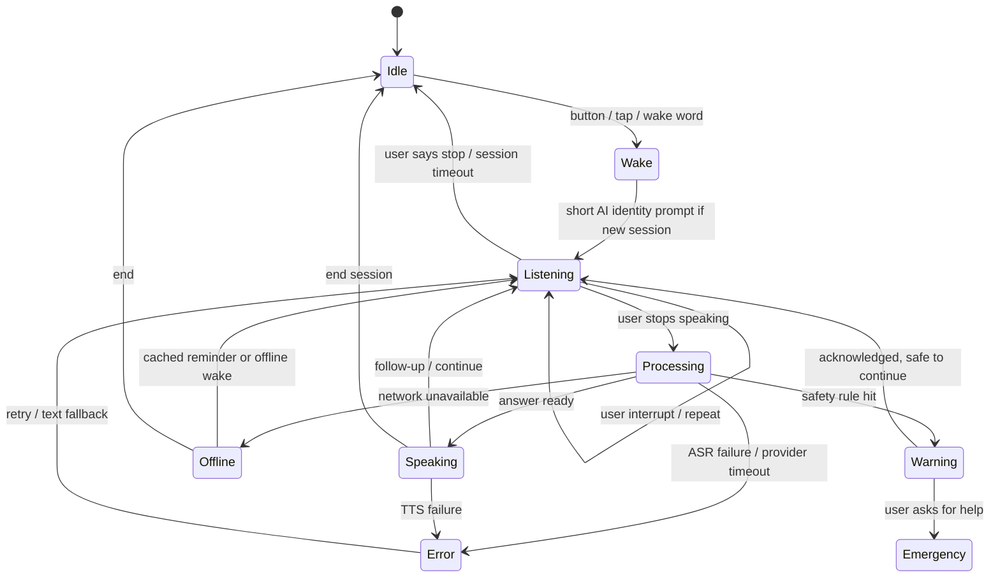

# 念念（NianNian）页面与交互规格

| 项目 | 内容 |
| --- | --- |
| 文档状态 | Baseline / v1.0 |
| 产品需求基线 | [`nian-nian-requirements-design.md`](../nian-nian-requirements-design.md) v1.1 |
| 技术基线 | [`system-design.md`](system-design.md)、[`database-design.md`](database-design.md) |
| 适用端 | `app-elder` 老人端、`app-family` 子女端 |
| 本文不包含 | Kotlin、Compose 代码、Android 工程、API endpoint、数据库修改和新的业务需求 |

## 1. Purpose

本文把已确认的产品需求和技术边界转成 Android 开发者可以直接实现和测试的 Information Architecture、Screen、Navigation、UI State、语音、权限、无障碍和错误规格。它不改变 PRD；无法由 UI 解决的冲突均记录在第 25 节。

## 2. Shared Design Principles

### 2.1 老人端原则

1. 大字、高对比、大点击区域；每页只突出一到三个动作。
2. 核心任务可用语音完成，但所有关键动作保留明显的屏幕入口。
3. 状态文字说人话：使用“我在听”“现在网络不可用”“还没有收到反馈”，不显示协议、HTTP 或模型术语。
4. 不用颜色单独表达状态；状态同时使用文字、图标和声音。
5. 危险动作需要二次确认；紧急按钮与普通入口视觉区分，但不制造恐慌。
6. 不把首页做成监控面板；不增加没有需求支撑的设置或卡片。

### 2.2 子女端原则

1. 先看需要行动的动态，再看统计和管理入口。
2. SignalEvent 只展示最小必要摘要，不默认展示完整对话。
3. 所有健康、记忆和摘要内容旁边显示授权范围或访问限制。
4. 周报是交流观察，不是医疗、心理、睡眠或认知诊断。
5. 允许快速确认、联系、误报；复杂管理在二级页面完成。

### 2.3 共同信息规则

- 念念在首次使用和每个新会话明确是 AI；不模拟具体子女的脸、声音或身份。
- `Offline`、`Permission Denied`、`Provider unavailable` 都必须有下一步动作。
- Demo/Mock 模式在设置或开发构建状态中明确标注“演示数据/演示能力”，不伪装成真实联系或真实接通。
- 日志和分析事件不采集完整语音、原始对话、完整电话号码或未脱敏健康内容。

## 3. Elder UI Design Tokens

这些是 Compose 主题和组件的起始基准，不是最终视觉稿。所有尺寸使用稳定的 `dp/sp`，不随屏幕宽度缩放字号。

| Token | Elder baseline | Family baseline | 说明 |
| --- | --- | --- | --- |
| Body text | 22sp，支持系统放大至至少 28sp | 16sp，支持系统放大 | 老人端正文不低于 22sp |
| Secondary text | 18sp | 14sp | 不用低对比度小字承载关键状态 |
| Section title | 28sp | 22sp | 短标题，避免长句 |
| Hero/status text | 32sp | 24sp | “我在听”“正在联系女儿”使用 |
| Touch target | 64dp 高，最小 64 x 64dp | 最小 48 x 48dp | 老人端按钮可整行点击 |
| Primary button | 64-72dp 高，圆角不超过 16dp | 48-56dp 高 | 文本 + 图标，不只放图标 |
| Spacing | 8dp 基准，关键区块 24-32dp | 8dp 基准 | 保持稳定布局，防止状态变化跳动 |
| Line spacing | 1.4-1.6 倍 | 1.3-1.5 倍 | 语音播报和文字同步可读 |
| Contrast | 正文至少 7:1，较大文字至少 4.5:1 | 正文至少 4.5:1 | 以 WCAG AA 为底线，老人端优先更高 |
| Focus | 4dp 高对比描边 | 2dp 高对比描边 | 键盘、TalkBack、遥控器均可见 |
| Motion | 200-400ms；无障碍减少动画 | 150-300ms | 不用持续闪烁或快速旋转 |
| Voice speed | 默认 0.9x，可调 0.75-1.1x | 默认 1.0x | 老人端设置可直接听到预览 |
| Replay | 所有关键提示有“再说一遍” | 错误和帮助可重播 | 不依赖记忆上一屏文字 |

颜色只作为辅助：`success`、`attention`、`danger`、`offline` 均必须配合图标、文字和可选语音。诈骗和紧急状态不使用满屏红色，不让界面产生医院或警报设备的感觉。

## 4. Information Architecture

### 4.1 Elder App

底部只保留四个一级入口：

1. **今日**：时间、天气、下一个提醒、主动陪伴和呼叫家人。
2. **和我聊聊**：进入会话；首页大按钮也进入这里。
3. **家人记忆**：按照片/故事浏览，不提供复杂后台管理。
4. **设置**：字体、音量、语速、授权、设备能力、隐私和帮助。

提醒、诈骗、身体不适、紧急联系和权限说明采用全屏状态页或底部确认层覆盖当前页面，不再增加底部导航入口。

### 4.2 Family App

采用五项 Bottom Navigation：

1. **首页/动态**：需要关注、今日摘要、普通动态。
2. **周报**：固定模板统计、趋势、缺失说明。
3. **家庭记忆**：列表、待确认、已发布、已撤回/删除。
4. **提醒**：规则、创建/编辑、执行历史。
5. **家庭与设置**：成员、邀请、Consent、紧急联系人、设备、Privacy & Audit。

不单独增加“通知中心”“设备管理中心”“安全中心”一级入口，避免过度分裂。

## 5. Navigation Diagrams

### 5.1 Elder Navigation

Elder App 不允许从一个普通页面进入超过两层的设置树；紧急联系可从任何主要页面通过固定按钮、语音或 BLE 进入。

### 5.2 Family Navigation

## 6. Screen Inventory

“Screen”包含全屏页、底部 sheet 和阻断式状态层；普通 Snackbar 不单独编号。每个 ID 是后续测试、埋点和开发讨论的稳定引用。

### 6.1 Elder App Inventory

| ID | App | Screen | Purpose | Entry | Primary Action | FR |
| --- | --- | --- | --- | --- | --- | --- |
| E-001 | Elder | 今日 / Elder Home | 让老人看到今天最重要的三件事 | 登录完成、返回首页 | 和念念说话 | FR-010、030、053 |
| E-002 | Elder | Conversation | 语音/按钮对话和 Avatar 状态 | E-001、唤醒词、按钮 | 开始/继续说话 | FR-003、010~016 |
| E-003 | Elder | 首次身份与隐私说明 | 完整 AI 身份、边界和授权摘要 | 首次使用/未完成 onboarding | 我知道了，继续 | FR-003、004 |
| E-004 | Elder | Reminder Incoming | 到点播报并让老人选择反馈 | 今日事项/本地提醒 | 已完成/晚点/跳过 | FR-030~033 |
| E-005 | Elder | Reminder Detail & Feedback | 查看内容、来源和反馈状态 | 点击提醒 | 提交反馈 | FR-030、031 |
| E-006 | Elder | Photo Memory View | 浏览照片并听解释 | 家人记忆 | 听念念讲讲 | FR-020、022 |
| E-007 | Elder | Photo Memory Detail | 显示人物、关系、时间地点和不确定性 | E-006 | 听解释/标记说错 | FR-020~023 |
| E-008 | Elder | 身体不适安全提示 | 给出边界和联系动作 | Conversation 识别身体不适 | 联系家人 | FR-040、053 |
| E-009 | Elder | Scam Warning | 先暂停敏感操作并建议核实 | 规则命中 | 联系家人 | FR-050~052 |
| E-010 | Elder | Emergency Contact Flow | 统一处理按钮、语音和系统电话 | 任意页、BLE、语音 | 联系首位联系人 | FR-053、063 |
| E-011 | Elder | Session Recap | 回顾本次会话摘要 | Conversation 结束/新会话 | 再聊聊/返回今日 | FR-015 |
| E-012 | Elder | 家庭记忆错误反馈 | 只收集“这里说错了/不知道” | E-007 | 提交反馈 | FR-013、023 |
| E-013 | Elder | Settings & Accessibility | 字体、音量、语速、对比度和帮助 | 底部设置 | 保存设置/播放预览 | FR-012、033 |
| E-014 | Elder | Consent & Privacy | 查看、撤回授权和数据操作入口 | 设置 | 查看授权 | FR-004、005 |
| E-015 | Elder | Permission Explainer | 用老人能理解的话解释系统权限 | 首次使用/功能触发 | 允许/暂不开启 | FR-060~063 |
| E-016 | Elder | Offline / Capability State | 告知离线和设备能力降级 | 网络/设备状态变化 | 查看可用功能 | FR-033、060~063 |

### 6.2 Family App Inventory

| ID | App | Screen | Purpose | Entry | Primary Action | FR |
| --- | --- | --- | --- | --- | --- | --- |
| F-001 | Family | 登录 / 家庭选择 | 登录并确定家庭 scope | 启动 App | 进入家庭 | FR-001 |
| F-002 | Family | 首页 / Dynamic | 按紧急程度组织事件和摘要 | 登录后默认页 | 打开需要关注 | FR-040~044、052、053 |
| F-003 | Family | SignalEvent Detail | 解释事件、状态和建议动作 | F-002 事件卡 | 联系老人/确认 | FR-040~044、050~053 |
| F-004 | Family | Weekly Report | 查看结构化周报和数据缺失 | 底部周报 | 选择周次 | FR-043 |
| F-005 | Family | Memory List | 按状态筛选家庭记忆 | 底部家庭记忆 | 打开记忆 | FR-020~023 |
| F-006 | Family | Memory Detail | 查看来源、授权、确认和删除影响 | F-005 | 编辑/撤回/删除 | FR-020~023 |
| F-007 | Family | Create/Edit Memory | 手动创建或纠正家庭记忆 | F-005/F-006 | 保存待确认/已确认 | FR-020、021 |
| F-008 | Family | Pending Confirmation | 处理模型/成员提交的待确认信息 | F-005 筛选 | 确认/拒绝/纠正 | FR-021 |
| F-009 | Family | Reminder List | 查看启用/暂停/历史入口 | 底部提醒 | 创建提醒 | FR-030、014 |
| F-010 | Family | Create/Edit Reminder | 设置时间、周期、内容和免打扰 | F-009 | 保存提醒 | FR-030、014 |
| F-011 | Family | Reminder History | 查看执行和反馈，不推断服药 | F-009 | 查看一次执行 | FR-031、043 |
| F-012 | Family | Family & Settings | 家庭设置的分组入口 | 底部家庭与设置 | 打开成员/授权 | FR-001、002 |
| F-013 | Family | Members & Invite | 成员、角色、邀请码/二维码 | F-012 | 邀请成员 | FR-001、002 |
| F-014 | Family | Member Permission / Consent | 针对成员查看和修改 scope | F-013 | 开启/撤回授权 | FR-004、044 |
| F-015 | Family | Emergency Contacts | 管理注册/外部紧急联系人 | F-012 | 添加/验证联系人 | FR-053 |
| F-016 | Family | Device Status | 查看平板、BLE、唤醒和权限状态 | F-012 | 查看解决建议 | FR-060~063 |
| F-017 | Family | Privacy & Audit | 授权、访问记录和隐私入口 | F-012 | 查看访问记录 | FR-004、005、044 |
| F-018 | Family | Export / Delete | 导出、删除和影响确认 | F-017 | 提交删除请求 | FR-005 |

## 7. Shared State Model

每个主要页面必须实现 `Loading`、`Content`、`Empty`、`Error`、`Offline`、`Permission Denied` 中适用的状态。Compose 层使用稳定的 `UiState`；导航、播报、电话 Intent 等一次性动作使用 `UiEffect`，防止重组重复执行。

### 7.1 全局状态

| Domain | States | UI language |
| --- | --- | --- |
| Network | ONLINE / DEGRADED / OFFLINE / UNKNOWN | 在线、连接不稳定、现在网络不可用 |
| Auth | SIGNED_OUT / REFRESHING / SIGNED_IN / EXPIRED | 请重新登录、正在恢复连接 |
| Permission | UNKNOWN / GRANTED / DENIED / REVOKED / SYSTEM_REQUIRED | 可使用、暂未开启、已撤回 |
| Sync | SYNCED / PENDING / SYNCING / FAILED | 已同步、等待同步、同步失败 |
| Demo | REAL / MOCK / DEMO_DATA | 演示数据、演示能力只在设置/状态处明确显示 |

### 7.2 Elder AvatarState

| State | Avatar表现 | 页面文字 | 声音 | Available actions | Timeout / failure |
| --- | --- | --- | --- | --- | --- |
| IDLE | 平静、轻微呼吸，不持续闪烁 | “我在这里”或今日提示 | 无 | 说“念念”、点击开始、呼叫家人 | 保持待机；无联网动作 |
| LISTENING | 面向老人、轻微声波/呼吸动画 | “我在听” | 可播放短提示，不重复身份声明 | 停一下、重新说、取消 | 10-15 秒无输入提示“我还在听，需要我停下来吗？” |
| THINKING | 低频、可停止的思考动画 | “我想一想” | 不播技术状态 | 停止、取消 | 超时转 ERROR/OFFLINE，给出稍后重试/问家人 |
| SPEAKING | 基础口型、表情与音频同步 | “我在说” | 播放 TTS | 停一下、再说一遍、慢一点/大声一点 | TTS 失败显示文字，允许重播 |
| WARNING | 表情严肃但不惊恐，固定高对比区域 | “先不要操作” | 播放固定安全话术 | 联系家人、我知道了、查看原因 | 不因 LLM 失败消失；直到确认或安全动作完成 |
| OFFLINE | 简化为稳定状态，不显示假口型 | “现在网络不可用” | 只播报缓存提醒/离线话术 | 看时间、缓存提醒、查看联系人、离线唤醒 | 恢复后自动同步；联网问题不伪造回答 |
| ERROR | 静态友好图标，不闪烁 | “我暂时没有做好这件事” | 简短错误话术 | 重试、改用按钮/文字、联系家人 | 保存错误状态；安全入口继续可用 |

### 7.3 Conversation state diagram

同一会话的 `Listening -> Processing -> Speaking -> Listening` 不重复完整身份声明；新会话才播放“你好，我是念念 AI”。

## 8. Elder Screen Specifications

以下页面是实现和验收的主要页面。每个页面都定义入口、内容、动作、状态、语音、权限、后端数据、审计、错误、无障碍和出口。

### E-001 今日 / Elder Home

- **Purpose / Related FR**：老人不用找菜单即可聊天、看今日事项和呼叫家人；FR-010、014、030、033、053、060~063。
- **Entry Conditions**：登录有效且完成首次身份说明；未完成时先进入 E-003。
- **Content**：顶部日期/时间/天气可用性；中央 Avatar 和状态；主按钮“和念念说话”；今日最近一个提醒；固定“呼叫家人”按钮；底部四项导航。横屏时中央 Avatar 占主区，今日事项和呼叫按钮分列左右；竖屏时按 Avatar、事项、呼叫顺序纵向排列。
- **Primary Action**：点击或说“和你说话”进入 E-002。
- **Secondary Action**：点击今日事项进入 E-004；长按/语音“联系女儿”进入 E-010；底部进入记忆或设置。
- **UI States**：Loading 只显示骨架和“正在准备今天的内容”；Content；Empty 无提醒时显示“今天没有安排好的提醒”；Offline 显示 E-016 banner 但仍显示时间、缓存提醒和联系人；设备能力缺失显示可理解状态，不阻塞聊天。
- **Voice Actions**：念念、和你说话、今天有什么事、天气怎么样、联系女儿、我要帮助。
- **Permissions**：麦克风用于唤醒/对话；通知用于提醒；电话/蓝牙/摄像头只在首次使用对应功能时请求。
- **Backend Dependencies**：User accessibility/timezone、DeviceBinding latest state、Reminder/ReminderExecution、天气 provider 状态、EmergencyContact、Consent 摘要。
- **Analytics / Audit Events**：`elder_home_viewed`、`conversation_started`、`emergency_entry`、权限提示展示；不记录语音正文。
- **Error Behavior**：天气失败显示“天气暂时拿不到，仍可查看时间和提醒”；后端失败保留呼叫按钮并提供重试。
- **Accessibility**：主按钮整行 64dp 以上；TalkBack 顺序为状态 -> 和我说话 -> 下一条提醒 -> 呼叫家人；不以颜色区分在线/离线。
- **Exit / Navigation**：进入 E-002/E-004/E-006/E-010/E-013/E-014；返回始终回今日，不堆叠多个状态层。

### E-002 Conversation

- **Purpose / Related FR**：完成 ASR -> 编排 -> TTS/Avatar，并支持打断、重复、慢速和诚实拒答；FR-003、010~016、040、050。
- **Entry Conditions**：通过按钮、点击或唤醒词进入；网络/离线能力在进入时注入状态。
- **Content**：Avatar、当前状态文字、可选最近一句脱敏文字、停止/再说一遍/慢一点/大声一点按钮；不显示“ASR/LLM/WebSocket”。
- **Primary Action**：按住/点击“说话”或自然开始收听。
- **Secondary Action**：停止、重复、结束；遇到未知家庭事实显示“我不确定”与“问问家人”。
- **UI States**：IDLE、LISTENING、THINKING、SPEAKING、WARNING、OFFLINE、ERROR 见 AvatarState 表；新会话短提示只播一次。
- **Voice Actions**：停一下、再说一遍、慢一点、大声一点、今天有什么事、天气怎么样、联系女儿、我要帮助。
- **Permissions**：麦克风拒绝时转文字/按钮入口；电话/蓝牙只有在联系动作时触发说明。
- **Backend Dependencies**：Conversation/ConversationMessage 最小状态、AI Adapter metadata、Memory authorized context、SignalEvent draft、DeviceBinding。
- **Analytics / Audit Events**：`conversation_started`、`conversation_state_changed`、`voice_intent_recognized`、`conversation_ended`；敏感查看/摘要生成写 AuditLog。
- **Error Behavior**：ASR 失败“我没有听清，请再说一次”；LLM 超时“我现在没法回答，稍后再试或问问家人”；TTS 失败显示文字并可重播；禁止生成假回答。
- **Accessibility**：状态文字和 AvatarState 同时播报；系统字体放大不裁剪；支持 TalkBack 焦点、物理音量键和重复播放。
- **Exit / Navigation**：结束进入 E-011；警告进入 E-009/E-008；紧急进入 E-010；返回今日保留本次会话摘要入口。

### E-003 首次身份与隐私说明

- **Purpose / Related FR**：让老人理解“AI，不是家人”、能力边界和授权；FR-003、004、005。
- **Entry Conditions**：首次登录、Consent 版本更新或用户从隐私设置重新查看。
- **Content**：分三段语音/文字：我是 AI；我可以做什么/不能做什么；哪些信息会在授权后给家人。每段不超过一屏，提供再次播放。
- **Primary Action**：播放完成或用户阅读后点击“我知道了，继续”。
- **Secondary Action**：打开 E-014 查看授权；退出则保持基础功能受限，不伪装完成授权。
- **UI States**：Loading 准备语音；Content；TTS Error 显示文字和阅读选项；Offline 允许文字确认但标注语音暂不可用。
- **Voice Actions**：再说一遍、慢一点、我想看看授权、继续。
- **Permissions**：此页不一次性请求所有系统权限；只展示业务授权摘要，系统权限在实际功能触发时请求。
- **Backend Dependencies**：User onboarding version、Consent scopes、AuditLog。
- **Analytics / Audit Events**：`identity_disclosure_shown`、`identity_disclosure_acknowledged`、`consent_summary_opened`。
- **Error Behavior**：无法播放不阻塞文字阅读；无法保存确认时提示“请稍后再试”，不标记完成。
- **Accessibility**：每段一句主旨、22sp 以上、可听可读；不使用模糊法律术语。
- **Exit / Navigation**：完成进入 E-001；查看授权返回本页，不把用户丢失在设置层级。

### E-004 Reminder Incoming / E-005 Detail & Feedback

- **Purpose / Related FR**：到点提醒并让老人选择结果；FR-030~033、043。
- **Entry Conditions**：ReminderExecution 到达触发时间，在线或有本地缓存。
- **Content**：标题、时间、家属录入提示（用药时显示“内容由家属录入”）、三个大按钮“已完成”“晚点提醒”“跳过”；详情页显示注意事项和当前反馈，不显示医学判断。
- **Primary Action**：提交三种反馈之一；LATER 需要选择稍后时间或使用默认建议。
- **Secondary Action**：重播、关闭详情、查看今天其他事项。
- **UI States**：Incoming 播报；Detail；Loading 提交；Offline 使用缓存并标注稍后同步；Empty 无执行记录；Error 保留本地反馈并显示“稍后同步”。
- **Voice Actions**：我吃过药了 -> DONE；晚点提醒我 -> LATER；跳过这次 -> SKIPPED；没有操作到反馈窗口后显示“还没有收到反馈”。
- **Permissions**：通知/音频权限；健康/用药内容受 Consent 和设备设置控制。
- **Backend Dependencies**：Reminder、ReminderExecution、owner timezone、Notification policy；不允许客户端修改药名/剂量/医嘱。
- **Analytics / Audit Events**：`reminder_presented`、`reminder_feedback_submitted`、`reminder_no_response`；不记录“已服药”以外的推断。
- **Error Behavior**：同步失败写本地 pending 状态，文案为“我已记下，网络恢复后同步”；禁止显示“老人没有服药”。
- **Accessibility**：三个按钮纵向排列、颜色之外显示文字；按钮朗读包含结果含义；跳过原因是可选说明，不强迫长表单。
- **Exit / Navigation**：提交后回 E-001；详情返回 E-001；家属端通过 F-011 查看历史。

### E-006 / E-007 Photo Memory View & Detail

- **Purpose / Related FR**：老人浏览和纠正家庭记忆，不承担创建/删除后台；FR-020~023。
- **Entry Conditions**：从底部“家人记忆”进入；只加载已授权、CONFIRMED、未删除的内容。
- **Content**：照片（若有）、人物/关系、时间/地点、来源标签“家人提供的信息”、按钮“听念念讲讲”“这里说错了”“我不确定”。
- **Primary Action**：播放简短解释或询问家人。
- **Secondary Action**：提交错误反馈、下一张、返回。
- **UI States**：Loading 图片占位；Content；Empty“还没有家庭记忆，家人添加后我可以在聊天时使用”；Offline 显示最近缓存但标明缓存时间，撤回后的内容不再显示；Error 显示重试。
- **Voice Actions**：这是谁、听念念讲讲、这里说错了、我不确定。
- **Permissions**：PORTRAIT/FAMILY_MEMORY Consent；撤回后立即离开详情并显示“这条记忆已停止共享”。
- **Backend Dependencies**：Memory、FileAsset Signed URL、MemoryEmbedding 状态、Consent、AuditLog。
- **Analytics / Audit Events**：`memory_viewed`、`memory_feedback_submitted`；敏感读取写 `MEMORY_READ` 审计，事件只存 ID。
- **Error Behavior**：图片不可用时仍显示文字；无授权不显示“暂无数据”，而是说明“这条内容没有授权给你”。
- **Accessibility**：图片必须有描述文本；按钮文字完整；不要只用缩略图网格；支持语音顺序浏览。
- **Exit / Navigation**：返回今日/聊天；错误反馈进入 E-012。

### E-008 身体不适安全提示

- **Purpose / Related FR**：在不做诊断的前提下给出联系动作；FR-040、053。
- **Entry Conditions**：已授权对话中识别身体不适，或老人主动说“我要帮助”。
- **Content**：固定话术“你提到身体不舒服。我不能判断是什么原因。”；按钮“联系家人”“联系紧急联系人”“暂时不用”。
- **Primary Action**：根据老人选择进入 E-010。
- **Secondary Action**：暂时不用回到对话，但保留事件状态和可再次联系入口。
- **UI States**：显示事件已记录/未通知/通知失败；不可显示疾病概率、健康评分或危险指数。
- **Voice Actions**：联系家人、联系紧急联系人、暂时不用、再说一遍。
- **Permissions**：通知/电话按 E-010 流程请求；Consent 不得阻塞老人自己查看和发起联系。
- **Backend Dependencies**：SignalEvent、Consent check、Notification、EmergencyContact。
- **Analytics / Audit Events**：`health_signal_shown`、`contact_flow_started`、家属联系写 AuditLog。
- **Error Behavior**：联系失败显示具体下一步，不自动判断严重程度；保留“重新联系/第二联系人”。
- **Accessibility**：避免红色满屏；主动作固定且朗读；不使用医学术语。
- **Exit / Navigation**：联系进入 E-010；暂时不用返回 E-002。

### E-009 Scam Warning

- **Purpose / Related FR**：规则优先阻止敏感动作并帮助老人核实；FR-050~052。
- **Entry Conditions**：RuleEngine 命中转账、验证码、冒充亲属、保密、陌生链接、银行卡/账户信息组合。
- **Content**：标题“先不要转账”；说明“这段话中出现了转账/验证码/保密等风险信息。建议先联系家人核实。”；按钮“联系家人”“我知道了”“查看为什么提醒我”。
- **Primary Action**：联系家人进入 E-010。
- **Secondary Action**：查看可理解的原因标签；“我知道了”只确认提示，不放行敏感动作。
- **UI States**：WARNING AvatarState；重复告警时保留当前风险摘要并避免每秒弹出；通知失败不隐藏老人端阻止提示；误报由家属端处理。
- **Voice Actions**：我知道了、联系女儿、为什么提醒我、再说一遍。
- **Permissions**：无需额外隐私权限才能显示规则安全提示；联系动作单独请求电话/通知。
- **Backend Dependencies**：SignalEvent(rule/version/severity)、Notification、EmergencyContact、Consent。
- **Analytics / Audit Events**：`scam_warning_shown`、`scam_warning_acknowledged`、`scam_contact_started`；不把“这是诈骗犯”写入 UI。
- **Error Behavior**：LLM 不可用仍使用固定规则话术；规则服务异常时显示“我无法确认这段话，请先不要操作并联系家人”。
- **Accessibility**：文字、图标和语音三重提示；按钮高度 72dp；不使用恐慌动画。
- **Exit / Navigation**：联系进入 E-010；确认后回 E-002，但会话仍显示安全状态。

### E-010 Emergency Contact Flow

- **Purpose / Related FR**：统一按钮、语音、BLE 的联系流程；FR-053、063。
- **Entry Conditions**：E-001 固定按钮、E-002 语音、E-008/E-009 联系家人、BLE button event。
- **Content**：联系人姓名（外部联系人仅显示授权快照）、进度“正在联系女儿……”、取消/切换联系人；结果使用“已发起、正在拨打、已接通、未接听、失败”。
- **Primary Action**：联系优先级最高且 enabled/verified 的联系人。
- **Secondary Action**：取消、重新拨打、联系第二联系人、返回今日。
- **UI States**：Preparing、Calling、Connected、NoAnswer、Failed、Offline limitation；本地 BLE 先显示呼叫已开始，再同步后端。
- **Voice Actions**：我要帮助、联系女儿、取消联系、重新拨打、联系第二联系人。
- **Permissions**：电话、蓝牙、通知在需要时解释；无权限时显示“系统电话功能还没有开启”，提供设置入口。
- **Backend Dependencies**：EmergencyContact、SignalEvent/Notification、DeviceBinding、Telecom/Push provider status。
- **Analytics / Audit Events**：`emergency_started`、`emergency_result`、`emergency_cancelled`、`device_button_received`；完整号码不进入事件。
- **Error Behavior**：无网/SIM/权限失败显示原因和下一步，不显示 `Emergency API failed`；尝试第二联系人不会覆盖第一次结果。
- **Accessibility**：结果文字大而稳定；“取消”与危险动作有明确焦点；自动播报结果但允许重复。
- **Exit / Navigation**：成功接通保持页面直到用户结束；失败进入重试/第二联系人；结束回 E-001 并保留状态摘要。

### E-011 Session Recap

- **Purpose / Related FR**：只回顾本次会话摘要，不展示默认敏感原文；FR-015。
- **Entry Conditions**：用户结束会话或新会话开始前选择“刚才聊了什么”。
- **Content**：摘要 2-4 条、是否产生提醒/关注提示、联系状态；明确“这是本次会话摘要”。
- **Primary Action**：听摘要/再聊聊。
- **Secondary Action**：返回今日；不提供完整原文导出。
- **UI States**：Loading 生成摘要；Empty“这次还没有可回顾的内容”；Offline 显示本地可用摘要或说明不可用；Error 提示稍后再试。
- **Voice Actions**：刚才聊了什么、再说一遍、继续聊。
- **Permissions**：Conversation summary Consent；撤回后不显示家属可见范围内容。
- **Backend Dependencies**：Conversation summary status、Consent、AuditLog。
- **Analytics / Audit Events**：`summary_viewed`、`summary_replayed`。
- **Error Behavior**：摘要生成失败不编造、不回退到完整原文。
- **Accessibility**：摘要短句逐条朗读；支持暂停和重播。
- **Exit / Navigation**：回 E-002/E-001。

### E-013 / E-014 / E-015 / E-016 Settings, Privacy, Permission, Offline

- **Purpose / Related FR**：提供老人可理解的设置、授权、系统权限和离线状态；FR-004、005、012、033、060~063。
- **Entry Conditions**：E-001 设置、功能首次触发、设备/网络状态变化。
- **Content**：E-013 字体/音量/语速/对比度/重复预览；E-014 每项授权状态、撤回影响、导出/删除入口；E-015 麦克风/摄像头/蓝牙/通知/电话解释；E-016 时间、缓存提醒、BLE、离线唤醒、不可用能力。
- **Primary Action**：保存设置、允许/暂不开启、查看授权、查看可用功能。
- **Secondary Action**：恢复默认、再说一遍、打开系统设置。
- **UI States**：Loading 读取配置；Content；Empty 无访问记录；Offline 保留本地设置；Permission Denied 显示影响和恢复路径；删除显示确认、进度、成功/失败。
- **Voice Actions**：大声一点、慢一点、今天别提醒我、查看授权、现在网络怎么样。
- **Permissions**：每种权限先业务解释，再系统弹窗；拒绝不循环弹窗。
- **Backend Dependencies**：User accessibility settings、Consent/AuditLog、DeviceBinding、删除任务状态。
- **Analytics / Audit Events**：`settings_changed`、`permission_explainer_shown`、`permission_result`、`consent_revoked`、`data_delete_requested`。
- **Error Behavior**：保存失败保留当前值并提示“没有保存成功，请重试”；撤回成功立即更新状态，后台清理进度可查看。
- **Accessibility**：设置项整行可点；滑块有数值和语音预览；高对比模式不隐藏焦点。
- **Exit / Navigation**：返回今日；系统设置返回后重新读取权限状态。

## 9. Voice Interaction Specification

语音 Intent 是类别而不是穷举词表；ASR 置信度不足时先复述确认，不执行危险动作。每个动作都必须有 UI 反馈和失败路径。

| Example utterance | Intent | UI reaction | Voice response | Backend action | Confirmation | Failure behavior |
| --- | --- | --- | --- | --- | --- | --- |
| “念念”“和你说话” | WAKE_SESSION | E-002 -> LISTENING | “你好，我是念念 AI。今天想聊点什么？”（新会话） | 创建/恢复 Conversation | No | 麦克风不可用时提示按按钮 |
| “停一下” | STOP_SPEAKING | SPEAKING -> LISTENING/IDLE | “好的，我停一下。” | 更新会话状态 | No | 无法停止时显示停止按钮 |
| “再说一遍” | REPEAT_LAST | 重播上一回答 | “我再说一遍。” | TTS replay metadata | No | 无上一回答则诚实说明 |
| “慢一点” | SLOW_SPEECH | 语速控件短暂高亮 | “好的，我慢一点说。” | 更新 accessibility setting | No | 不支持时用短句分段 |
| “大声一点” | INCREASE_VOLUME | 音量提示层 | “好的，我调大一点。” | 调系统/应用音量 | No | 系统限制时提供物理音量键 |
| “今天有什么事” | TODAY_OVERVIEW | 显示今日事项并播报 | 读取下一个提醒/天气 | 读取 Reminder/Weather | No | 天气失败仍播报提醒 |
| “天气怎么样” | WEATHER_QUERY | THINKING -> SPEAKING | 说明地点和天气来源 | Weather Adapter；不写入家庭事实 | No | 无网说明无法更新 |
| “我吃过药了” | REMINDER_DONE | 打开对应 Reminder Feedback | “我记下已完成。” | ReminderExecution = DONE | No | 多个提醒时询问是哪一个 |
| “晚点提醒我” | REMINDER_LATER | 显示可选稍后时间 | “想在几点提醒？” | ReminderExecution = LATER | Yes time | 无法保存时本地 pending |
| “跳过这次” | REMINDER_SKIPPED | 打开跳过确认/原因可选 | “我会记录跳过这次，不代表没有服药。” | ReminderExecution = SKIPPED | Yes for medication | 失败时不报成功 |
| “今天别提醒我” | QUIET_TODAY | 显示今日免打扰确认 | “今天减少主动提醒，紧急联系仍可用。” | 更新主动陪伴/quiet policy | Yes | 离线先本地生效，恢复后同步 |
| “联系女儿” | CONTACT_FAMILY | 进入 E-010 | “我准备联系女儿。” | 创建联系/通知事件 | Yes before call | 无联系人显示添加路径 |
| “我要帮助” | EMERGENCY_HELP | 进入 E-010，必要时优先紧急联系人 | “我会帮你联系已设置的联系人。” | 创建 Emergency/SignalEvent | Yes unless configured emergency fast path | 显示电话/网络/权限原因 |
| “取消联系” | CANCEL_EMERGENCY | 停止未接通流程 | “好的，先不联系。” | 更新联系状态并审计 | Yes if already dialing | 已接通不能静默挂断 |
| “这张照片说错了” | MEMORY_CORRECTION | 打开 E-012 | “我会把这条信息交给家人确认。” | 创建 Memory feedback/审计 | No | 离线本地待同步 |
| “我不确定” | MEMORY_UNCERTAIN | 显示“不确定/问问家人” | “我也不确定，不想猜错。” | 不写入事实；可发起联系 | No | 不触发无依据记忆写入 |
| “为什么提醒我” | EXPLAIN_WARNING | 展开 E-009 reason | 解释风险类别，不断言诈骗 | 读取 SignalEvent 最小摘要 | No | 无解释数据时说明规则正在确认 |

危险动作（联系、删除、撤回、跳过用药）在识别置信度低或对象不明确时必须再问一次，不能根据猜测执行。

## 10. Reminder, Active Companionship and Memory Interactions

### 10.1 主动陪伴

主动出现使用轻量全屏层，不使用广告式弹窗或连续抢焦点。示例：“下午好，要不要看看今天的天气？”按钮为“听一听”“晚点再说”“今天少提醒我”。

触发前服务端必须已经通过时间窗、频率上限、免打扰和授权四道门；UI 只展示结果。`今天少提醒我` 不关闭紧急联系、已到点的必要提醒或设备安全状态。拒绝后今日不重复同一内容，界面提供“已减少今天的主动互动”。

### 10.2 Family Memory

老人端只读浏览、听解释、纠错和表示不知道。创建、确认、编辑、撤回和删除均在 Family App。若记忆不是 `CONFIRMED + AUTHORIZED`，老人端不能显示为家庭事实；可显示“这条信息还在等待家人确认”。

### 10.3 身体不适和诈骗优先级

安全提示覆盖普通聊天和主动陪伴，但不隐藏紧急联系人。诈骗 WARNING 只阻止敏感操作，不把规则结果扩展成对方身份断言；身体不适只提供联系路径，不显示诊断、评分或疾病概率。

## 11. Family App Screen Specifications

### F-001 登录 / 家庭选择

- **Purpose / Related FR**：完成 Authentication 并确定 Family scope；FR-001、002。
- **Entry Conditions**：首次启动、token 过期或退出后。
- **Content**：手机号/登录方式、家庭名称和角色确认；多家庭用户必须选择当前家庭。
- **Primary Action**：登录并进入 F-002。
- **Secondary Action**：退出、重新发送验证、查看 AI/隐私说明。
- **UI States**：Loading、输入错误、账号无家庭 Empty、网络 Offline、Session Expired；不显示后端错误码。
- **Voice Actions**：Family App 不把语音作为核心输入；系统 TalkBack 可读。
- **Permissions**：通知权限在登录后解释，不在登录页一次请求摄像头/电话。
- **Backend Dependencies**：User、DeviceSession、FamilyMember、Family。
- **Analytics / Audit Events**：登录成功/失败、家庭切换、登出；不记录密码或验证码。
- **Error Behavior**：网络失败允许重试；家庭无权限显示联系管理员/邀请人。
- **Accessibility**：表单标签明确，错误紧邻字段；支持字体放大和横屏。
- **Exit / Navigation**：进入 F-002；退出回登录。

### F-002 Home / Dynamic

- **Purpose / Related FR**：让家属在 30 秒内看懂需要行动的事件；FR-040~044、050~053。
- **Entry Conditions**：登录并选择 Family。
- **Content**：三个分组“需要关注”“今日摘要”“普通动态”；每张卡有 type、time、最小 summary、reason、status、action。
- **Primary Action**：打开 F-003 或点击“联系老人”。
- **Secondary Action**：筛选 severity/status/time、标记已读，不默认展开完整原文。
- **UI States**：Loading skeleton；Empty“今天还没有需要处理的动态”；Offline 显示上次同步时间；Permission Denied 隐藏未授权内容并说明原因；Error 重试。
- **Voice Actions**：无产品核心语音要求，系统读屏可读卡片。
- **Permissions**：Notification 权限可选；敏感摘要需 Consent。
- **Backend Dependencies**：SignalEvent、Notification、ReminderExecution、Consent、AuditLog。
- **Analytics / Audit Events**：`family_home_viewed`、`signal_card_opened`、`signal_marked_read`。
- **Error Behavior**：推送失败不删除事件；卡片显示“等待同步”，可手动刷新。
- **Accessibility**：卡片焦点顺序稳定；severity 同时用文字标签和图标；操作按钮不少于 48dp。
- **Exit / Navigation**：F-003、F-004、F-005、F-009、F-012。

### F-003 SignalEvent Detail

- **Purpose / Related FR**：解释为什么提醒、当前处理和建议动作；FR-040~044、050~053。
- **Entry Conditions**：从 F-002 打开且 actor 有家庭/Consent 权限。
- **Content**：人话类型、时间、最小必要摘要、为什么产生、建议动作、状态、家属动作、访问记录入口；技术详情仅在开发/调试模式显示。
- **Primary Action**：确认、联系老人、标记误报，根据状态只显示可用动作。
- **Secondary Action**：查看访问记录、返回动态；不显示 `confidence=0.84291`、`rule_id=SCAM_004` 作为普通文案。
- **UI States**：Loading；Content；Withheld/Permission Denied 显示“这条内容没有授权给你”；Notification Failed 显示重试/应用内查看；Resolved 显示处理时间。
- **Voice Actions**：TalkBack 读取详情；不要求家属语音操作危险动作。
- **Permissions**：Consent 对摘要/原文逐项检查；完整原文默认不可见。
- **Backend Dependencies**：SignalEvent、Notification/Attempt、Consent、AuditLog、EmergencyContact。
- **Analytics / Audit Events**：`signal_detail_viewed`、`signal_acknowledged`、`signal_contact_clicked`、`signal_false_positive`；所有敏感读取写审计。
- **Error Behavior**：联系失败仍保留事件和结果；误报需要可选原因并写回状态。
- **Accessibility**：摘要先于技术来源；建议动作固定在底部；颜色不是唯一风险表达。
- **Exit / Navigation**：联系进入联系人/系统流程；返回 F-002。

### F-004 Weekly Report

- **Purpose / Related FR**：阅读可解释的互动统计；FR-043。
- **Entry Conditions**：Family scope 有报告或正在生成。
- **Content**：陪伴次数、交流时长、提醒反馈、SignalEvent 汇总、情绪表达分类、互动时段变化、重复主题；顶部固定免责声明：“这些内容来自交流记录，只用于帮助家人了解互动情况，不代表医疗、心理或认知诊断。”
- **Primary Action**：选择周次/查看指标详情。
- **Secondary Action**：重试生成、查看数据缺失说明；不允许由 narrative 反算数字。
- **UI States**：Generating、Ready、Empty“还没有足够数据”、Missing Data、Failed；离线显示最近报告和生成时间。
- **Voice Actions**：TalkBack 逐项读统计；无家属核心语音指令。
- **Permissions**：只显示授权范围内的结构化指标；原文不默认出现。
- **Backend Dependencies**：WeeklyReport、InteractionMetric、ReminderExecution、SignalEvent、Consent。
- **Analytics / Audit Events**：`weekly_report_viewed`、`weekly_report_version_selected`。
- **Error Behavior**：报告生成失败显示重试，不显示半成品诊断文案。
- **Accessibility**：数字有单位和文字解释；趋势使用文字“增加/减少/数据不足”，不只用箭头颜色。
- **Exit / Navigation**：回 F-002 或进入对应提醒/事件详情。

### F-005 / F-006 / F-007 / F-008 Family Memory

- **Purpose / Related FR**：家庭记忆的创建、确认、纠正、撤回、删除和授权管理；FR-020~023、044。
- **Entry Conditions**：Family scope 已确认；创建/编辑需相应 Consent/成员权限。
- **Content**：列表按“待确认、已发布、已撤回/删除”筛选；详情显示 type、标题、内容、来源、谁提供、谁可使用、确认状态、更新时间、关联照片；表单支持 photo/person/relationship/event/place/preference/taboo。
- **Primary Action**：创建、确认、纠正或保存；模型提取默认进入 Pending Confirmation。
- **Secondary Action**：撤回、删除、查看访问记录、取消。
- **UI States**：Loading；Empty 各状态给出下一步（例如“添加照片或家庭故事后，念念可以在聊天时使用它们”）；Upload Pending/Failed；Permission Denied；Deleted/Revoked 只读原因。
- **Voice Actions**：可被 TalkBack 读取；不要求语音创建复杂记忆。
- **Permissions**：上传照片前解释 PORTRAIT/FAMILY_MEMORY；健康/用药内容需要更窄 scope；删除需数据主体/授权角色。
- **Backend Dependencies**：Memory、MemoryChunk/Embedding 状态、FileAsset、Consent、AuditLog。
- **Analytics / Audit Events**：`memory_created`、`memory_confirmation`、`memory_edited`、`memory_revoked`、`memory_deleted`、`asset_upload_failed`。
- **Error Behavior**：照片上传失败保留文本 metadata 并可重试；删除显示影响说明、进度、成功/失败，不用“确定删除吗？”。
- **Accessibility**：表单分段、必填项明确、错误紧邻字段；照片有描述；状态文字不依赖颜色。
- **Exit / Navigation**：返回 F-005；待确认处理后回列表并显示剩余数量。

### F-009 / F-010 / F-011 Reminder

- **Purpose / Related FR**：管理提醒规则、免打扰和执行历史；FR-014、030~033、043。
- **Entry Conditions**：Family scope 和 owner 权限有效。
- **Content**：列表显示启用/暂停、类型、当地时间、下一次触发；表单结构化编辑时间、周期、timezone、播报内容、quiet hours、升级策略；用药页固定提示“内容由家属录入”，禁止 AI 自动填剂量。
- **Primary Action**：创建/编辑/启用/暂停。
- **Secondary Action**：查看历史、复制规则、删除；暂停主动陪伴要显示影响。
- **UI States**：Loading；Empty 提示“添加提醒”；Offline 只允许编辑本地草稿，保存后待同步；Error 保留未提交数据；History 显示 NO_RESPONSE 而不是未服药。
- **Voice Actions**：子女端不要求语音；系统读屏完整读出时间/周期/状态。
- **Permissions**：修改用药提醒需要家庭权限；通知权限缺失显示提醒仍可在设备内播报但推送不可用。
- **Backend Dependencies**：Reminder、ReminderExecution、User timezone、Notification policy、Consent。
- **Analytics / Audit Events**：`reminder_created/edited/disabled`、`reminder_history_viewed`。
- **Error Behavior**：timezone 无效要求重新选择；重复冲突提示具体时间；不提交半成品规则。
- **Accessibility**：日期/时间使用本地化完整读法；周期选择不只用缩写；表单支持分步而非长页。
- **Exit / Navigation**：回 F-009/F-002。

### F-012 / F-013 / F-014 Family, Members & Consent

- **Purpose / Related FR**：家庭成员、邀请码/二维码、角色和分项授权；FR-001、002、004、044。
- **Entry Conditions**：已选家庭，具有管理成员/授权权限。
- **Content**：成员列表区分 Family Member 和 Emergency Contact；邀请显示对方身份和权限范围，双方确认才激活；权限页用普通语言展示“允许女儿小林查看：家庭记忆、对话摘要、健康/用药”。
- **Primary Action**：邀请成员、开启/撤回某 scope。
- **Secondary Action**：查看授权版本、影响说明、成员状态、复制二维码。
- **UI States**：Pending 邀请、Expired/Revoked、Empty 无成员、Permission Denied、Offline 只读；撤回处理中显示清理影响。
- **Voice Actions**：TalkBack 支持；不要求复杂授权语音操作。
- **Permissions**：撤回需当前管理权限并二次确认；健康 scope 单独确认。
- **Backend Dependencies**：Family、FamilyMember、FamilyInvitation、Consent、AuditLog、DeviceSession。
- **Analytics / Audit Events**：`invite_created/accepted/revoked`、`consent_granted/revoked`、`member_role_viewed`。
- **Error Behavior**：邀请码过期说明重新生成；撤回成功先立即停止内容展示，再显示后台清理状态。
- **Accessibility**：复选项配完整文本；不直接展示 `subject/grantee/scope`；撤回影响在按钮附近可读。
- **Exit / Navigation**：回 F-012；成员详情可进入 Consent/紧急联系人。

### F-015 / F-016 Emergency Contacts & Device Status

- **Purpose / Related FR**：管理联系人和查看平板能力，不做复杂 MDM；FR-053、060~063。
- **Entry Conditions**：家庭设置；管理权限有效。
- **Content**：紧急联系人姓名、渠道、优先级、验证状态；设备页显示“念念平板 在线/最近连接”“蓝牙按钮 正常”“离线唤醒 已开启”，以及 BLE 断开、Camera/Phone 权限缺失的建议。
- **Primary Action**：添加/验证联系人；查看设备解决建议。
- **Secondary Action**：调整优先级、禁用联系人、复制设备诊断摘要。
- **UI States**：Loading；Empty 无联系人/未绑定设备；Offline 显示最后在线时间；Permission Missing；BLE LOW_BATTERY/DISCONNECTED；Kiosk CONFIG_ERROR。
- **Voice Actions**：TalkBack 读取状态；不要求家属语音操作设备配置。
- **Permissions**：电话/短信/Push provider 状态由服务端和设备能力共同决定，不在家属端伪造已接通。
- **Backend Dependencies**：EmergencyContact、DeviceBinding、DeviceSession、NotificationAttempt、AuditLog。
- **Analytics / Audit Events**：`contact_added/verified/disabled`、`device_status_viewed`、`device_issue_opened`。
- **Error Behavior**：设备离线提供“检查网络/电源”；BLE 断开提供“重新配对或使用屏幕呼叫”；不显示原始异常堆栈。
- **Accessibility**：在线/离线使用文字 + 图标；按状态分组，不让家属扫描密集指标。
- **Exit / Navigation**：回 F-012。

### F-017 / F-018 Privacy & Audit / Export & Delete

- **Purpose / Related FR**：让用户查看授权、访问记录、导出和删除；FR-004、005、044。
- **Entry Conditions**：已登录且访问本人/授权家庭范围。
- **Content**：人话审计：“9 月 22 日 14:30，女儿小林查看了家庭记忆‘春节合照’”；授权状态、导出范围、删除影响、进度和结果。
- **Primary Action**：查看记录、提交导出/删除。
- **Secondary Action**：按对象筛选、撤回授权、取消未开始的请求。
- **UI States**：Loading；Empty 无访问记录；Offline 显示缓存并标记时间；Delete Pending/Completed/Failed；Permission Denied 隐藏他人记录。
- **Voice Actions**：TalkBack 可读；不要求语音删除。
- **Permissions**：删除/导出必须二次确认、影响说明和当前身份验证；撤回不删除 Consent 历史。
- **Backend Dependencies**：AuditLog、Consent、FileAsset、Memory、Conversation/summary retention、异步删除任务状态。
- **Analytics / Audit Events**：`audit_viewed`、`data_export_requested`、`data_delete_requested`、`data_delete_result`。
- **Error Behavior**：删除失败显示“部分内容还在清理”，不显示已完成；导出失败允许重试。
- **Accessibility**：进度文字说明阶段；危险按钮不只用红色；确认文本说明哪些内容会停止可用。
- **Exit / Navigation**：回 F-017/F-012。

## 12. Shared Loading / Empty / Error / Offline Matrix

| State | Elder copy/action | Family copy/action |
| --- | --- | --- |
| Loading | “正在准备，请稍等” + 可取消/重试 | Skeleton + “正在加载” |
| Empty | 说明下一步，例如“还没有家庭记忆，家人添加后…” | 说明下一步，例如“还没有需要处理的动态” |
| Error | “我暂时没有做好这件事；重试/换按钮/联系家人” | “暂时加载失败；重试/查看上次同步” |
| Offline | “现在网络不可用；可用：时间、缓存提醒、联系人、BLE” | “离线；显示上次同步时间，写操作等待同步” |
| Permission Denied | 解释用途、影响、允许/暂不开启/系统设置 | 显示业务授权范围和申请理由，不显示内部 scope 术语 |
| Sync pending | “我已记下，网络恢复后同步” | “待同步”，不丢失草稿和动作 |
| Provider unavailable | “我暂时不能回答，不想猜错” | “外部服务暂不可用；Mock/重试状态” |

错误页面不得出现 `HTTP 500`、`WebSocket disconnected`、`LLM timeout`、堆栈或 provider secret。

## 13. Permission Interaction

### 13.1 Microphone

“念念需要使用麦克风，才能听到你说话。你可以随时关闭。”

- 允许：进入 E-002 LISTENING。
- 暂不开启：保留点击/文字入口，E-002 显示“可以按按钮继续”；不循环弹窗。
- 系统拒绝：提供“打开系统设置”和“以后再说”；写权限状态，不上传音频。

### 13.2 Camera

“念念需要使用摄像头判断是否有人来到设备前。不会识别你是谁，也不会保存人脸照片。”

- 允许：启用人员接近唤醒；只保存事件时间/设备状态。
- 暂不开启：E-016 显示“接近唤醒已关闭”，其他功能继续。
- 拒绝：不显示人脸框或假检测；可从 E-013 重新尝试。

### 13.3 Bluetooth

“蓝牙用于连接你的实体呼叫按钮。”

- 允许：配对流程显示连接中/已连接/低电量/断开。
- 拒绝或断开：屏幕/语音呼叫仍可用，E-010 不假设按钮成功。

### 13.4 Notification

“通知用于提醒你和家人有新的关注事项。应用内仍会显示已产生的事件。”

- 允许：使用 PushProvider/应用内通知。
- 拒绝：Family App 显示应用内动态和同步提示；紧急联系结果不伪造。

### 13.5 Phone

“电话权限用于联系你设置的家人或紧急联系人。念念不会替你拨打未保存的号码。”

- 允许：E-010 可发起系统电话。
- 拒绝/无 SIM/无网络：显示失败原因和第二联系人/应用内通知，不承诺接通。

## 14. Analytics, Audit and Privacy Boundary

### 14.1 UI analytics

只记录非内容事件：`screen_viewed`、`voice_intent_category`、`permission_result`、`reminder_feedback`、`signal_action`、`contact_flow_result`、`offline_entered/exited`、`sync_result`。Intent 只记录类别和置信度区间，不记录原始 utterance。

### 14.2 Audit events

以下动作必须由服务端 AuditLog 记录，UI 只触发并显示结果：查看敏感 Memory、查看 Conversation summary、Consent 授权/撤回、Memory 创建/修改/删除、数据导出/删除、SignalEvent 联系/误报、紧急联系、设备权限状态变化。

### 14.3 UI 不得显示或传输

- 未授权照片、健康/用药信息或摘要。
- 完整敏感对话作为 Notification 或普通动态卡片。
- confidence 数字、rule_id、provider 错误、token、完整电话号码。
- “睡眠下降”“记忆力下降”“疾病概率”“健康评分”等医疗化结论。

## 15. Demo Mode

Demo mode 只改变数据/provider 来源，不改变 UI 安全语义。Family App 的设置/调试区域显示“演示数据”；Elder App 的非技术用户视图仍显示真实状态词，例如“演示联系：未接通”，而不是伪造“已接通”。

演示脚本必须能从 UI 完成：

1. 首次 AI 身份说明和授权。
2. 家属创建 Memory，待确认后发布，老人检索并反馈错误。
3. 主动陪伴、Reminder feedback 和今日免打扰。
4. 思念/身体不适 SignalEvent、诈骗 WARNING、家属确认和联系。
5. Weekly Report 的交流统计和数据缺失说明。
6. BLE Emergency、离线提醒、Consent 撤回后记忆不可见。

Mock provider、未接通电话、推送失败和离线状态必须在 UI 中可解释，不通过隐藏失败来保证演示。

## 16. Compose Component Candidates

仅定义职责，不写 Compose 代码：

| Component | 用途 |
| --- | --- |
| `NianNianPrimaryButton` | 老人端整行主动作，支持图标、语音标签和 loading |
| `NianNianVoiceButton` | 开始/停止收听，绑定 LISTENING 状态 |
| `AvatarPanel` | AvatarState 映射、状态文字、基础动画和 reduced motion |
| `StatusBanner` | Offline、Permission、Sync pending 等全局状态 |
| `ReminderCard` | 下一条提醒、反馈按钮和未响应文案 |
| `ReminderFeedbackSheet` | DONE/LATER/SKIPPED 统一反馈层 |
| `SignalEventCard` | severity、time、summary、status、action |
| `SignalReasonRow` | 用人话解释规则/AI 来源，不展示技术 ID |
| `PermissionExplainer` | 系统权限前的业务解释和允许/暂不开启 |
| `ConsentScopeCard` | 成员 + 可理解的授权范围 + 撤回影响 |
| `MemoryStatusChip` | 待确认/已确认/已撤回/删除状态的文字和图标 |
| `EmptyState` | 有意义的空态说明和下一步 |
| `ErrorState` | 可操作错误、重试和替代路径 |
| `OfflineBanner` | 离线能力和上次同步时间 |
| `AccessibleMetricRow` | 周报数字、单位、趋势文字和数据缺失 |
| `EmergencyProgressPanel` | 联系中、接通、未接、失败和下一动作 |

## 17. Requirement Traceability

| FR | Screen / UI | User action -> system response |
| --- | --- | --- |
| FR-001 | E-001、F-001、F-012/F-013 | 登录/选择家庭 -> 服务端角色和 family scope 决定可见首页与入口；未授权页不可进入。 |
| FR-002 | F-013、E-003 | 邀请/扫码/确认 -> 显示身份和权限范围，双方确认后 FamilyMember ACTIVE。 |
| FR-003 | E-003、E-002 | 首次确认完整说明；新会话短提示；打断/恢复不重复完整声明。 |
| FR-004 | E-014、F-014 | 查看/开启/撤回 scope -> 立即更新状态并停止相关内容显示。 |
| FR-005 | E-014、F-017/F-018 | 查看/导出/删除 -> 二次确认、异步进度、结果通知。 |
| FR-010~016 | E-001、E-002、E-011、E-013 | 唤醒/对话/打断/重复/慢速 -> AvatarState、TTS、摘要和设置反馈。 |
| FR-020~023 | E-006/E-007/E-012、F-005~F-008 | 浏览/纠错/创建/确认/撤回/删除 -> Memory 状态和授权改变。 |
| FR-030~033 | E-004/E-005、F-009~F-011、E-016 | 创建/触发/反馈/断网 -> ReminderExecution 和缓存同步。 |
| FR-040~044 | E-008、E-011、F-002/F-003/F-004 | 线索产生 -> 最小摘要、授权检查、家属动作、周报观察。 |
| FR-050~052 | E-009、F-003 | 规则命中 -> WARNING、阻止敏感动作、解释原因、通知家属。 |
| FR-053 | E-010、F-015 | 按钮/语音/电话 -> 统一联系状态和失败下一步。 |
| FR-060 | E-016、F-016 | kiosk/开机能力 -> 显示 ACTIVE 或配置失败原因。 |
| FR-061 | E-002、E-004、E-016 | 离线唤醒/缓存提醒 -> 可用；联网回答明确不可用。 |
| FR-062 | E-015、E-016、F-016 | 摄像头授权/接近唤醒 -> 只检测有人，不做人脸身份识别。 |
| FR-063 | E-010、F-016 | BLE 按钮 -> 本地立即显示呼叫状态，断连/低电量可见。 |
| NFR 可解释性 | E-009、F-003、F-004、E-016 | 所有安全/统计/离线状态都有文字和下一动作。 |
| NFR 可访问性 | 全部 Elder screens、F-004 | 字体、对比度、TalkBack、语速和重复播放。 |

无需独立 UI 的需求：后台 embedding、规则版本、任务重试、审计写入和 RAG 过滤为 `No direct UI`，但其结果在 E-006、F-003、F-004、E-014 等页面可观察。

完整编号校验：`FR-001`、`FR-002`、`FR-003`、`FR-004`、`FR-005`、`FR-010`、`FR-011`、`FR-012`、`FR-013`、`FR-014`、`FR-015`、`FR-016`、`FR-020`、`FR-021`、`FR-022`、`FR-023`、`FR-030`、`FR-031`、`FR-032`、`FR-033`、`FR-040`、`FR-041`、`FR-042`、`FR-043`、`FR-044`、`FR-050`、`FR-051`、`FR-052`、`FR-053`、`FR-060`、`FR-061`、`FR-062`、`FR-063` 均在本规格中有对应 Screen、交互响应或 `No direct UI` 标记。

## 18. Requirement Conflicts / Open Decisions

| Requirement Conflict | Problem | Impact | Recommended Resolution | Decision Required |
| --- | --- | --- | --- | --- |
| FR-053 支持紧急联系，但需求不承诺电话一定成功 | 无 SIM、电话权限、无网或 provider 失败时无法保证接通 | UI 不能把“已发起”写成“已接通” | 采用 E-010 五态结果和第二联系人/重试路径 | 确认指定设备的 SIM、Telecom 权限和演示网络 |
| FR-062 要求接近唤醒，但摄像头授权可能被拒绝 | 未授权时不能检测人员 | 接近唤醒不可用 | E-015 解释后允许/关闭；其余功能继续 | 是否默认开启 Camera Proximity Consent |
| FR-041 支持 SMS/电话升级，但 ADR-008 provider 未定 | 不能在 UI 写死供应商或承诺到达 | 通知状态可能只到应用内 | PushProvider/应用内动态为基线，渠道显示实际状态 | 确认 provider、费用、网络和合规 |
| FR-015 需要会话回顾，但原始文本保留未定 | 摘要可能过期或无法生成 | 不能回退展示完整敏感逐字稿 | 只显示受控 summary；失败时诚实提示 | 确认 summary/raw audio retention |
| 需求规定“老人紧急呼叫始终可用”与系统权限限制 | Android 系统可能拒绝电话/蓝牙权限 | 只能保证进入联系流程，不能保证外呼 | 保留屏幕联系状态、联系人信息和替代路径 | 确认设备级权限预配置方式 |

## 19. Completion Checks

- [x] Elder 与 Family 两套导航分别设计，未为共享代码强行统一 UI。
- [x] Elder 首页只有数字人/语音、今日事项、呼叫家人三个高优先级区域。
- [x] AvatarState 包含 IDLE、LISTENING、THINKING、SPEAKING、WARNING、OFFLINE、ERROR。
- [x] 语音 Intent 覆盖唤醒、打断、重复、慢速、音量、提醒、免打扰、联系和求助。
- [x] 主要页面具有 Loading、Content、Empty、Error、Offline、Permission Denied 规格。
- [x] Consent、Memory、SignalEvent、Reminder、WeeklyReport、Audit 和 Device 状态都映射到 UI。
- [x] 未创建 Kotlin、Compose、Android 工程、API 或数据库代码。
